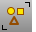
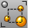
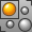
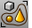
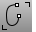
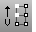
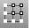
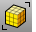
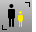
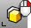

---
---

# Select objects
Select objects for further processing by commands.

## Select all objects
 [Select](selection-commands.html#select) 
Select objects.
 [SelAll](selection-commands.html#selall) 
Select all objects.
 [SelNone](selection-commands.html#selnone) 
Deselect all objects.
 [SelSmall](selection-commands.html#selsmall) 
Select all objects smaller than a specified size.
 [Invert](selection-commands.html#invert) 
Deselect all selected objects and select all previously unselected objects.
 [SelBadObjects](selection-commands.html#selbadobjects) 
Select all objects that do not pass [Check](check.html).

## Select with enclosure
 [SelCrossing](selection-commands.html#selcrossing) 
Select with a crossing window.
 [SelWindow](selection-commands.html#selwindow) 
Select with an enclosing window.
 [SelFence](selection-commands.html#selfence) 
Select a using a crossing sketched polyline.
 [Lasso](selection-commands.html#lasso) 
Select objects by drawing a freehand shape.
 [SelBoundary](selection-commands.html#selboundary) 
Select objects within an existing closed curve.
 [SelCircular](selection-commands.html#selcircular) 
Draw a circle to select objects.
 [SelVolumePipe](selection-commands.html#selvolumepipe) 
Select objects inside, outside, or crossing a pipe-shaped volume.
 [SelVolumeSphere](selection-commands.html#selvolumesphere) 
Select objects inside, outside, or crossing a spherical volume.

## Brush select
 [SelBrush](selection-commands.html#selbrush) 
Drag the mouse like a brush stroke to select objects.
 [SelBrushPoints](selection-commands.html#selbrushpoints) 
Drag mouse like a brush stroke to select points and control points.

## Select annotation objects
 [SelDim](selection-commands.html#seldim) 
Select all dimensions.
 [SelDimStyle](selection-commands.html#seldimstyle) 
Select dimensions of a specified style.
 [SelDot](selection-commands.html#seldot) 
Select all annotation dots.
 [SelLeader](selection-commands.html#selleader) 
Select all leaders.
 [SelText](selection-commands.html#seltext) 
Select all text.

## Select curves and points
 [SelCrv](selection-commands.html#selcrv) 
Select all curves.
 [SelClosedCrv](selection-commands.html#selclosedcrv) 
Select all closed curves.
 [SelOpenCrv](selection-commands.html#selopencrv) 
Select all open curves.
 [SelShortCrv](selection-commands.html#selshortcrv) 
Select all curves shorter than a specified length.
 [SelPolyline](selection-commands.html#selpolyline) 
Select all polylines.
 [SelPt](selection-commands.html#selpt) 
Select all [point](point.html) objects, [control points](pointson.html), [edit points](pointson.html#editpton), and [solid points](pointson.html#solidpton).
 [SelPtCloud](selection-commands.html#selptcloud) 
Select all point cloud objects.
 [SelChain](selection-commands.html#selchain) 
Select curve or surface edges that touch end-to-end.

## Select control points
 [SelU](selection-commands.html#selu) 
Select all connected control points in the u&#160;direction.
 [NextU](selection-commands.html#nextu) 
Select the control point in the positive u&#160;direction.
 [PrevU](selection-commands.html#prevu) 
Select the control point in the negative u&#160;direction.
 [AddNextU](selection-commands.html#addnextu) 
Add the next control point in the u&#160;direction to the selection.
 [AddPrevU](selection-commands.html#addprevu) 
Add the previous control point in the u&#160;direction to the selection.
 [SelV](selection-commands.html#selv) 
Select all connected control points in v&#160;direction.
 [NextV](selection-commands.html#nextv) 
Select the control point in the positive v&#160;direction.
 [PrevV](selection-commands.html#prevv) 
Select the control point in the negative v&#160;direction.
 [AddNextV](selection-commands.html#addnextv) 
Add the next control point in the v&#160;direction to the selection.
 [AddPrevV](selection-commands.html#addprevv) 
Add the previous control point in the v&#160;direction to the selection.
 [SelUV](selection-commands.html#seluv) 
Select connected control points in the u and v&#160;directions.
 [SelConnected](selection-commands.html#selconnected) 
Select adjacent control points.

## Select meshes
 [SelMesh](selection-commands.html#selmesh) 
Select all mesh objects.
 [SelClosedMesh](selection-commands.html#selclosedmesh) 
Select all closed mesh objects.
 [SelNakedMeshEdgePt](selection-commands.html#selnakedmeshedgept) 
Select unwelded vertices on mesh edges.
 [SelOpenMesh](selection-commands.html#selopenmesh) 
Select all open mesh objects.

## Select surfaces
 [SelClosedSrf](selection-commands.html#selclosedsrf) 
Select all closed surfaces.
 [SelOpenSrf](selection-commands.html#selopensrf) 
Select all open surfaces.
 [SelSrf](selection-commands.html#selsrf) 
Select all surfaces.
 [SelTrimmedSrf](selection-commands.html#seltrimmedsrf) 
Select all trimmed surfaces.
 [SelUntrimmedSrf](selection-commands.html#seluntrimmedsrf) 
Select all untrimmed surfaces.

## Select polysurfaces
 [SelPolysrf](selection-commands.html#selpolysrf) 
Select all polysurfaces.
 [SelClosedPolysrf](selection-commands.html#selclosedpolysrf) 
Select all closed polysurfaces.
 [SelOpenPolysrf](selection-commands.html#selopenpolysrf) 
Select all open polysurfaces.
 [SelNonManifold](selection-commands.html#selnonmanifold) 
Select non-manifold objects.

## Select miscellaneous object types
 [SelNamedViewWidget](selection-commands.html#selnamedviewwidget) 
Select all [Named View](namedview.html) widget objects.
 [SelClippingPlane](selection-commands.html#selclippingplane) 
Select all clipping planes.
 [SelHatch](selection-commands.html#selhatch) 
Select hatch objects.
 [SelLight](selection-commands.html#sellight) 
Select all lights.
 [SelMappingWidget](selection-commands.html#selmappingwidget) 
Select all texture mapping widgets.

## Select by object property
 [SelColor](selection-commands.html#selcolor) 
Select all objects of a specified color.
 [SelGroup](selection-commands.html#selgroup) 
Select a group by name.
 [SelID](selection-commands.html#selid) 
Select objects by object ID number.
 [SelLayer](selection-commands.html#sellayer) 
Select all objects on a layer.
 [SelLayerNumber](selection-commands.html#sellayernumber) 
Select objects by layer number.
 [SelMaterialName](selection-commands.html#selmaterialname) 
Select objects with the same render material name.
 [SelName](selection-commands.html#selname) 
Select objects by name.
 [SelRenderColor](selection-commands.html#selrendercolor) 
Select objects by their render color.

## Select cage objects
 [SelControls](selection-commands.html#selcontrols) 
Select all cage controls.
 [SelCaptives](selection-commands.html#selcaptives) 
Select captive objects of a specified cage controls.

## Select objects with history
 [SelObjectsWithHistory](selection-commands.html#selobjectswithhistory) 
Select objects that have history.
 [SelChildren](selection-commands.html#selchildren) 
Select children of specified parents.
 [SelParents](selection-commands.html#selparents) 
Select parents of specified children.

## Select duplicates
 [SelDup](selection-commands.html#seldup) 
Select geometrically identical objects.
 [SelDupAll](selection-commands.html#seldupall) 
Select all visible geometrically identical objects.

## Select by action order
 [SelLast](selection-commands.html#sellast) 
Select the last changed objects.
 [SelPrev](selection-commands.html#selprev) 
Re-select the previous selection set.
See also
 [SelVisible](selection-commands.html#selvisible) 
Select all surfaces or meshes that are in front of other objects with a crossing selection.
 [SelectionFilter](selection-commands.html#selectionfilter) 
Restrict a selection mode to specified object types.
 [Selection Menu](selection-menu.html) 
Manage dialog placement, height, and appearance; highlight display and appearance.
&#160;
&#160;
Rhinoceros 6 © 2010-2015 Robert McNeel &amp; Associates.11-Nov-2015
 [Open topic with navigation](sak-selectobjects.html) 

