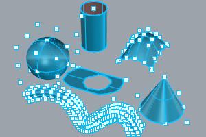
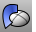
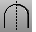

---
---

# Create surfaces
A surface is like a rectangular stretchy rubber sheet. The NURBS form can represent simple shapes, such as planes and cylinders, as well as free-form, sculptured surfaces.
All surface creation commands in Rhino result in the same object: a NURBS surface. Rhino has many tools for constructing surfaces directly or from existing curves.

All NURBS surfaces have an inherently rectangular organization.
Even a closed surface such as a cylinder is like a rectangular piece of paper that has been rolled up so two opposite edges are touching. The place where the edges come together is called theseam. If a surface does not have a rectangular shape, either it has been trimmed or the control points on the edges have been moved.

## Closed and open surfaces
A surface can be open or closed. An open cylinder is closed in one direction.
A torus (donut shape) is closed in two directions.

## Draw a surface
 [Plane](plane.html) 
Draw a rectangular planar surface.
 [Picture](picture.html) 
Draw a rectangular planar surface with a bitmap texture.

## Create a surface from points
 [PlaneThroughPt](planethroughpt.html) 
Fit a rectangular planar surface through points.
 [SrfControlPtGrid](srfcontrolptgrid.html) 
Draw a surface from a grid of points that represent surface control points.
 [SrfPt](srfpt.html) 
Draw a surface from three or four corner points.
 [SrfPtGrid](srfptgrid.html) 
Draw a surface from a grid of points that lie on the surface.

## Create a surface from curves
 [ExtrudeCrv](extrudecrv.html) 
Drive closed planar curves in a straight line.
 [EdgeSrf](edgesrf.html) 
Create a surface from two, three, or four curves.
 [Fin](fin.html) 
Extrude a curve on a surface in the surface normal direction.
 [Loft](loft.html) 
Fit a surface through profile curves that define the surface shape.
 [NetworkSrf](networksrf.html) 
Fit a surface through a network of crossing curves.
 [Patch](patch.html) 
Fit a surface through curves and point objects.
 [PlanarSrf](planarsrf.html) 
Create a planar surface from planar curves.
 [RailRevolve](railrevolve.html) 
Revolve a profile curve around an axis and along a rail curve.
 [Revolve](revolve.html) 
Create a surface by revolving a profile curve around an axis.
 [Ribbon](ribbon.html) 
Offset a curve and create a ruled surface between the curves.
 [Sweep1](sweep1.html) 
Fit a surface through profile curves and one edge curve.
 [Sweep2](sweep2.html) 
Fit a surface through profile curves and two edge curves.

## Create a surface from other surfaces
 [CutPlane](cutplane.html) 
Create planar surfaces through objects at specified locations.
 [Drape](drape.html) 
Create a surface through the intersections of objects and points projected toward the construction plane.
 [OffsetSrf](offsetsrf.html) 
Copy a surface parallel to the original.
 [VariableOffsetSrf](variableoffsetsrf.html) 
Copy a surface specified varying distances from the original surface.
 [UnrollSrf](unrollsrf.html) 
Flatten (develop) a surface or polysurface with curvature in one direction to a planar surface.

## Other methods
 [Heightfield](heightfield.html) 
Create a surface based on gray-scale color values in an image file.
 [MeshToNURB](meshtonurb.html) 
Duplicate each mesh face with a NURBS surface.
 [Symmetry](symmetry.html) 
Mirror a copy of a curve or surface with continuity.
See also
 [Edit surfaces](sak-surfacetools.html) 
 [Split and trim curves and surfaces](sak-splittrim.html) 
&#160;
&#160;
Rhinoceros 6 © 2010-2015 Robert McNeel &amp; Associates.11-Nov-2015
 [Open topic with navigation](sak-surface.html) 

