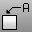

---
---

# Text and dimensions
Use text, dimensions, leaders, and annotation dots.
Dimensions are created parallel to the current viewport's construction plane. Combine dimension commands with object snaps to give precise values.
The dimension style controls the way a dimension displays. For example, the dimension text location can be above the dimension line or in the dimension line. The end of a dimension line can display an arrow, a tick, or a dot. The dimension text can show decimal, fractional, or feet and inches numbers.

## Create text
 [Text](text.html) 
Create annotation text.
 [EditText](edittext.html) 
Open an edit box in the viewport for changing text or annotation dot.
 [RText](text.html#rtext) 
Create two-dimensional rich text. Rich text can be formatted on a word-by-word or letter-by-letter basis similar to a word processor.
 [TextProperties](text.html#textproperties) 
Set the font, bold, italic, height.
 [FindText](findtext.html) 
Search for specified text.

## Use annotation dots
 [Dot](dot.html) 
Draw an annotation dot that stays parallel to and sizes with the view.
 [ConvertDots](dot.html#convertdots) 
Convert [Dot](dot.html) objects to either [points](point.html) or [text](text.html).

## Create dimension objects
 [Dim](dim.html) 
Draw horizontal or vertical linear dimensions.
 [DimAligned](dimaligned.html) 
Draw a linear dimension lined up with two points.
 [DimAngle](dimangle.html) 
Dimension the angle between two lines.
 [DimArea](dimarea.html) 
Dimension the area of a closed curve, surface, mesh, or hatch.
 [DimCurveLength](dimcurvelength.html) 
Dimension the length of a curve.
 [DimDiameter](dimdiameter.html) 
Dimension the diameter of a curve.
 [DimOrdinate](dimordinate.html) 
Dimension the x or y&#160;distance from a base location.
 [DimRadius](dimradius.html) 
Dimension the radius of an arc or circle.
 [DimRotated](dimrotated.html) 
Draw a linear dimension that is rotated from the xy axis.
 [DimCreaseAngle](dimcreaseangle.html) 
Dimension the angle between two planes.
 [SetCurrentDimstyle](dimensions-style.html#setcurrentdimstyle) 
Specify the current [dimensions style](dimensions-style.html).

## Draw leaders
 [Leader](leader.html) 
Draw an annotation leader with attached text.
 [Arrowhead](arrowhead.html) 
Create or remove an arrowhead on a curve.

## Utilities
 [DimRecenterText](dimrecentertext.html) 
Return dimension text to its default location.
 [ImportDimStyles](dimensions-style.html#importdimstyles) 
Import dimension styles into the current document.
 [Dimension Properties](dimension.html) 
Manage angle brackets, dimension display, degree, diameter, plus/minus symbols.
See also
 [Measure objects](sak-measure.html) 
 [Use drafting tools](sak-drafting.html) 
 [Notes](notes.html) 
Open a text notes window.
 [TextObject](textobject.html) 
Draw text-shaped curves, surfaces, or polysurfaces based on TrueType fonts.
&#160;
&#160;
Rhinoceros 6 © 2010-2015 Robert McNeel &amp; Associates.11-Nov-2015
 [Open topic with navigation](sak-textanddimensions.html) 

