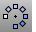
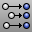
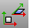
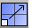

---
---

# Transform objects
Commands that transform an object to change its size, shape, location, or orientation.

## Copy objects
 [Copy](copy.html) 
Duplicate objects.
 [Array](array.html) 
Copy and space objects in columns, rows, and levels.
 [ArrayPolar](arraypolar.html) 
Copy and space objects around a central location.
 [Mirror](mirror.html) 
Create a mirror-image copy of objects.

## Move objects
 [Move](move.html) 
Move objects from one location to another.
 [Align](align.html) 
Line up bounding boxes of objects.
 [SetPt](setpt.html) 
Move objects to a specified location in the x, y, and/or z&#160;directions.

## Rotate objects
 [Rotate](rotate.html) 
Rotate objects around an axis perpendicular to the construction plane.
 [Rotate3D](rotate3d.html) 
Rotate objects around a 3-D axis.
 [RemapCPlane](remapcplane.html) 
Reorient objects to a different construction plane.

## Change the size of objects
 [Scale](scale.html) 
Change the size of objects uniformly in the x, y, and z&#160;directions.
 [Scale1D](scale1d.html) 
Change the size of objects in one direction.
 [Scale2D](scale2d.html) 
Change the size of objects uniformly in two directions.
 [ScaleNU](scalenu.html) 
Change the size of objects non-uniformly in three directions.
 [ScaleByPlane](scalebyplane.html) 
Change the size of objects in two directions non-uniformly.

## Orient objects
 [Orient](orient.html) 
Transform objects using two reference and two target points.
 [Orient3Pt](orient3pt.html) 
Transform objects using three reference and three target points.
 [OrientCrvToEdge](orientcrvtoedge.html) 
Copy and align a curve to a surface edge.
 [OrientOnCrv](orientoncrv.html) 
Transform objects along a curve normal.
 [OrientOnSrf](orientonsrf.html) 
Transform objects normal to a surface.

## Other transforms
 [Gumball](gumball.html) 
Displays the gumball widget on a selected object facilitating move, scale, and rotate transformations around the gumball origin.
 [BoxEdit](boxedit.html) 
Size, scale, position, and rotate objects numerically.
 [ProjectToCPlane](projecttocplane.html) 
Flatten objects onto the construction plane.
 [Shear](shear.html) 
Skew objects parallel to one axis at an angle.
 [SoftMove](softmove.html) 
Move objects relative to a center with falloff.
&#160;
&#160;
Rhinoceros 6 © 2010-2015 Robert McNeel &amp; Associates.11-Nov-2015
 [Open topic with navigation](sak-transform.html) 

