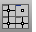

---
---

# Manage views
View manipulation commands.
 [ClippingPlane](clippingplane.html) 
Create a plane that hides objects.
 [DisplayProperties](displayproperties.html) 
Open the Display panel.
 [LimitReferenceModel](worksession.html#limitreferencemodel) 
Limit the amount of reference geometry that is available to work on.
 [SynchronizeViews](synchronizeviews.html) 
Set the scale and center of all viewports to match the active viewport.
 [ViewCaptureToClipboard](viewcapture.html#viewcapturetoclipboard) 
Save an image of the current view to the Clipboard.
 [ViewCaptureToFile](viewcapture.html#viewcapturetofile) 
Save an image of the current view to a file.
 [ViewportProperties](viewport.html) 
Title, size, projection, camera and target, lens length, wallpaper.
&#160;
&#160;
Rhinoceros 6 © 2010-2015 Robert McNeel &amp; Associates.11-Nov-2015
 [Open topic with navigation](sak-view.html) 

