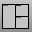
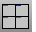
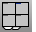

---
---

# Manage viewports

## Set up viewports
 [3View](new-viewport-arrangements.html#3view) 
Set up a three-viewport workspace.
 [4View](new-viewport-arrangements.html#4view) 
Set up a four-viewport workspace.
 [NewViewport](new-viewport-arrangements.html#newviewport) 
Create a new viewport.
 [NewFloatingViewport](new-viewport-arrangements.html#newfloatingviewport) 
Create a new free-floating viewport.
 [ToggleFloatingViewport](new-viewport-arrangements.html#togglefloatingviewport) 
Toggle the viewport between docked and floating.
 [ReadViewportsFromFile](new-viewport-arrangements.html#readviewportsfromfile) 
Set the viewport layout to match that of another model.
 [MaxViewport](maxviewport.html) 
Maximize the active viewport.
 [CloseViewport](new-viewport-arrangements.html#closeviewport) 
Close the active viewport.

## Specify the active viewport
 [SetActiveViewport](setactiveviewport.html) 
Activate a named viewport.
 [SetMaximizedViewport](setmaximizedviewport.html) 
Maximize a named viewport inside the application window.
 [NextViewport](nextviewport.html) 
Activate the next viewport.
 [NextOrthoViewport](nextviewport.html#nextorthoviewport) 
Activate the next viewport with an orthogonal projection.
 [NextPerspectiveViewport](nextviewport.html#nextperspectiveviewport) 
Activate the next viewport with a perspective projection.
 [PrevViewport](nextviewport.html#prevviewport) 
Activate the previous viewport.

## Arrange the viewports
 [BringViewportToTop](viewport-arrangement.html#bringviewporttotop) 
Bring a viewport to the front.
 [NextViewportToTop](viewport-arrangement.html#nextviewporttotop) 
Display the next viewport in front of all other viewports.
 [PushViewportToBack](viewport-arrangement.html#pushviewporttoback) 
Send a named viewport behind all viewports.
 [SplitViewportHorizontal](viewport-arrangement.html#splitviewporthorizontal) 
Divide a viewport horizontally into two viewports.
 [SplitViewportVertical](viewport-arrangement.html#splitviewportvertical) 
Divide a viewport vertically into two viewports.

## Define viewport properties
 [ViewportProperties](viewport.html) 
Title, size, projection, camera and target, lens length, wallpaper.
 [ViewportTabs](new-viewport-arrangements.html#viewporttabs) 
Display a tab control UI along the viewport edge.

## Rhino Application Window
 [Fullscreen](fullscreen.html) 
Hide menus, status bar, toolbars, command prompt, and windows title bar and maximize the Rhino window.
 [Minimize](sizeapplicationwindow-commands.html#minimize) 
Minimize the Rhino application window.
 [Maximize](sizeapplicationwindow-commands.html#maximize) 
Maximize the Rhino application window.
 [Restore](sizeapplicationwindow-commands.html#restore) 
Restore the application window from being maximized.
See also
 [Viewport display modes](sak-displaymodes.html) 
&#160;
&#160;
Rhinoceros 6 © 2010-2015 Robert McNeel &amp; Associates.11-Nov-2015
 [Open topic with navigation](sak-viewports.html) 

