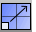

---
---

# Scale toolbar
{: #kanchor2367}
 [To open a toolbar](javascript:void(0);) Toolbars can be opened as a free-standing group or added to the current group.
To open a toolbar as a free-standing group
Click theOptionsicon in any toolbar group.On the menu, clickShow Toolbar, and then select the toolbar name from the list.To open a toolbar as a new tab in the current group
Click theOptionsicon in the toolbar group where you want to add the new tab.On the menu, clickShow or Hide Tabs, and then select the toolbar name from the list. [Scale](scale.html) 
Change the size of objects uniformly in the x, y, and z&#160;directions.
 [Scale 3-D,Rigid](scale.html) 
Scale the position of objects uniformly in the x, y, and z&#160;directions without scaling the objects themselves.
 [Scale1D](scale1d.html) 
Change the size of objects in one direction.
 [Scale1-D,Rigid](scale1d.html) 
Scale the position of objects in one direction without scaling the objects themselves.
 [Scale2D](scale2d.html) 
Change the size of objects uniformly in two directions.
 [Scale2-D,Rigid](scale2d.html) 
Scale the position of objects uniformly in two directions without scaling the objects themselves.
 [ScaleNU](scalenu.html) 
Change the size of objects non-uniformly in three directions.
 [Scale non-uniform,Rigid](scalenu.html) 
Scale the position of objects non-uniformly in three directions without scaling the objects themselves.
 [ScaleByPlane](scalebyplane.html) 
Change the size of objects in two directions non-uniformly.
 [ScaleByPlane](scalebyplane.html) 
Scale the position of objects in two directions non-uniformly without scaling the objects themselves.
&#160;
&#160;
Rhinoceros 6 © 2010-2015 Robert McNeel &amp; Associates.11-Nov-2015
 [Open topic with navigation](scale-toolbar.html) 

