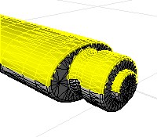

---
---

# Select mesh faces
The Select Mesh Faces commands help to edit existing meshes by selecting faces in the mesh object.
Mesh faces can be selected using:
 [A specified maximum or minimum area](#selmeshfacesbyarea)  [By a view-based draft angle](#selmeshfacesbydraftangle)  [A specified aspect ratio](#selmeshfacesbyaspectratio)  [A specified edge length](#selmeshfacesbyedgelength) Note
Some STL/SLA printers have problems if meshes contain many long, thin facets. These can slow the printer's slicing process down, produce odd printed results, and run the printer out of memory.The [MeshRepair](meshrepair.html) command may be useful when tuning up meshes for STL/SLA printing.
## Select mesh faces commands

## SelMeshFacesByArea
{: #kanchor1918}
{: #selmeshfacesbyarea}
 [Where can I find this command?](javascript:void(0);) Toolbars
 [Not on toolbars.](toolbarwhattodo.html) 
Menus
 [Not on menus.](menuwhattodo.html) 
TheSelMeshFacesByAreacommand selects mesh faces from the parent mesh object that are within a specified range of area.

Steps
 [Select](select-objects.html) a mesh object.Select mesh faces by area options
Select faces larger than ___
Selects mesh faces with an area larger than the specified setting.
 **Select smallest face** 
Select a mesh face to set the area of the smallest face.
Select faces smaller than
Selects mesh faces with an area smaller than the specified setting.
 **Select largest face** 
Select a mesh face to set the area of the largest face.
Increment
Sets the amount the value is changed with each arrow click.
 **Select range from face** 
Select an example mesh face to set the size range. A range of ±10% of the area of the selected face is used.

## SelMeshFacesByAspectRatio
{: #kanchor1919}
{: #selmeshfacesbyaspectratio}
 [Where can I find this command?](javascript:void(0);) Toolbars
 [Not on toolbars.](toolbarwhattodo.html) 
Menus
 [Not on menus.](menuwhattodo.html) 
TheSelMeshFacesByAspectRatiocommand selects mesh faces from the parent mesh object that are greater than the specified aspect ratio limit.
SelMeshFacesByAspectRatioselects mesh faces that are very long compared to their width. A ratio of 25:1 or above is considered long.
In the image, the selected red faces have an aspect ratio of 9:1 or more.

Steps
 [Select](select-objects.html) a mesh object.Select mesh faces by aspect ratio options
Aspect ratio ___ to 1
Set the target aspect ratio.
Increment
Sets the amount the value is changed with each arrow click.
 **Select aspect ratio from face** 
Select a mesh face to specify theAspect Ratiovalue.

## SelMeshFacesByDraftAngle
{: #kanchor1920}
{: #selmeshfacesbydraftangle}
 [Where can I find this command?](javascript:void(0);) Toolbars
 [Not on toolbars.](toolbarwhattodo.html) 
Menus
 [Not on menus.](menuwhattodo.html) 
TheSelMeshFacesByDraftAnglecommand selects mesh faces from the parent mesh object based on the angle of the faces to the view.
SelMeshFacesByDraftAnglecan split a mesh object for molds or to look for undercut areas. In the example, the mesh faces were selected in the top view.

Steps
 [Select](select-objects.html) a mesh object.Select mesh faces by draft angle options
Start angle from camera direction
Sets the starting angle from the direction of the viewport camera.
End angle from camera direction
Sets the ending angle from the direction of the viewport camera.

## SelMeshFacesByEdgeLength
{: #kanchor1921}
{: #selmeshfacesbyedgelength}
 [Where can I find this command?](javascript:void(0);) Toolbars
 [Not on toolbars.](toolbarwhattodo.html) 
Menus
 [Not on menus.](menuwhattodo.html) 
TheSelMeshFacesByEdgeLengthcommand selects mesh faces from the parent mesh object that have an edge length greater or less than a specified value.
SelMeshFacesByEdgeLengthselects small or large mesh faces that do not belong in the mesh object.
In the example image, the selected red faces have an edge length shorter than 0.1.

Steps
 [Select](select-objects.html) a mesh object.Select mesh faces by edge length options
Edge length
Sets the mesh edge length to compare.
 **Select edge** 
Pick a mesh edge to specify the edge length you want.
Increment
Sets the amount the value is changed with each arrow click.
Select edges:
Shorter than edge length
Selects mesh faces with an edge length shorter than theEdge lengthsetting.
Longer than edge length
Selects mesh faces with an edge length longer than theEdge lengthsetting.

## SelConnectedMeshFaces
{: #kanchor1923}
{: #kanchor1922}
{: #selconnectedmeshfaces}
 [Where can I find this command?](javascript:void(0);) Toolbars
 [Not on toolbars.](toolbarwhattodo.html) 
Menus
 [Not on menus.](menuwhattodo.html) 
TheSelConnectedMeshFacescommand selects mesh faces from the parent mesh object that are connected to a selected face.
TheSelConnectedMeshFacescommand selects a set of mesh faces from a joined mesh object based on a specified break angle. This can be used to select a series of mesh faces that make up a planar surface in a mesh object or to select set of faces that make up a coherent feature in the mesh.
Steps
 [Select](select-objects.html) mesh faces, and press [Enter](enter-key.html) .Adjust options to get the selection you want.Your browser does not support the video tag.Select connected mesh faces options
Select faces connected with angle
Sets the angle between mesh faces for selection.
Less than / Greater than ___ degrees
Note
A setting of 0 will give you all the mesh faces that are connected and planar with the face you select.Sometimes planar meshes have a little noise in them, so a angle of 1 can help select planar faces.Increment
Sets the amount the value is changed with each arrow click.
 **Select faces to measure angle** 
Select two mesh faces to specify the angle you want.
 **Edit Selection** 
Click to select a different mesh face.

## SelMeshEdges
{: #kanchor1924}
 [Where can I find this command?](javascript:void(0);) Toolbars
 [Not on toolbars.](toolbarwhattodo.html) 
Menus
 [Not on menus.](menuwhattodo.html) 
TheSelMeshEdgescommand selects edges from the parent mesh determined by an angle between mesh face normals.
The command may help if you have a mesh that came from a polysurface but no longer have the polysurface. Using the command with theUnweldedoption creates polyline approximations of where the edges of the polysurface were.
Steps
 [Select](select-objects.html) a mesh.Select Edges Options
Extract edges by
Unwelded
Extracts edges with coincident vertices.
Break angle
The angle between the face normals of adjacent faces.
Greater than
Specify a minimum break angle.
Select Edge
Specify an example edge to set the minimum break angle.
Less than
Specify a maximum break angle
Select Edge
Specify an example edge to set the maximum break angle.
Increment
Sets the amount the value is changed with each arrow click.

## SelMeshPart
{: #kanchor1925}
 [Where can I find this command?](javascript:void(0);) Toolbars
 [Not on toolbars.](toolbarwhattodo.html) 
Menus
 [Not on menus.](menuwhattodo.html) 
TheSelMeshPartcommand selects all mesh faces radiating out from the selected face to naked or unwelded edges in the parent mesh object.
Note
Some STL/SLA printers have problems if meshes contain many long, thin facets. These can slow the printer's slicing process down, produce odd printed results, and run the printer out of memory.The [MeshRepair](meshrepair.html) command may be useful when tuning up meshes for STL/SLA printing.Steps
 [Select](select-objects.html) a mesh object.Command-line option
EditSelection
Change which mesh faces are selected.
BorderOnly
Makes polylines out of the edges of the selected mesh faces instead of extracting them from the parent mesh object.
MakeCopy
Yes
Makes a copy of the selected mesh faces rather than extracting them from the parent mesh object.
No
Extracts the mesh face leaving a hole in the parent mesh object.
ExtractToNonManifoldEdges
Adds non-manifold edges (edges common to three or more faces) to the selection criteria.
See also
 [Collapse mesh faces and vertices](sak-collapsemesh.html) 
 [Extract object sub-elements](sak-extract.html) 
 [Edit mesh objects](sak-meshtools.html) 
 [White paper: Scan, Cleanup, Remodel](http://download.rhino3d.com/download.asp?id=ScanCleanupRemodel) 
&#160;
&#160;
Rhinoceros 6 © 2010-2015 Robert McNeel &amp; Associates.11-Nov-2015
 [Open topic with navigation](select-mesh-faces-commands.html) 

