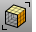

---
---

# Select Meshes toolbar
{: #kanchor2371}
 [To open a toolbar](javascript:void(0);) Toolbars can be opened as a free-standing group or added to the current group.
To open a toolbar as a free-standing group
Click theOptionsicon in any toolbar group.On the menu, clickShow Toolbar, and then select the toolbar name from the list.To open a toolbar as a new tab in the current group
Click theOptionsicon in the toolbar group where you want to add the new tab.On the menu, clickShow or Hide Tabs, and then select the toolbar name from the list. [SelMesh](selection-commands.html#selmesh) 
Select all mesh objects.
 [SelClosedMesh](selection-commands.html#selclosedmesh) 
Select all closed mesh objects.
 [SelOpenMesh](selection-commands.html#selopenmesh) 
Select all open mesh objects.
 [SelVisible](selection-commands.html#selvisible) 
Select all surfaces or meshes that are in front of other objects with a crossing selection.
&#160;
&#160;
Rhinoceros 6 © 2010-2015 Robert McNeel &amp; Associates.11-Nov-2015
 [Open topic with navigation](select-meshes-toolbar.html) 

