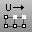
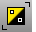
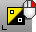
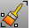
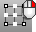

---
---

# Select Points toolbar
{: #kanchor2372}
 [To open a toolbar](javascript:void(0);) Toolbars can be opened as a free-standing group or added to the current group.
To open a toolbar as a free-standing group
Click theOptionsicon in any toolbar group.On the menu, clickShow Toolbar, and then select the toolbar name from the list.To open a toolbar as a new tab in the current group
Click theOptionsicon in the toolbar group where you want to add the new tab.On the menu, clickShow or Hide Tabs, and then select the toolbar name from the list. [AddNextU](selection-commands.html#addnextu) 
Add the next control point in the u&#160;direction to the selection.
 [AddPrevU](selection-commands.html#addprevu) 
Add the previous control point in the u&#160;direction to the selection.
 [AddNextV](selection-commands.html#addnextv) 
Add the next control point in the v&#160;direction to the selection.
 [AddPrevV](selection-commands.html#addprevv) 
Add the previous control point in the v&#160;direction to the selection.
 [Lasso](selection-commands.html#lasso) 
Select objects by drawing a freehand shape.
 [NextU](selection-commands.html#nextu) 
Select the control point in the positive u&#160;direction.
 [PrevU](selection-commands.html#prevu) 
Select the control point in the negative u&#160;direction.
 [NextV](selection-commands.html#nextv) 
Select the control point in the positive v&#160;direction.
 [PrevV](selection-commands.html#prevv) 
Select the control point in the negative v&#160;direction.
 [InvertPt](selection-commands.html#invertpt) 
Deselect all selected control or edit points and select all previously unselected control or edit points.
 [ShowPt](hide.html#showpt) 
Redisplay all hidden control points and edit points.
 [SelBrushPoints](selection-commands.html#selbrushpoints) 
Drag mouse like a brush stroke to select points and control points.
 [SelConnected](selection-commands.html#selconnected) 
Select adjacent control points.
 [Invert](selection-commands.html#invert) 
Deselect adjacent control points.
 [SelU](selection-commands.html#selu) 
Select all connected control points in the u&#160;direction.
 [SelUV](selection-commands.html#seluv) 
Select connected control points in the u and v&#160;directions.
 [SelV](selection-commands.html#selv) 
Select all connected control points in v&#160;direction.
&#160;
&#160;
Rhinoceros 6 © 2010-2015 Robert McNeel &amp; Associates.11-Nov-2015
 [Open topic with navigation](select-points-toolbar.html) 

