---
---

# Selection commands
{: #kanchor27}
Dedicated selection commands let you select by object properties.
Selection categories
 [All objects](#allobjects) 
 [Action order](#actionorder) 
 [Annotation](#annotation) 
 [Blocks](#blocks) 
 [Capture](#bycapture) 
 [Cages](#cages) 
 [Control Points](#controlpoints) 
 [Curves](#curves) 
 [Duplicates](#duplicates) 
 [History](#history) 
 [Invert](#invert) 
 [Lasso](#lasso) 
 [Layers and Groups](#layersgroups) 
 [Lights](#sellight) 
 [Meshes](#meshes) 
 [Object type](#byobjecttype) 
 [Point](#point) 
 [Polysurfaces](#polysurfaces) 
 [Properties](#properties) 
 [Surfaces](#surfaces) 

## Select object basics
{: #select-object-basics}
To select single objects with a click
Click an object to select it.Click away from the objects to deselect.Your browser does not support the video tag.{: #windowselection}To select objects by a window rectangle{: #kanchor28}
Drag a selection rectangle from left to right to use a window selection.Your browser does not support the video tag.Note
When you make a window selection, objects completely enclosed in the selection rectangle are selected.To make the mouse always use either a window or crossing selection, see [Mouse Options](mouse.html)  [, Mouse group select](mouse.html#select-mouse) .See: [SelWindow](#selwindow) 
{: #crossingselection}To select objects by a crossing rectangle{: #kanchor29}{: #kanchor30}
Drag a selection rectangle from right to left to do a crossing selection.Your browser does not support the video tag.See: [SelCrossing](#selcrossing) 
Note
When you make a crossing selection, all objects inside or partially inside the selection rectangle are selected.To make the mouse always use either a window or crossing selection, see [Mouse Options](mouse.html)  [, Mouse group select](mouse.html#select-mouse) .To add objects to a selection{: #kanchor31}
Press and hold [Shift](shift-key.html) while clicking single objects or using a window or crossing. [Shift](shift-key.html) +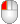and [Shift](shift-key.html) +Your browser does not support the video tag.{: #removeobjects}To remove objects from a selection{: #kanchor32}
Press and hold [Ctrl](ctrl-key.html) while clicking single objects or using a window or crossing. [Ctrl](ctrl-key.html) +and [Ctrl](ctrl-key.html) +Your browser does not support the video tag.
## Selection menu
{: #kanchor33}
{: #selection-menu}
If several objects appear to be stacked in the area of the cursor and Rhino is not able to tell which one you want to select, theSelection Menuappears.
When theSelection Menupops up, the current object and its designation in the list highlight.
To select an object
Click the desired object name in the selection menu list with the [left mouse button](mouse-buttons.html) .OrClick the [left mouse button](mouse-buttons.html) at the original pick point to cycle through the object name list.Click the [right mouse button](right-mouse-click.html) to accept the currently-highlighted object name.OrUse the [mouse wheel](mouse-buttons.html) to cycle through the list.Click the [right mouse button](right-mouse-click.html) to accept the currently-highlighted object name.To cancel the selection process
ClickNone.Click away from the objects.Click another object.To configure the selection menu, see: [Selection Menu Options](selection-menu.html), or right-click theSelection Menutitle bar.

## Select sub-parts of objects
{: #kanchor34}
{: #sub-object-selection}
For many commands, you can select sub-parts of objects or specified object types to allow you to restrict selection in a tight area.
Examples include:
Curve and surface [control points](controlpoint.html) Polysurface and extrusion faces and edge curvesSurface edge curves [Mesh vertices](meshvertex.html), faces, boundaries, and edgesObjects within a groupPolycurve and polyline segmentsSurface, polysurfaces, and extrusion object vertices. These are the equivalent of the points enabled by [SolidPtOn](pointson.html#solidpton).
### Selecting sub-objects with a mouse
{: #kanchor35}
You can select sub-objects with a mouse before a command starts (pre-select) or during a command (post-select).
To select sub-object parts with a mouse
Press and hold [Ctrl](ctrl-key.html) + [Shift](shift-key.html) and left mouse click, window, or crossing. [Ctrl](ctrl-key.html) + [Shift](shift-key.html) +orTo de-select sub object parts with a mouse
Press and hold [Ctrl](ctrl-key.html) and left mouse click, window, or crossing. [Ctrl](ctrl-key.html) +or
### Select sub-parts with a command-line filter
{: #kanchor36}
Command-line selection filters work on a more limited set of sub-objects for commands that ask you to select objects after the command starts (post-select). These commands let you use filters to pick a sub-part of an object or specific objects rather than the whole object.
To select a sub-part of an object as input to a command, type
Sub-object parts can be selected and de-selected using capture tools: [SelWindow](#selwindow) and [SelCrossing](#selcrossing), [Lasso](#lasso), [SelBrush](#selbrush), [SelCircular](#selcircular), [SelBoundary](#selboundary), [SelVolumeSphere](#selvolumesphere), and [SelBox](#selbox).
for curves,crvfor dimensions,dimfor edges,edgefor meshes,meshfor points,ptfor polysurfaces,polysrffor surfaces,srf
## Selection Filter
{: #kanchor39}
{: #kanchor38}
{: #kanchor37}
{: #selectionfilter}
The Selection Filter{: #kanchor40}restricts any selection mode ( [SelWindow](#selwindow), [SelCrossing](#selcrossing), [SelAll](#selall), etc.) to specified object types.
Note
The selection filter works for pre-selecting sub-parts of objects using [Ctrl](ctrl-key.html) + [Shift](shift-key.html) + Left-mouse click.Sub-object pre-select honorsSelection Filtersettings. This only affects polysurface face and edge selection. Since edges are essentially curves, and polysurface faces are surfaces, if you clear theCurvescheck box, edges won't select when you hold [Ctrl](ctrl-key.html) + [Shift](shift-key.html) and click. If you clear theSurfacescheck box, polysurface faces won't select.Example: To select only red points
Set the filter toPoints.Use the [SelColor](#selcolor) command to select red objects.Only red points will be selected.Example: To select only curves within a window
Set the filter toCurves. [Window select](#selwindow) objects.Only curves within the window will be selected.Example: To select curves one time
Set the filter toSurfaces.With the mouse over theSelection Filtercontrol press [Ctrl](ctrl-key.html) or [Shift](shift-key.html) ClickCurves.Select objects.Only curves will be selected for one selection. The filter then returns to its previous mode.To clear all but one filter
 [Right-click](mouse-buttons.html) the desired filter check box.To restore the previous set of filters
 [Right-click](mouse-buttons.html) the desired filter check box again.To clear / restore all filters
 [Right-click](mouse-buttons.html) Disable.Selection Filter options{: #kanchor41}
Disable
Turn off selection filters.
Sub-objects
Allows sub-object selection.
Points
Restricts the selection to [point](sak-point.html) objects, and with [sub-object selection](#) checked, mesh vertices.
Polysurfaces
Restricts selection to [polysurface](sak-polysurfaces.html) objects.
Lights
Restricts selection to [light](sak-lights.html) objects.
Point clouds
Restricts selection to [point cloud](pointcloud.html) objects.
Curves
Restricts the selection to [curve](sak-curve.html) objects, and with [sub-object selection](#) checked, sub-curves and mesh edges.
Meshes
Restricts the selection to [mesh](sak-mesh.html) objects.
Blocks
Restricts selection to [block](sak-blocksgroups.html) instances.
Hatches
Restricts selection to [hatch](hatch.html) objects.
Surfaces
Restricts selection to [surface](sak-surface.html) objects, and with [sub-object selection](#) checked, mesh faces.
Annotations
Restricts the selection to [Dimensions](sak-textanddimensions.html), [Leaders](leader.html), [Dots](dot.html), and [Text](text.html).
Control points
Restricts the selection to curve and surface [control points](sak-pointediting.html).
Others
Control cages
Morph control objects
 [Detail views](detail.html) 
 [Clipping plane](clippingplane.html) objects

## SelectionFilter
{: #kanchor43}
{: #kanchor42}
{: #selectionfilter}
 [Where can I find this command?](javascript:void(0);) Toolbars
 [Select](select-toolbar.html) Use the status bar [Filter](rhino-window.html#filter-pane) pane.
Menus
Edit
Selection Filter
TheSelectionFiltercommand opens the Selection Filter control.

### One-shot selection filters
You can restrict selection to one or more of the filtered types for one selection only. For example, this lets you select only curves or only hatches and blocks for the next single click, window, crossing or any other selection operation.
To restrict the object type for one selection only
Press [Ctrl](ctrl-key.html) and hover over theSelection Filtercontrol.The check boxes clear and change to buttons.Click the buttons for the object types you want to select.
### Pre-select/Post-select
{: #kanchor46}
{: #kanchor45}
{: #kanchor44}
{: #preselect}
For commands requiring selected objects as input, the objects can be selected before starting the command or after starting the command. Normally pre-selecting objects saves steps; however, in some cases the prompts and options for the command may be slightly different depending on the order used. When objects are pre-selected the possibilities include:
The command determines that the objects can be used and proceeds without further prompting.The command may proceed, but the result may be unexpected.The command cannot determine which objects are to be used and the pre-selected objects are unselected, and you are prompted to select specific objects again.Options may not appear at the command prompt.
# Select all objects
{: #selectall}
{: #allobjects}

## Select
{: #select}
 [Where can I find this command?](javascript:void(0);) Toolbars
 [Not on toolbars.](toolbarwhattodo.html) 
Menus
 [Not on menus.](menuwhattodo.html) 
The Select command selects objects.
Steps
Click an object to select it.
## SelAll
{: #selall}
 [Where can I find this command?](javascript:void(0);) Toolbars
 [Select](select-toolbar.html)  [Standard](standard-toolbar.html) 
Menus
Edit
Select Objects
All Objects
Shortcut
 [Ctrl](ctrl-key.html) +A
The SelAll command selects all objects.

## SelNone
{: #selnone}
 [Where can I find this command?](javascript:void(0);) Toolbars
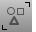 [SelectStandard](standard-toolbar.html) 
Menus
Edit
Select Objects
None
Shortcut
Esc
The SelNone command deselects all objects.
The SelNone command does not run inside a command to clear pre-selected objects.

## SelCrossing
{: #selcrossing}
 [Where can I find this command?](javascript:void(0);) Toolbars
 [Select](select-toolbar.html) 
Menus
 [Not on menus.](menuwhattodo.html) 
Shortcut
C
The SelCrossing command selects with a [crossing window](#crossingselection).
Steps
Drag a selection rectangle enclosing or crossing objects.
## SelWindow
{: #selwindow}
 [Where can I find this command?](javascript:void(0);) Toolbars
 [Select](select-toolbar.html) 
Menus
 [Not on menus.](menuwhattodo.html) 
Shortcut
W
The SelWindow command selects with an [enclosing window](#windowselection).
Steps
Drag a selection rectangle enclosing objects.
## Invert
{: #invert}
 [Where can I find this command?](javascript:void(0);) Toolbars
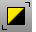 [Select Points](select-points-toolbar.html)  [Select](select-toolbar.html) 
Menus
Edit
Select Objects
Invert
The Invert command deselects all selected objects and selects all visible objects that were not previously selected.

## SelBadObjects
{: #selbadobjects}
 [Where can I find this command?](javascript:void(0);) Toolbars
 [Analyze](analyze-toolbar.html)  [Diagnostics](diagnostics-toolbar.html)  [Geometry Fix](geometry-fix-toolbar.html) 
Menus
Analyze
Diagnostics
Select Bad Objects
The SelBadObjects command selects all objects that do not pass [Check](check.html).
Delete or rebuild the object.

## SelVisible
{: #selvisible}
 [Where can I find this command?](javascript:void(0);) Toolbars
 [Select Meshes](select-meshes-toolbar.html)  [Select Polysurfaces](select-polysurfaces-toolbar.html)  [Select Surfaces](select-surfaces-toolbar.html) 
Menus
Edit
Select Objects
Visible Surfaces and Meshes
The SelVisible command selects all surfaces or meshes that are in front of other objects in the active viewport with a crossing selection.
Your browser does not support the video tag.
Steps
Drag a crossing selection.
## SelSmall
{: #selsmall}
 [Where can I find this command?](javascript:void(0);) Toolbars
 [Select](select-toolbar.html) 
Menus
Edit
Select Objects
Small Objects
The SelSmall command selects all objects smaller than the specified size.

# Select objects by capturing
{: #bycapture}

## Lasso
{: #lasso}
 [Where can I find this command?](javascript:void(0);) Toolbars
 [Organic](organic-toolbar.html)  [Select Points](select-points-toolbar.html)  [Select](select-toolbar.html) 
Menus
Edit
Control Points
Select Control Points
Lasso
The Lasso command selects objects by sketching an irregular shape around them.
The lasso uses the Tracking lines color set in [Color Options](appearance.html).
Your browser does not support the video tag.Note
Objects outside the viewport boundaries but within the boundaries of the selection object can be selected.The view can be panned during the selection to bring more objects into view.Use the [CullControlPolygon](cullcontrolpolygon.html) command to hide control points and mesh vertices behind objects.
## SelBoundary
{: #selboundary}
 [Where can I find this command?](javascript:void(0);) Toolbars
 [Select](select-toolbar.html) 
Menus
Edit
Select Objects
Area and Volume Select
Boundary
The SelBoundary command selects objects based on a boundary defined by an existing closed curve.
Your browser does not support the video tag.Command-line options
SelectionMode
Window
Selects objects completely covered by the selection object or brush stroke.
Crossing
Selects objects crossed by the selection object or brush stroke.
InvertWindow
Selects objects completely outside the selection object or brush stroke.
InvertCrossing
Selects objects outside and crossed by selection object or brush stroke.
Precise
Yes
The selection wire boundary is used as the boundary.
The testing is done in double-precision floating point in screen space. If any part of the object is even slightly outside the selection boundary, it will not be included.
No
A selection mask bitmap is built from the boundary, and the objects are tested against that mask.
The testing is done using a bitmap selection mask, which effectively adds an average of half a pixel wide fuzz zone around the selection boundary. Objects that visually seem as though they should be included, but are actually partially outside the boundary, are still included.

## SelBrush
{: #selbrush}
 [Where can I find this command?](javascript:void(0);) Toolbars
 [Select](select-toolbar.html)  [Select Points](select-points-toolbar.html) 
Menus
Edit
Select Objects
Area and Volume Select
Brush
The SelBrush command selects objects based on painting a thick brush stroke.
Steps
Click and drag or click repeatedly to draw the stroke.By default it uses crossing select: objects touched by the stroke are selected.Command-line options
Curve
Select an existing curve that represents the brush stroke.
SelectionMode
Window
Selects objects completely covered by the selection object or brush stroke.
Crossing
Selects objects crossed by the selection object or brush stroke.
InvertWindow
Selects objects completely outside the selection object or brush stroke.
InvertCrossing
Selects objects outside and crossed by selection object or brush stroke.
BrushWidth
Specifies the brush width in pixels.

## SelBrushPoints
{: #selbrushpoints}
 [Where can I find this command?](javascript:void(0);) Toolbars
 [Select Points](select-points-toolbar.html) 
Menus
Edit
Control Points
Select Control Points
Brush
The SelBrushPoints command selects [points](point.html) and [control points](controlpoint.html) with a drag of the mouse to simulate a brush stroke.
Command-line options
Curve
Select an existing curve that represents the brush stroke.
SelectionMode
Window
Selects objects completely covered by the selection object or brush stroke.
Crossing
Selects objects crossed by the selection object or brush stroke.
InvertWindow
Selects objects completely outside the selection object or brush stroke.
InvertCrossing
Selects objects outside and crossed by selection object or brush stroke.
BrushWidth
Specifies the brush width in pixels.

## SelFence
{: #selfence}
 [Where can I find this command?](javascript:void(0);) Toolbars
 [ [Not on toolbars.](toolbarwhattodo.html) ](select-toolbar.html) 
Menus
 [Not on menus.](menuwhattodo.html) 
The SelFence command selects objects based on drawing a line through objects. Only objects crossed by the line are selected.
Option
Curve
Select an existing curve as the selector.

## SelCircular
{: #selcircular}
 [Where can I find this command?](javascript:void(0);) Toolbars
 [Select](select-toolbar.html) 
Menus
Edit
Select Objects
Area and Volume Select
Circular
The SelCircular command draws a circle to select objects.
Your browser does not support the video tag.Command-line options
SelectionMode
Window
Selects objects completely covered by the selection object or brush stroke.
Crossing
Selects objects crossed by the selection object or brush stroke.
InvertWindow
Selects objects completely outside the selection object or brush stroke.
InvertCrossing
Selects objects outside and crossed by selection object or brush stroke.

## SelBox
{: #selbox}
 [Where can I find this command?](javascript:void(0);) Toolbars
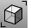 [Select](select-toolbar.html) 
Menus
Edit
Select Objects
Area and Volume Select
Box
The SelBox commands selects objects with point samples inside/outside/crossing a box-shaped volume.
It will not select objects that should not be included, but may miss an object if the point samples miss the selection box.
Command-line options
SelectionMode
Window
Selects objects completely covered by the selection object or brush stroke.
Crossing
Selects objects crossed by the selection object or brush stroke.
InvertWindow
Selects objects completely outside the selection object or brush stroke.
InvertCrossing
Selects objects outside and crossed by selection object or brush stroke.

## SelVolumePipe
{: #selvolumepipe}
 [Where can I find this command?](javascript:void(0);) Toolbars
 [Not on toolbars.](toolbarwhattodo.html) 
Menus
Edit
Select Objects
Area and Volume Select
Pipe
The SelVolumePipe command selects objects inside, outside, or crossing a pipe-shaped volume.
Command-line options
SelectionMode
Window
Selects objects completely covered by the selection object or brush stroke.
Crossing
Selects objects crossed by the selection object or brush stroke.
InvertWindow
Selects objects completely outside the selection object or brush stroke.
InvertCrossing
Selects objects outside and crossed by selection object or brush stroke.

## SelVolumeSphere
{: #selvolumesphere}
 [Where can I find this command?](javascript:void(0);) Toolbars
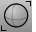 [Select](select-toolbar.html) 
Menus
Edit
Select Objects
Area and Volume Select
Sphere
The SelVolumeSphere command selects objects inside, outside, or crossing a spherical volume.
Command-line options
SelectionMode
Window
Selects objects completely covered by the selection object or brush stroke.
Crossing
Selects objects crossed by the selection object or brush stroke.
InvertWindow
Selects objects completely outside the selection object or brush stroke.
InvertCrossing
Selects objects outside and crossed by selection object or brush stroke.

## SelVolumeObject
{: #selvolumeobject}
 [Where can I find this command?](javascript:void(0);) Toolbars
 [ [Not on toolbars.](toolbarwhattodo.html) ](select-toolbar.html) 
Menus
 [Not on menus.](menuwhattodo.html) 
The SelVolumeObject command selects objects enclosed by an extrusion object, surface, polysurface, or mesh.

# Select annotation objects
{: #annotation}

## SelDim
{: #seldim}
 [Where can I find this command?](javascript:void(0);) Toolbars
 [Select](select-toolbar.html) 
Menus
Edit
Select Objects
Dimensions
The SelDim command selects all dimensions.

## SelDimStyle
{: #seldimstyle}
 [Where can I find this command?](javascript:void(0);) Toolbars
 [Not on toolbars.](toolbarwhattodo.html) 
Menus
Edit
Select Objects
By Dimension Style
The SelDimStyle command selects dimension objects based on their dimension style.

## SelDot
{: #seldot}
 [Where can I find this command?](javascript:void(0);) Toolbars
 [Select](select-toolbar.html) 
Menus
 [Not on menus.](menuwhattodo.html) 
The SelDot command selects all annotation dots.

## SelLeader
{: #selleader}
 [Where can I find this command?](javascript:void(0);) Toolbars
 [Not on toolbars.](toolbarwhattodo.html) 
Menus
Edit
Select Objects
Leaders
The SelLeader command selects all leaders.

## SelText
{: #seltext}
 [Where can I find this command?](javascript:void(0);) Toolbars
 [Select](select-toolbar.html) 
Menus
Edit
Select Objects
Text
The SelText command selects all text.

## Select control points
{: #controlpoints}

## AddNextU
{: #addnextu}
 [Where can I find this command?](javascript:void(0);) Toolbars
 [Select Points](select-points-toolbar.html) 
Menus
Edit
Control Points
Select Control Points
Add Next U
The AddNextU command adds the control point in the positive u&#160;direction to the selection.

## AddNextV
{: #addnextv}
 [Where can I find this command?](javascript:void(0);) Toolbars
 [Select Points](select-points-toolbar.html) 
Menus
Edit
Control Points
Select Control Points
Add Next V
The AddNextV command adds the control point in the positive v&#160;direction to the selection.

## AddPrevU
{: #addprevu}
 [Where can I find this command?](javascript:void(0);) Toolbars
 [Select Points](select-points-toolbar.html) 
Menus
Edit
Control Points
Select Control Points
Add Previous U
The AddPrevU command adds the control point in the negative u&#160;direction to the selection.

## AddPrevV
{: #addprevv}
 [Where can I find this command?](javascript:void(0);) Toolbars
 [Select Points](select-points-toolbar.html) 
Menus
Edit
Control Points
Select Control Points
Add Previous V
The AddPrevV command adds the control point in the negative v&#160;direction to the selection.

## NextU
{: #nextu}
 [Where can I find this command?](javascript:void(0);) Toolbars
 [Select Points](select-points-toolbar.html) 
Menus
Edit
Control Points
Select Control Points
Next U
The NextU command selects the control point in the positive u&#160;direction.

## NextV
{: #nextv}
 [Where can I find this command?](javascript:void(0);) Toolbars
 [Select Points](select-points-toolbar.html) 
Menus
Edit
Control Points
Select Control Points
Next V
The NextV command selects the control point in the positive v&#160;direction.

## PrevU
{: #prevu}
 [Where can I find this command?](javascript:void(0);) Toolbars
 [Select Points](select-points-toolbar.html) 
Menus
Edit
Control Points
Select Control Points
Previous U
The PrevU command selects the control point in the negative u&#160;direction.

## PrevV
{: #prevv}
 [Where can I find this command?](javascript:void(0);) Toolbars
 [Select Points](select-points-toolbar.html) 
Menus
Edit
Control Points
Select Control Points
Previous V
The PrevV command selects the control point in the negative v&#160;direction.

## SelControlPoint
{: #selcontrolpoint}
 [Where can I find this command?](javascript:void(0);) Toolbars
 [Not on toolbars.](toolbarwhattodo.html) 
Menus
 [Not on menus.](menuwhattodo.html) 
The SelControlPoint command selects all [control points](pointson.html) on a curve or surface.

## SelControlPointRegion
{: #selcontrolpointregion}
 [Where can I find this command?](javascript:void(0);) Toolbars
 [Select Points](select-points-toolbar.html) 
Menus
 [Not on menus.](menuwhattodo.html) 
The SelControlPointRegion command selects a range of [control points](pointson.html) on a curve or surface.
Note
If curve or surface control points are pre-selected, the command expands the selection to cover all control points between the limits set by the selected control points.If nothing is selected, the command asks to select a curve or surface, and then asks for two points that define a region of control points to select.
## SelConnected
{: #selconnected}
 [Where can I find this command?](javascript:void(0);) Toolbars
 [Select Points](select-points-toolbar.html) 
Menus
Edit
Control Points
Select Control Points
Connected
The SelConnected command selects adjacent control points.

## SelU
{: #selu}
 [Where can I find this command?](javascript:void(0);) Toolbars
 [Select Points](select-points-toolbar.html) 
Menus
Edit
Control Points
Select Control Points
Select U
The SelU command selects all control points in the u&#160;direction.

## SelUV
{: #seluv}
 [Where can I find this command?](javascript:void(0);) Toolbars
 [Select Points](select-points-toolbar.html) 
Menus
Edit
Control Points
Select Control Points
Select UV
The SelUV command selects all control points in the u and v&#160;directions.

## SelV
{: #selv}
 [Where can I find this command?](javascript:void(0);) Toolbars
 [Select Points](select-points-toolbar.html) 
Menus
Edit
Control Points
Select Control Points
Select V
The SelV command selects all control points in the v&#160;direction.

# Select by object type
{: #byobjecttype}

## SelClippingPlane
{: #selclippingplane}
 [Where can I find this command?](javascript:void(0);) Toolbars
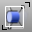 [Select](select-toolbar.html) 
Menus
Edit
Select Objects
Clipping Plane
The SelClippingPlane command selects all clipping planes.

## SelExtrusion
{: #selextrusion}
 [Where can I find this command?](javascript:void(0);) Toolbars
 [Not on toolbars.](toolbarwhattodo.html) 
Menus
Edit
Select Objects
Extrusions
The SelExtrusion command selects all objects created as light-weight extrusions.

## SelHatch
{: #selhatch}
 [Where can I find this command?](javascript:void(0);) Toolbars
 [Not on toolbars.](toolbarwhattodo.html) 
Menus
Edit
Select Objects
Hatches
The SelHatch command selects hatch objects.

## SelLight
{: #sellight}
 [Where can I find this command?](javascript:void(0);) Toolbars
 [Select](select-toolbar.html) 
Menus
Edit
Select Objects
Lights
The SelLight command selects all lights.

## SelMappingWidget
{: #selmappingwidget}
 [Where can I find this command?](javascript:void(0);) Toolbars
 [Not on toolbars.](toolbarwhattodo.html) 
Menus
 [Not on menus.](menuwhattodo.html) 
The SelMappingWidget command selects all texture mapping widgets.

## SelNamedViewWidget
{: #selnamedviewwidget}
 [Where can I find this command?](javascript:void(0);) Toolbars
 [Not on toolbars.](toolbarwhattodo.html) 
Menus
 [Not on menus.](menuwhattodo.html) 
The SelNamedViewWidget command selects all [named view widget](namedview.html#namedviewwidget) objects.

## SelPictureFrame
{: #selpictureframe}
 [Where can I find this command?](javascript:void(0);) Toolbars
 [Select Surfaces](select-surfaces-toolbar.html) 
Menus
 [Not on menus.](menuwhattodo.html) 
The SelPictureFrame command selects all objects created with the PictureFrame command.

## SelPicture
{: #selpicture}
 [Where can I find this command?](javascript:void(0);) Toolbars
 [Select Surfaces](select-surfaces-toolbar.html) 
Menus
 [Not on menus.](menuwhattodo.html) 
The SelPicture command selects all objects created with the Picture command.

# Select curves
{: #curves}

## SelCrv
{: #selcrv}
 [Where can I find this command?](javascript:void(0);) Toolbars
 [Select Curves](select-curves-toolbar.html)  [Select](select-toolbar.html) 
Menus
Edit
Select Objects
Curves
The SelCrv command selects all curves.

## SelShortCrv
{: #selshortcrv}
 [Where can I find this command?](javascript:void(0);) Toolbars
 [Select Curves](select-curves-toolbar.html) 
Menus
 [Not on menus.](menuwhattodo.html) 
The SelShortCrv command selects all curves less than a specified length.

## SelOpenCrv
{: #selopencrv}
 [Where can I find this command?](javascript:void(0);) Toolbars
 [Select Curves](select-curves-toolbar.html) 
Menus
 [Not on menus.](menuwhattodo.html) 
The SelOpenCrv command selects all open curves.

## SelPlanarCrv
{: #selplanarcrv}
 [Where can I find this command?](javascript:void(0);) Toolbars
 [Not on toolbars.](toolbarwhattodo.html) 
Menus
 [Not on menus.](menuwhattodo.html) 
The SelPlanarCrv command selects all planar curves.

## SelClosedCrv
{: #selclosedcrv}
 [Where can I find this command?](javascript:void(0);) Toolbars
 [Select Curves](select-curves-toolbar.html) 
Menus
 [Not on menus.](menuwhattodo.html) 
The SelClosedCrv command selects all closed curves.

## SelChain
{: #selchain}
 [Where can I find this command?](javascript:void(0);) Toolbars
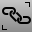 [Select Chain](select-chain-toolbar.html)  [Select](select-toolbar.html) 
Menus
Edit
Select Objects
Chain
The SelChain command selects curve or surface edges that touch end-to-end.
To chain-select objects
Inside a command that accepts chain selection, typechain. [Select](select-objects.html) first chain segment.Chain options
AutoChain
Selecting a curve or surface edge automatically selects all curve segments connected with the level of [continuity](continuity-descriptions.html) set by the ChainContinuity option.
ChainContinuity
Controls the level of [continuity](continuity-descriptions.html) required between segments to be selected with the AutoChain option.
Direction
Forward
Selects curves in the positive curve [direction](dir.html#normaldirection).
Backward
Selects curves in the negative curve [direction](dir.html#normaldirection).
Both
Selects curves in both the positive and negative curve [direction](dir.html#normaldirection).
GapTolerance
If the gap between two edges/curves is less than this value, the chain selection will ignore the gap and will select the next segment.

AngleTolerance
WhenContinuityis set toTangency, if the angle between two edges/curves is less than this value, the chain selection will consider the criteria for continuity met and will select the next segment.

Undo
Undo last segment selection.
Next
Select next segment.
All
Select all segments.

## SelLine
{: #selline}
 [Where can I find this command?](javascript:void(0);) Toolbars
 [Select Curves](select-curves-toolbar.html) 
Menus
Edit
Select Objects
Lines
The SelLine command selects all lines and straight, higher degree curves. For example, a straight degree three curve with four points will be selected, but a degree three curve with five or more points will not be selected.

### SelPolyline
{: #selpolyline}
 [Where can I find this command?](javascript:void(0);) Toolbars
 [Select Curves](select-curves-toolbar.html) 
Menus
Edit
Select Objects
Polylines
The SelPolyline command selects all polylines.

# Select meshes
{: #meshes}

## SelClosedMesh
{: #selclosedmesh}
 [Where can I find this command?](javascript:void(0);) Toolbars
 [Select Meshes](select-meshes-toolbar.html) 
Menus
 [Not on menus.](menuwhattodo.html) 
The SelClosedMesh command selects all closed mesh objects.

## SelMesh
{: #selmesh}
 [Where can I find this command?](javascript:void(0);) Toolbars
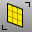 [Select Meshes](select-meshes-toolbar.html)  [Select](select-toolbar.html) 
Menus
Edit
Select Objects
Polygon Meshes
The SelMesh command selects all mesh objects.

## SelNakedMeshEdgePt
{: #selnakedmeshedgept}
 [Where can I find this command?](javascript:void(0);) Toolbars
 [STL Tools](stl-tools-toolbar.html) 
Menus
 [Not on menus.](menuwhattodo.html) 
The SelNakedMeshEdgePt command selects unwelded vertices on polygon mesh edges.
Note
Polygon mesh vertices are not completely surrounded by faces are displayed.Joined meshes, such as those made by the [MeshBox](meshbox.html) command, have naked mesh edge points where the sub-meshes are joined.To eliminate naked mesh edge points, match them in pairs, and then use the [Weld](weld.html) command to make a single mesh that cannot be exploded. Edges that formerly rendered sharp will shade rounded, unless you use the [FlatShade](flatshade.html) command.Command-line option
IncludeUnweldedEdges
The IncludeUnweldedEdges option determines whether points on edges that are unjoined or only naked edge vertices will be included.
This is good for troubleshooting [MatchMeshEdge](matchmeshedge.html).

## SelOpenMesh
{: #selopenmesh}
 [Where can I find this command?](javascript:void(0);) Toolbars
 [Select Meshes](select-meshes-toolbar.html) 
Menus
 [Not on menus.](menuwhattodo.html) 
The SelOpenMesh command selects all open mesh objects.

## SelClosedSubD
{: #selclosedsubd}
 [Where can I find this command?](javascript:void(0);) Toolbars
 [Not on toolbars.](toolbarwhattodo.html) 
Menus
 [Not on menus.](menuwhattodo.html) 
The SelClosedSubD command selects all closed subdivision objects.

## SelOpenSubD
{: #selopensubd}
 [Where can I find this command?](javascript:void(0);) Toolbars
 [Not on toolbars.](toolbarwhattodo.html) 
Menus
 [Not on menus.](menuwhattodo.html) 
The SelOpenSubD command selects all open subdivision objects.

## Select point objects
{: #point}

### InvertPt
{: #invertpt}
 [Where can I find this command?](javascript:void(0);) Toolbars
 [Select Points](select-points-toolbar.html)  [Select](select-toolbar.html) 
Menus
Edit
Control Points
Select Control Points
Invert
The InvertPt command deselects all selected control or edit points and selects all visible control or edit points that were not previously selected.

## SelPt
{: #selpt}
 [Where can I find this command?](javascript:void(0);) Toolbars
 [Select](select-toolbar.html) 
Menus
Edit
Select Objects
Points
The SelPt command selects all point objects.

## SelPtCloud
{: #selptcloud}
 [Where can I find this command?](javascript:void(0);) Toolbars
 [Select](select-toolbar.html) 
Menus
 [Not on menus.](menuwhattodo.html) 
The SelPtCloud command selects all point cloud objects.

# Select polysurfaces
{: #polysurfaces}

## SelPolysrf
{: #selpolysrf}
 [Where can I find this command?](javascript:void(0);) Toolbars
 [Select Polysurfaces](select-polysurfaces-toolbar.html)  [Select](select-toolbar.html) 
Menus
Edit
Select Objects
Polysurfaces
The SelPolysrf command selects all polysurfaces.

## SelClosedPolysrf
{: #selclosedpolysrf}
 [Where can I find this command?](javascript:void(0);) Toolbars
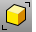 [Select Polysurfaces](select-polysurfaces-toolbar.html) 
Menus
 [Not on menus.](menuwhattodo.html) 
The SelClosedPolysrf command selects all closed polysurfaces.

## SelOpenPolysrf
{: #selopenpolysrf}
 [Where can I find this command?](javascript:void(0);) Toolbars
 [Edge Tools](edge-tools-toolbar.html)  [Select Polysurfaces](select-polysurfaces-toolbar.html) 
Menus
 [Not on menus.](menuwhattodo.html) 
The SelOpenPolysrf command selects all open polysurfaces.

## SelNonManifold
{: #selnonmanifold}
 [Where can I find this command?](javascript:void(0);) Toolbars
 [Not on toolbars.](toolbarwhattodo.html) 
Menus
 [Not on menus.](menuwhattodo.html) 
The SelNonManifold command selects [non-manifold polysurface](non-manifold-edges.html) objects.

# Select surfaces
{: #surfaces}

## SelSrf
{: #selsrf}
 [Where can I find this command?](javascript:void(0);) Toolbars
 [Select](select-toolbar.html)  [Select Surfaces](select-surfaces-toolbar.html) 
Menus
Edit
Select Objects
Surfaces
The SelSrf command selects all surfaces.

## SelClosedSrf
{: #selclosedsrf}
 [Where can I find this command?](javascript:void(0);) Toolbars
 [Select Surfaces](select-surfaces-toolbar.html) 
Menus
 [Not on menus.](menuwhattodo.html) 
The SelClosedSrf command select all closed surfaces.

## SelOpenSrf
{: #selopensrf}
 [Where can I find this command?](javascript:void(0);) Toolbars
 [Select Surfaces](select-surfaces-toolbar.html) 
Menus
 [Not on menus.](menuwhattodo.html) 
The SelOpenSrf command selects all open surfaces.

## SelPlanarSrf
{: #selplanarsrf}
 [Where can I find this command?](javascript:void(0);) Toolbars
 [Not on toolbars.](toolbarwhattodo.html) 
Menus
 [Not on menus.](menuwhattodo.html) 
The SelPlanarSrf command selects all planar surfaces.

## SelSmallSrf
{: #selsmallsrf}
 [Where can I find this command?](javascript:void(0);) Toolbars
 [Not on toolbars.](toolbarwhattodo.html) 
Menus
 [Not on menus.](menuwhattodo.html) 
The SelSmallSrf command selects all surfaces smaller than the specified size.

## SelTrimmedSrf
{: #seltrimmedsrf}
 [Where can I find this command?](javascript:void(0);) Toolbars
 [Select Surfaces](select-surfaces-toolbar.html) 
Menus
 [Not on menus.](menuwhattodo.html) 
The SelTrimmedSrf command selects all trimmed surfaces.

## SelUntrimmedSrf
{: #seluntrimmedsrf}
 [Where can I find this command?](javascript:void(0);) Toolbars
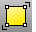 [Select Surfaces](select-surfaces-toolbar.html) 
Menus
 [Not on menus.](menuwhattodo.html) 
The SelUntrimmedSrf command selects all untrimmed surfaces.

# Select by object properties
{: #properties}

## SelColor
{: #selcolor}
 [Where can I find this command?](javascript:void(0);) Toolbars
 [Select](select-toolbar.html) 
Menus
Edit
Select Objects
By Color
The SelColor command selects all objects of a specified color. Objects enclosed in [block instances](block.html) or [groups](group.html) are not selected.
Command-line options
Color
Select a color from the [Select Color](select-color.html) dialog box.
RGB
Select color using red, green, blue values.

## SelID
{: #selid}
 [Where can I find this command?](javascript:void(0);) Toolbars
 [Select](select-toolbar.html) 
Menus
 [Not on menus.](menuwhattodo.html) 
The SelID command selects objects by object ID number.

## SelLinetype
{: #sellinetype}
 [Where can I find this command?](javascript:void(0);) Toolbars
 [Select Curves](select-curves-toolbar.html) 
Menus
 [Not on menus.](menuwhattodo.html) 
The SelLinetype command selects objects with the specified linetype.

## SelMaterialName
{: #selmaterialname}
 [Where can I find this command?](javascript:void(0);) Toolbars
 [Not on toolbars.](toolbarwhattodo.html) 
Menus
 [Not on menus.](menuwhattodo.html) 
The SelMaterialName command selects objects with the same render material name assigned [by object](material.html#assignbyobject) or [by layer](material.html#assignbylayer).
Steps
Click **Select** in the dialog box to select an object with the material assigned.
## SelName
{: #selname}
 [Where can I find this command?](javascript:void(0);) Toolbars
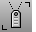 [Select](select-toolbar.html) 
Menus
Edit
Select Objects
By Object Name
The SelName command selects object by name.
Steps
Choose from the list or click **Select** to select an object with the target name.Objects on hidden or locked layers cannot be selected withSelName.
## SelRenderColor
{: #selrendercolor}
 [Where can I find this command?](javascript:void(0);) Toolbars
 [Not on toolbars.](toolbarwhattodo.html) 
Menus
 [Not on menus.](menuwhattodo.html) 
The SelRenderColor command selects objects by their (diffuse) render color. Objects enclosed in [block instances](block.html) are not selected. Objects enclosed in [groups](group.html) are selected.
Options
Color
Select a color from the [Select Color](select-color.html) dialog box.
RGB
Select color using red, green, blue values.

# Select blocks, layers, and groups
{: #blocks}
{: #layersgroups}

## SelBlockInstance
{: #selblockinstance}
 [Where can I find this command?](javascript:void(0);) Toolbars
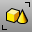 [Select](select-toolbar.html) 
Menus
Edit
Select Objects
Block Instances
The SelBlockInstance command selects all block instances.

## SelBlockInstanceNamed
{: #selblockinstancenamed}
 [Where can I find this command?](javascript:void(0);) Toolbars
 [Select](select-toolbar.html) 
Menus
Edit
Select Objects
By Block Name
The SelBlockInstanceNamed command selects all block instances of a specified name.

## SelGroup
{: #selgroup}
 [Where can I find this command?](javascript:void(0);) Toolbars
 [Select](select-toolbar.html) 
Menus
Edit
Select Objects
By Group Name
The SelGroup command selects a group by name

## SelLayer
{: #sellayer}
 [Where can I find this command?](javascript:void(0);) Toolbars
 [Select](select-toolbar.html) 
Menus
Edit
Select Objects
By Layer
The SelLayer command selects all objects on a layer.
Steps
Click **Select** in the dialog box to select an object on the layer.When using the script version -SelLayer, separate sublayer names from parent names with double colons (::) in the form *&lt;ParentLayer&gt;::&lt;Sublayer&gt;*. If the layer names contain spaces, surround the names with quote marks.Command-line option
Select
Allows selecting an object in the model to specify the layer.

## SelLayerNumber
{: #sellayernumber}
 [Where can I find this command?](javascript:void(0);) Toolbars
 [Select](select-toolbar.html) 
Menus
 [Not on menus.](menuwhattodo.html) 
The SelLayerNumber command selects objects by layer number.
Note
The number of the first layer is zero.Each layer has a number that is assigned to it for a Rhino editing session.The numbers may change when the model is closed and then reopened.This number has nothing to do with the order the layers appear in the layer dialog box.Deleted layers keep their number.
# Select cage objects
{: #cages}

## SelCaptives
{: #selcaptives}
 [Where can I find this command?](javascript:void(0);) Toolbars
 [Cage](cage-toolbar.html) 
Menus
 [Not on menus.](menuwhattodo.html) 
The SelCaptives command selects captive objects set up using the [CageEdit](cageedit.html) command.

## SelControls
{: #selcontrols}
 [Where can I find this command?](javascript:void(0);) Toolbars
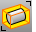 [Cage](cage-toolbar.html) 
Menus
 [Not on menus.](menuwhattodo.html) 
The SelControls command selects cage control objects set up using the [CageEdit](cageedit.html) command.

# Select objects with history
{: #history}

## SelObjectsWithHistory
{: #selobjectswithhistory}
 [Where can I find this command?](javascript:void(0);) Toolbars
 [History](history-toolbar.html)  [Select History](select-history-toolbar.html)  [Select](select-toolbar.html) 
Menus
Edit
Select Objects
History
Objects with History
The SelObjectsWithHistory command selects objects that have history.

## SelChildren
{: #selchildren}
 [Where can I find this command?](javascript:void(0);) Toolbars
 [Select History](select-history-toolbar.html)  [History](history-toolbar.html) 
Menus
Edit
Select Objects
History
Children
The SelChildren command selects child objects of the currently selected objects.

## SelParents
{: #selparents}
 [Where can I find this command?](javascript:void(0);) Toolbars
 [Select History](select-history-toolbar.html)  [History](history-toolbar.html) 
Menus
Edit
Select Objects
History
Parents
The SelParents command selects parent objects of the currently selected objects.

## Select by action order
{: #actionorder}

## SelLast
{: #sellast}
 [Where can I find this command?](javascript:void(0);) Toolbars
 [Select](select-toolbar.html) 
Menus
Edit
Select Objects
Last Created Objects
The SelLast command selects the last changed objects, including importing objects.
Command-line option
To access hidden command-line options
Type ahyphenin front of the command name:-SelLast.DeselectOthersBeforeSelect
Deselect currently selected objects before selecting the last changed objects.

## SelPrev
{: #selprev}
 [Where can I find this command?](javascript:void(0);) Toolbars
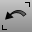 [Select](select-toolbar.html) 
Menus
Edit
Select Objects
Previous Selection
The SelPrev command re-selects the previous selection set.
Command-line option
To access hidden command-line options
Type ahyphenin front of the command name:-SelPrev.DeselectOthersBeforeSelect
Deselect currently selected objects before selecting the previous objects.

# Select duplicate objects
{: #duplicates}

## SelDup
{: #seldup}
 [Where can I find this command?](javascript:void(0);) Toolbars
 [Select](select-toolbar.html) 
Menus
Edit
Select Objects
Duplicate Objects
The SelDup command selects objects that are geometrically identical with another object, visible, and in the same location regardless of other object properties.

## SelDupAll
{: #seldupall}
 [Where can I find this command?](javascript:void(0);) Toolbars
 [Select](select-toolbar.html) 
Menus
 [Not on menus.](menuwhattodo.html) 
The SelDupAll command selects all visible objects that are geometrically identical, including the original.
Since this command selects both the copies and the originals, it lets you find objects that have been changed by comparing a before and after version of the model.
Compare to the [SelDup](#seldup) command, which selects all visible objects that are geometrically identical, excluding the original.
See also
 [Select objects](sak-selectobjects.html) 
 [Edit objects using control points](sak-pointediting.html).
&#160;
&#160;
Rhinoceros 6  2010-2015 Robert McNeel &amp; Associates.11-Nov-2015
 [Open topic with navigation](selection-commands.html) 

