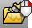

---
---

{: #kanchor2758}{: #kanchor2759}{: #kanchor2760}
# Selection Menu
 [Where can I find this command?](javascript:void(0);) Toolbars
 [Properties](properties-toolbar.html)  [Standard](standard-toolbar.html)  [Tools](tools-toolbar.html) 
Menus
Tools
Options
Selection Menu options control the location and appearance of the Selection Menu that appears when more than one object occupies the pick area.
Selection Menu
To set options from the Selection Menu
 [Right click](right-mouse-click.html) the Selection Menu title bar.Dialog placement
Specifies the location where the menu will display.
Follow cursor
The Selection Menu appears at the cursor. If this setting is off, the Selection Menu will always appear in the last position it was placed.
X offset/Y offset ___ pixels
Specifies the amount in pixels in the x and y&#160;directions the Selection Menu will be away from the cursor.
Dialog height
Specifies the number of objects that display in the Selection Menu.
Automatic height
Expands the menu until all objects are displayed or the number specified in theMax automatic heightsetting is reached.
Max automatic height ___ items
The maximum number of object to be displayed when theAutomatic heightsetting is selected.
Dialog appearance
Show titlebar and border
Specifies the display of the title bar and border.
Turn off to save space.
Right-click to set options.
Items
Specifies the object descriptions that display in the menu.
Show object name/type
Displays the object name if it has one, otherwise displays the object type.
Show object type/layer/color
Displays the object type, layer, or color.
Show object type details *(curves only)* 
Displays the type of object when possible: polyline, joined, line, linear, circle, arc, elliptic, hyperbolic, parabolic.
Show "All" option
Allows selecting all of the objects listed in the Selection Menu.
Highlight
Dynamic highlight
Controls whether the objects highlight or not as you move the mouse over the items in the selection menu.
Custom highlight color
Sets the object's highlight color while moving the mouse cursor in theSelection Menu.
Highlight color
Click to select a custom color for the highlighted objects.
To save options for use on other computers
 [OptionsExport](optionsexport.html) 
Save [Options](options.html) settings to a file.
 [OptionsImport](optionsexport.html#optionsimport) 
Restore [Options](options.html) settings from a file.
See also
 [Options](options.html) 
Manage global options: [3D mouse](3dconnexion.html), [alerter](alerter.html), [aliases](aliases.html), [appearance](appearance.html), [context menu](context-menu.html), [display modes](view-displaymode-options.html), [files](files.html), [general](general.html), [idle processor](idleprocessor.html), [keyboard](keyboard.html), [libraries](libraries.html), [licenses](licenses.html), [modeling aids](modeling-aids.html), [mouse](mouse.html), [plug-ins](plug-ins.html), [render](rendering.html), [RhinoScript](rhinoscript.html), [selection menu](#), [toolbars](toolbars.html), [updates and statistics](updates-and-statistics.html), [view](view.html).
&#160;
&#160;
Rhinoceros 6 © 2010-2015 Robert McNeel &amp; Associates.11-Nov-2015
 [Open topic with navigation](selection-menu.html) 

