---
---

# SetView
{: #kanchor1666}
 [Where can I find this command?](javascript:void(0);) Toolbars
 [Set View](set-view-toolbar.html) 
Menus
View
 [Viewport title](rhino-window.html#viewport-title-menu) 
Set View
The SetView command changes the view to a standard view (top, bottom, left, right, front, back, perspective, or two-point perspective) of the current construction plane or the world coordinate system.
Steps
 [Specify a command line option.](specifycommandlineoption.html) Options
CPlane{: #kanchor1667}{: #kanchor1668}
Sets the active view (camera, target, etc.) to a plan view based on one of Rhino's pre-defined construction planes (Back, Bottom, Front, Left, Right, and Top). The view's projection is not modified, and this option does not update the view's construction plane. Since there is no definition for a Perspective construction plane, there is no Perspective option. The following illustrations show views of the Right construction plane.
Top{: #cplanetop}{: #kanchor1669}
Sets the view to look at the Top of the current construction plane.
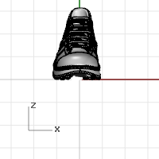
Bottom{: #cplanebottom}{: #kanchor1670}
Sets the view to look at the bottom of the current construction plane.
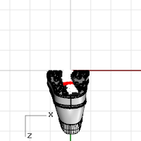
Front{: #cplanefront}{: #kanchor1671}
Sets the view to look at the Front of the current construction plane.
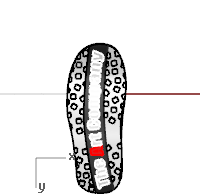
Back{: #cplaneback}{: #kanchor1672}
Sets the view to look at the back of the current construction plane.
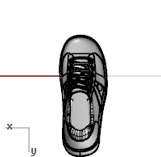
Right{: #cplaneright}{: #kanchor1673}
Sets the view to look at the Right of the current construction plane.
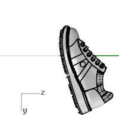
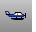Left{: #cplaneleft}{: #kanchor1674}
Sets the view to look at the Left of the current construction plane.

World{: #kanchor1675}
Sets the active view (camera, target, etc.) to one of Rhino's pre-defined view orientations (Back, Bottom, Front, Left, Right, Top, and Perspective). Also, the view's projection is modified to match the pre-defined view orientation.
In addition to setting the view orientation, the World options also modify the active view's construction plane, setting it to the corresponding, pre-defined construction plane. The exception to this is the Perspective option, which sets only the view orientation and projection to Rhino's pre-defined Perspective view and does not modify the view's construction plane.
Top{: #worldtop}
Sets the view to look at the Top of the world view.
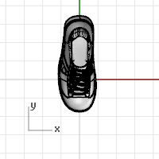
Bottom{: #worldbottom}
Sets the view to look at the Bottom of the world view.
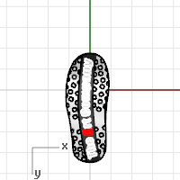
Front{: #worldfront}
Sets the view to look at the Front of the world view.
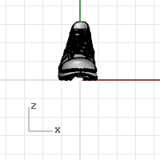
Back{: #worldback}
Sets the view to look at the Back of the world view.
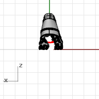
Right{: #worldright}
Sets the view to look at the Right of the world view.
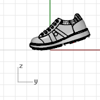
Left{: #worldleft}
Sets the view to look at the Left of the world view.
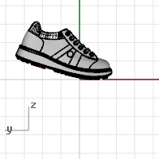
Perspective{: #kanchor1676}{: #worldperspective}
Sets the view to look at a world view in perspective mode.
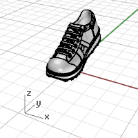
Two Point Perspective
Sets the view to look at a world view in two-point perspective mode.
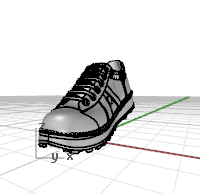

# Plan
{: #kanchor1678}
{: #kanchor1677}
{: #plan}
 [Where can I find this command?](javascript:void(0);) Toolbars
 [Set View](set-view-toolbar.html) 
Menus
View [Viewport title](rhino-window.html#viewport-title-menu) 
Set View
Plan
The Plan command sets the active view aligned down toward the current construction plane at 0,0, and sets the viewport projection to parallel.
See also
 [Navigate in the viewports](sak-navigate.html) 
&#160;
&#160;
Rhinoceros 6 © 2010-2015 Robert McNeel &amp; Associates.11-Nov-2015
 [Open topic with navigation](setview.html) 

