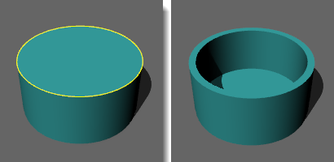
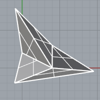
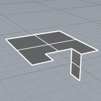
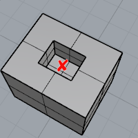

---
---

{: #kanchor1983}
# Shell
 [Where can I find this command?](javascript:void(0);) Toolbars
 [Not on toolbars.](toolbarwhattodo.html) 
Menus
 [Not on menus.](menuwhattodo.html) 
The Shell command creates a hollowed out shell from a solid.
Shell only operates on simple, solid, [manifold](non-manifold-edges.html) polysurfaces. These surfaces are removed and the remainder is offset inward, using the outer parts of the removed surfaces to join the inner and outer parts.
Steps
 [Select](select-objects.html) faces to remove from closed polysurface.Leave at least one face unselected.Press [Enter](enter-key.html) when doneThis step specifies which surfaces will be removed to make the shelled object.
The top surface of the cylinder was selected for removal.
Command-line option
Thickness
Specifies the thickness for the shell.

### Troubleshoot shelling
 [Shell](#) and [OffsetSrf](offsetsrf.html) for polysurfaces are works in progress. There are several known problem areas:
Singular surfaces can cause problems, especially when the offset of the surface must be extended at the singularity. The extensions are done in [OffsetSrf](offsetsrf.html) (Corner= *Sharp* ) and shelling, which always uses sharp corners. These extensions happen when the offsets of adjacent surfaces come apart. Also, cone-like singularities cause problems in all cases.Complex vertices (ones with more than three edges) can be problematic, especially in shelling and sharp corner offsets and where some, but not all, of the surfaces at the vertex offset apart. [OffsetSrf](offsetsrf.html) on polysurfaces with naked edges, where the naked edges make concave boundaries will not work correctly.If faces adjacent to the removed faces offset in such a way that the removed face must be extended to fill in the gap, it will fail.Any surface whose offset self-intersects will cause a problem.See also
 [Edit solid objects](sak-solidtools.html) 
&#160;
&#160;
Rhinoceros 6 © 2010-2015 Robert McNeel &amp; Associates.11-Nov-2015
 [Open topic with navigation](shell.html) 

