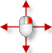
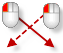
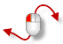

---
---

{: #kanchor2510}{: #kanchor2511}{: #kanchor2512}{: #kanchor2513}{: #kanchor2514}{: #kanchor2515}{: #kanchor2516}{: #kanchor2517}{: #kanchor2518}{: #kanchor2519}{: #kanchor2520}{: #kanchor2521}{: #kanchor2522}
# Shortcuts by function
To view or change keyboard shortcuts
In [Keyboard Options](keyboard.html), type a shortcut for a key.Note
Rhino menus list the default keyboard shortcuts. If you change a command to a different shortcut, the menus do not update to reflect this change.Many of these shortcuts can be changed and you can add new shortcuts and aliases.See: [Aliases Options](aliases.html), [Keyboard Options](keyboard.html), and [Mouse Options](mouse.html).

## Navigation shortcuts
{: #navigation}
{: #shortcuts-by-key}

 [Rotate](rotateview.html) (tumble) perspective views.
 [Pan](pan.html) parallel views.
 [Shift](shift-key.html) +
Press [Shift](shift-key.html) to constrain to view rotation to horizontal or vertical.
The direction is determined by the relative location of the cursor to the point where the right mouse button was pressed down. If the cursor is more to the left or right than up or down, the rotation is locked horizontally, and vice versa.
(Wheel)
 [Zoom](zoom.html) view in/out.
(Click)
 [Pop up toolbar](popuptoolbar.html).
 [Ctrl](ctrl-key.html) +Tab
 [Next viewport active](nextviewport.html). Cycles through layout pages if a layout is active and through model viewports if model space is active.
 [Ctrl](ctrl-key.html) +PageDn
 [Pan](pan.html) view out.
 [Ctrl](ctrl-key.html) +PageUp
 [Pan](pan.html) view in.
 [Alt](alt-key.html) +
 [Pan](pan.html) view in/out.
 [Alt](alt-key.html) +
 [Pan](pan.html) view in/out.
 [Shift](shift-key.html) +
 [Pan](pan.html) any view.
 [Ctrl](ctrl-key.html) +
 [Zoom](zoom.html) view in/out.
 [Shift](shift-key.html) + [Alt](alt-key.html) +
 [TiltView](tiltview.html).
 [Ctrl](ctrl-key.html) + [Shift](shift-key.html) +PageDn
 [TiltView](tiltview.html) right.
 [Ctrl](ctrl-key.html) + [Shift](shift-key.html) +PageUp
 [TiltView](tiltview.html) left.
 [Ctrl](ctrl-key.html) + [Shift](shift-key.html) + [Alt](alt-key.html) +
Adjust camera [lens length](viewport.html#lens-length) in a perspective view.
 [Shift](shift-key.html) + [Alt](alt-key.html) +PageUp
Adjust camera [lens length](viewport.html#lens-length) in a perspective view (toward telephoto).
 [Shift](shift-key.html) + [Alt](alt-key.html) +PageUp
Adjust camera [lens length](viewport.html#lens-length) in a perspective view (toward wide angle).
 [Ctrl](ctrl-key.html) + [Alt](alt-key.html) +
+ [Shift](shift-key.html) 
 [RotateCamera](rotatecamera.html) 
In addition, press [Shift](shift-key.html) to lock the camera rotation horizontally or vertically.
The direction is determined by the relative location of the cursor to the point where the right mouse button was pressed down. If the cursor is more to the left or right than up or down, the rotation is locked horizontally, and vice versa.
 [Ctrl](ctrl-key.html) + [Shift](shift-key.html) +
Adjust camera [lens length](viewport.html#lens-length) in a perspective view.
 [Ctrl](ctrl-key.html) + [Shift](shift-key.html) +
{: #forceviewtumble}Force parallel view to [rotate](rotateview.html).
 [Ctrl](ctrl-key.html) + [Shift](shift-key.html) +
+ [Shift](shift-key.html) 
Constrain to view rotation to horizontal or vertical.
Release [Ctrl](ctrl-key.html) or [Shift](shift-key.html) while rotating, and then press [Shift](shift-key.html) again to lock the direction.

## Selection

Add object to selection.
 [Shift](shift-key.html) +
Add [crossed](selection-commands.html#selcrossing) / [windowed](selection-commands.html#selwindow) objects to selection.
 [Ctrl](ctrl-key.html) + [Shift](shift-key.html) +
 [Select](selection-commands.html#sub-object-selection) polysurface/surface faces, edges, boundaries, mesh faces or edges, and objects within groups.
 [Ctrl](ctrl-key.html) +
 [Remove](selection-commands.html#removeobjects) object from selection.
 [Ctrl](ctrl-key.html) +
 [Remove](selection-commands.html#removeobjects)  [crossed](selection-commands.html#crossingselection) / [windowed](selection-commands.html#selwindow) objects from selection.

## Toolbars
 [Ctrl](ctrl-key.html) 
Press [Ctrl](ctrl-key.html) while dragging a toolbar to prevent [toolbar docking](using-toolbars.html#dockfloated).
+
 [Link](using-toolbars.html#linkbydragging) toolbar button.
 [Ctrl](ctrl-key.html) +
 [Copy](using-toolbars.html#copybutton) toolbar button.

## Default keyboard shortcut assignments
F1= [Help](help.html) 
F2= [CommandHistory](commandhistory.html) 
F3= [Properties](properties.html) 
F6=Toggle [Camera](camera.html) 
F7= [Grid](grid.html) &gt; ShowGrid &gt; ShowGridAxes
F8=Toggle [Ortho](ortho.html) 
F9=Toggle [Snap](snap.html) 
F10= [Points On](pointson.html#pointson) 
F11= [Points Off](pointson.html#pointsoff) 
F12= [Dig Click](digitize.html#digclick) 
Ctrl+F1= [SetMaximizedViewport](setmaximizedviewport.html) &gt; Top
Ctrl+F2= [SetMaximizedViewport](setmaximizedviewport.html) &gt; Front
Ctrl+F3= [SetMaximizedViewport](setmaximizedviewport.html) &gt; Right
Ctrl+F4= [SetMaximizedViewport](setmaximizedviewport.html) &gt; Perspective
Ctrl+A= [SelAll](selection-commands.html) 
Ctrl+B= [Block](block.html) 
Ctrl+C= [CopyToClipboard](copytoclipboard.html) 
Ctrl+F= [FindText](findtext.html) 
Ctrl+G= [Group](group.html) 
Ctrl+H= [Hide](hide.html) 
Ctrl+I= [Insert](insert.html) 
Ctrl+J= [Join](join.html) 
Ctrl+L= [Lock](lock.html) 
Ctrl+M= [MaxViewport](maxviewport.html) 
Ctrl+N= [New](new.html) 
Ctrl+O= [Open](open.html) 
Ctrl+P= [Print](print.html) 
Ctrl+S= [Save](save.html) 
Ctrl+T= [Trim](trim.html) 
Ctrl+V= [Paste](paste.html) 
Ctrl+W= [Zoom](zoom.html) 
Ctrl+X= [Cut](cut.html) 
Ctrl+Y= [Redo](undo.html#redo) 
Ctrl+Z= [Undo](undo.html) 
Ctrl+Shift+E= [Zoom](zoom.html) &gt; Extents
Ctrl+Shift+G= [Ungroup](group.html) 
Ctrl+Shift+H= [ShowSelected](hide.html#showselected) 
Ctrl+Shift+L= [UnlockSelected](lock.html#unlockselected) 
Ctrl+Shift+S= [Split](split.html) 
Ctrl+Alt+E= [Zoom](zoom.html) All Extents
Ctrl+Alt+G= [SetDisplayMode](setdisplaymode.html) Ghosted
Ctrl+Alt+H= [Show](hide.html#show) 
Ctrl+Alt+L= [Unlock](lock.html#unlock) 
Ctrl+Alt+R= [SetDisplayMode](setdisplaymode.html) &gt; Rendered
Ctrl+Alt+S= [SetDisplayMode](setdisplaymode.html) &gt; Shaded
Ctrl+Alt+W= [SetDisplayMode](setdisplaymode.html) &gt; Wireframe
Ctrl+Alt+X= [SetDisplayMode](setdisplaymode.html) &gt; XRay
Home= [UndoView](undoview.html) 
End= [RedoView](undoview.html#redoview) 
Shift+Home= [CPlane](cplane.html#undo) &gt; Undo
Shift+End= [CPlane](cplane.html#redo) &gt; Redo
Shift+Page+Up= [ZoomLens](zoom.html#zoomlens) &gt; In
Shift+Page+Down= [ZoomLens](zoom.html#zoomlens) &gt; Out
Ctrl+Page+Up= [Pan](pan.html) &gt; In
Ctrl+Page+Down= [Pan](pan.html) &gt; Out
Shift+Ctrl+PageUp= [TiltView](tiltview.html) &gt; Left
Shift+Ctrl+PageDown= [TiltView](tiltview.html) &gt; Right
&#160;
&#160;
Rhinoceros 6 © 2010-2015 Robert McNeel &amp; Associates.11-Nov-2015
 [Open topic with navigation](shortcuts.html) 

