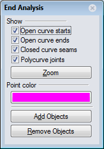
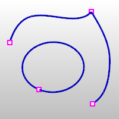

---
---

{: #kanchor2001}{: #kanchor2002}{: #kanchor2003}{: #kanchor2004}{: #kanchor2005}{: #kanchor2006}{: #kanchor2007}
# ShowEnds
 [Where can I find this command?](javascript:void(0);) Toolbars
 [Analyze](analyze-toolbar.html) 
Menus
 [Not on menus.](menuwhattodo.html) 
The ShowEnds command opens the End Analysis control and displays the endpoints of curves.
Steps
 [Select](select-objects.html) curve objects.Points display on the object.End Analysis options
Right-click once to set one option and clear all others.Right-click twice to set all options.Show
Open curve starts
Displays a point display marker at the start of open curves.
Open curve ends
Displays a point display marker at the end of open curves.
Closed curve seams
Displays a point display marker at the seams of closed curves such as circles.
Polycurve joints
Displays a point display marker at the join location of polycurve segments.
 **Zoom** 
Zooms to include the display marker locations.
Zoom options
All
Zooms to include all end display markers.
Current
Zooms to the first end display marker in the selection. This useful if you zoom out with the mouse and want to zoom back in.
Next
Zooms to the next end display marker in the selection. If the selected objects have only one end marker, this option is not displayed.
Previous
Zooms to the previous end display marker in the selection. If the selected objects have only one end marker, this option is not displayed.
Mark
Marks the ends with point objects. If theAlloption was previously selected, all ends are marked.
Point color
Set the display color for the display markers.
  
 **Add Objects** 
Add objects to theEnd Analysisdisplay.
 **Remove Objects** 
Remove objects from theEnd Analysisdisplay.

# ShowEndsOff
{: #showends}
 [Where can I find this command?](javascript:void(0);) Toolbars
 [Analyze](analyze-toolbar.html) 
Menus
 [Not on menus.](menuwhattodo.html) 
The ShowEndsOff command closes the End Analysis control and turns off end display points.

# ZoomEnds
{: #zoomends}
 [Where can I find this command?](javascript:void(0);) Toolbars
 [Not on toolbars.](toolbarwhattodo.html) 
Menus
 [Not on menus.](menuwhattodo.html) 
The ZoomEnds command finds and curve ends.
Steps
 [Select](select-objects.html) objects.The active view zooms to display the curve end.ZoomEnds options
All
Zooms to include all end display markers.
Current
Zooms to the first end display marker in the selection. This useful if you zoom out with the mouse and want to zoom back in.
Next
Zooms to the next end display marker in the selection. If the selected objects have only one end marker, this option is not displayed.
Previous
Zooms to the previous end display marker in the selection. If the selected objects have only one end marker, this option is not displayed.
Mark
Marks the ends with [point objects](point.html). If theAlloption was previously selected, all ends are marked.
See also
 [Analyze objects](sak-analysis.html) 
 [Manage object visibility](sak-visibility.html) 
&#160;
&#160;
Rhinoceros 6 © 2010-2015 Robert McNeel &amp; Associates.11-Nov-2015
 [Open topic with navigation](showends.html) 

