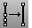

---
---

{: #kanchor2032}
# SimplifyCrv
 [Where can I find this command?](javascript:void(0);) Toolbars
 [Curve Tools](curve-tools-toolbar.html) 
Menus
Curve
Curve Edit Tools
Simplify Lines and Arcs
The SimplifyCrv command replaces each curve segment that has the geometry of a line or an arc with a true line or arc.
Note
SimplifyCrv also combines consecutive co-linear and co-circular segments. [NURBS](http://www.rhino3d.com/nurbs) curves are broken apart at [knot](knot.html) .Tangent joins are tuned up to meet tangent with machine precision.Steps
 [Select](select-objects.html) curves.See also
 [Edit curves](sak-curvetools.html) 
&#160;
&#160;
Rhinoceros 6 © 2010-2015 Robert McNeel &amp; Associates.11-Nov-2015
 [Open topic with navigation](simplifycrv.html) 

