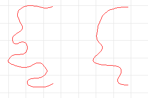

---
---

{: #kanchor2041}
# Smooth
 [Where can I find this command?](javascript:void(0);) Toolbars
 [Geometry Fix](geometry-fix-toolbar.html)  [Transform](transform-toolbar.html) 
Menus
Transform
Smooth
The Smooth command averages the positions of curve and surface [control points](controlpoint.html) and [control point](meshvertex.html) in a specified region.
The Smooth command evens out the spacing of selected control points in small increments. This command is useful for removing unwanted detail, and for removing loops in curves and surfaces.
On mesh objects use the [Weld](weld.html) command before smoothing in order to prevent the mesh from pulling apart.

Steps
 [Select](select-objects.html) curves, meshes, or surfaces to smooth and press [Enter](enter-key.html) .The selected entities will appear to melt, losing detail due to the averaging of the positions of the control points.To smooth part of a curve or surface
 [Select](select-objects.html) a curve, surface, or mesh to smooth.To smooth a region, [turn on control points](pointson.html), and select the control points in the region of the object to smooth.Start the Smooth command.Click the check boxes for the coordinate directions and adjust the Smooth factor.The selected control points will move slightly, smoothing the curve or surface.To set one check box and clear the others
 [Right-click](mouse-buttons.html) the check box you want to check.Smooth Options
Smooth X / Y / Z
Smooths only in the specified x, y, or z&#160;direction.
Shortcuts
Right-click a checkbox once to set one direction option and clear all others.Right-click a checkbox twice to set all direction options.Fix Boundaries
Prevents edges and endpoints from being included.
Meshes: Vertices along naked edges will not be modified.
Curves: End control points will not be modified.
Surfaces: The control points along the boundaries of the surface will not be modified. The edges and trims of trimmed surfaces will be modified if they do not coincide with the surface boundary.
Note
If all of the object control points are selected, Rhino perceives this as the whole object being selected.Fix Boundaries may cause undesirable seams or singularities in closed curves and surfaces.World / CPlane / Object coordinates
Use [world](unit-systems.html#world-coordinates) or [construction plane](unit-systems.html#construction-plane-coordinates) or object u, v, and n coordinates to determine the direction of the smoothing.
Smooth factor per step
Sets an amount of smoothing.
0 to 1
The curve control point toward the average.
Greater than 1
The curve control point moves past the average.
Negative
The curve control point moves away from the average (roughing).
Number of smooth steps
Specifies the number of steps to iterate the smoothing factor through.
Note
Many steps and small factor are preferable to setting the factor above 1.Setting the factor to 1 means the original control point locations are ignored, the new locations then are the average of the neighboring points.See also
 [Edit curves](sak-curvetools.html) 
 [Edit surfaces](sak-surfacetools.html) 
&#160;
&#160;
Rhinoceros 6 © 2010-2015 Robert McNeel &amp; Associates.11-Nov-2015
 [Open topic with navigation](smooth.html) 

