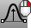

---
---

{: #kanchor2043}
# SoftEditSrf
 [Where can I find this command?](javascript:void(0);) Toolbars
 [Move](move-toolbar.html) 
Menus
Surface
Surface Edit Tools
Soft Edit
The SoftEditSrf command moves the surface area surrounding the selected point smoothly relative to the distance from selected point.
Note
Editing is done by moving the selected point.This location on the surface is moved, and the move is smoothly tapered off with increasing distance along the surface from this point.Steps
 [Select](select-objects.html) a surface.Click a base point.Pick a point to move to.Press [Enter](enter-key.html) to end the command.Note
The selection point snaps to the closest edit point.Corresponding control points of the curve/surface are moved.Command-line options
U_Distance/V_Distance
Distance in the u or v&#160;direction influenced by the move.
Your browser does not support the video tag.Copy
The Copy option specifies whether or not the objects are copied. A plus signappears at the cursor when copy mode is on.
The [RememberCopyOptions](remembercopyoptions.html) command determines whether the selected option is used as the default.
FixEdges
Keeps edge locations fixed.
Your browser does not support the video tag.DirConstraint
Constrains the direction of the move.
None
Allows free movement.
SrfNormal
Constrains movement [normal](curvesurfacedirection.html) to the surface.
UTangent
Constrains the surface tangent to the surface u&#160; [direction](curvesurfacedirection.html).
VTangent
Constrains the surface tangent to the surface v&#160; [direction](curvesurfacedirection.html).
See also
 [Edit surfaces](sak-surfacetools.html) 
&#160;
&#160;
Rhinoceros 6 © 2010-2015 Robert McNeel &amp; Associates.11-Nov-2015
 [Open topic with navigation](softeditsrf.html) 

