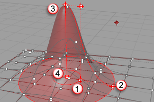

---
---

{: #kanchor2044}
# SoftMove
 [Where can I find this command?](javascript:void(0);) Toolbars
 [Move](move-toolbar.html) 
Menus
Transform
Soft Move
The SoftMove command moves objects relative to a base or reference location of the move with a falloff curve.
Note
Allows smooth editing of dense points. The command works on all objects, but is most useful for control points or mesh points.TheSoftMovecommand works on selected objects. To work on all points in a curve or surface that fall within a given distance from the edit point use the [SoftEditCrv](softeditcrv.html) and [SoftEditSrf](softeditsrf.html) commands.Steps
 [Select](select-objects.html) objects. [Pick](pick-location.html) the point to move from or click an object type option.Pick the radius of influence.Pick the offset. [Specify a command line option](specifycommandlineoption.html), or press [Enter](enter-key.html) to end the command.Your browser does not support the video tag.Object Type options
Points
Select point objects as basis for the move. The falloff curve is based on each selected point and acts through a sphere of radius set by the user.
Your browser does not support the video tag.Curves
Select curves as basis for the falloff curve. The falloff is applied radially along the curve creating a tube-shaped volume where the move is active.
Your browser does not support the video tag.Surfaces
Select surfaces to radiate the falloff curve and influence the move. The reference surface forms the tip of the falloff dome and the falloff curve is active across the edges of the surface over the set radius.
Your browser does not support the video tag.Interactive manipulation
Drag the inner circle (1) to the falloff distance.Drag the outer circle (2) to change the radius of influence (fall-off/inner circle will drag proportionally).Drag the point (3) at the top of the dome to change the offset amount.Drag the point at the base of the dome to change the base point.
Falloff (1), radius (2), offset (3), anchor (4).
Command-line options
Vertical
Moves objects vertical to the construction plane.
Copy
The Copy option specifies whether or not the objects are copied. A plus signappears at the cursor when copy mode is on.
The [RememberCopyOptions](remembercopyoptions.html) command determines whether the selected option is used as the default.
LinkAll
Ties the falloff, radius, offset, and anchor to each other so changing one, changes the others.
See also
 [Move objects](sak-move.html) 
 [Transform objects](sak-transform.html) 
&#160;
&#160;
Rhinoceros 6 © 2010-2015 Robert McNeel &amp; Associates.11-Nov-2015
 [Open topic with navigation](softmove.html) 

