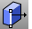

---
---

# Solid Editing toolbar
{: #kanchor2378}
 [To open a toolbar](javascript:void(0);) Toolbars can be opened as a free-standing group or added to the current group.
To open a toolbar as a free-standing group
Click theOptionsicon in any toolbar group.On the menu, clickShow Toolbar, and then select the toolbar name from the list.To open a toolbar as a new tab in the current group
Click theOptionsicon in the toolbar group where you want to add the new tab.On the menu, clickShow or Hide Tabs, and then select the toolbar name from the list. [Extrude,face](extrudesrf.html) 
Drive a surface face in a straight line to create a solid.
 [Extrude,face along a curve](extrudesrfalongcrv.html) 
Drive surface edges along a path curve to create a solid.
 [Extrude,face *ToBoundary* ](extrudesrf.html) 
Drive surface edges in a straight line to a boundary.
 [FoldFace](foldface.html) 
Rotate polysurface faces around an axis.
 [MergeFace](mergeface.html) 
Combine co-planar polysurface faces.
 [MergeAllFaces](mergeallfaces.html) 
Combine all co-planar polysurface faces.
 [MoveEdge](moveedge.html) 
Move a polysurface edge.
 [MoveUntrimmedEdge](moveuntrimmededge.html) 
Move the edge of an untrimmed polysurface face.
 [MoveFace](moveface.html) 
Move a polysurface face.
 [MoveUntrimmedFace](moveuntrimmedface.html) 
Move an untrimmed polysurface face.
 [MoveFace, *ToBoundary* ](moveface.html) 
Move a polysurface face to a boundary.
 [SplitFace](splitface.html) 
Divide a planar polysurface face.
 [RoundHole](roundhole.html) 
Create circular holes in surfaces.
Link to [Holes toolbar](holes-toolbar.html) 
 [PlaceHole](placehole.html) 
Project a closed curve to a surface to define a hole.
 [WireCut](wirecut.html) 
Trim a polysurface with a curve similar to cutting foam with a heated wire.
&#160;
&#160;
Rhinoceros 6 © 2010-2015 Robert McNeel &amp; Associates.11-Nov-2015
 [Open topic with navigation](solid-editing-toolbar.html) 

