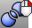
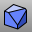
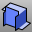
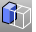
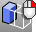
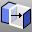
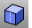
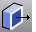
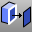
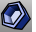

---
---

# Solid Tools toolbar
{: #kanchor2379}
 [To open a toolbar](javascript:void(0);) Toolbars can be opened as a free-standing group or added to the current group.
To open a toolbar as a free-standing group
Click theOptionsicon in any toolbar group.On the menu, clickShow Toolbar, and then select the toolbar name from the list.To open a toolbar as a new tab in the current group
Click theOptionsicon in the toolbar group where you want to add the new tab.On the menu, clickShow or Hide Tabs, and then select the toolbar name from the list. [ArrayHole](arrayhole.html) 
Copy and space holes in rows and columns.
 [ArrayHolePolar](arrayholepolar.html) 
Copy and space holes around a central location.
 [BooleanDifference](booleandifference.html) 
Subtract the volume of one set of objects from another.
 [BooleanIntersection](booleanintersection.html) 
Create a new solid from solids' intersected volumes.
 [BooleanSplit](booleansplit.html) 
Split and close solids at intersections.
 [Boolean2Objects](boolean2objects.html) 
Cycle through possible Boolean operations between two objects.
 [BooleanUnion](booleanunion.html) 
Combine the volumes of one or more objects.
 [Cap](cap.html) 
Fill planar openings with a surface joined to the hole edge.
 [ChamferEdge](chamferedge.html) 
Create a ruled surface at polysurface edges.
 [CreateSolid](createsolid.html) 
Create a closed polysurface from surfaces.
 [DeleteHole](deletehole.html) 
Delete a hole from a polysurface and remake the surface.
 [ExtractSrf](extractsrf.html) 
Separate or duplicate a polysurface face.
 [ExtrudeSrf,face](extrudesrf.html) 
Drive a surface face in a straight line to create a solid.
 [ExtrudeSrf,face AlongCurve](extrudesrfalongcrv.html) 
Drive surface edges along a path curve to create a solid.
 [ExtrudeSrf,face *ToBoundary* ](extrudesrf.html) 
Drive surface edges in a straight line to a boundary.
 [FilletEdge](filletedge.html) 
Create a tangent surface between polysurface edges.
 [BlendEdge](blendedge.html) 
Create a surface between polysurface edges maintaining continuity.
 [FoldFace](foldface.html) 
Rotate polysurface faces around an axis.
 [MakeHole](makehole.html) 
Project a closed curve to a surface to define a hole.
 [PlaceHole](placehole.html) 
Project a closed curve to a surface to define a hole.
 [MergeFace](mergeface.html) 
Combine co-planar polysurface faces.
Link to [Solid Editing toolbar](solid-editing-toolbar.html) 
 [MergeAllFaces](mergeallfaces.html) 
Combine all co-planar polysurface faces.
 [MoveFace](moveface.html) 
Move a polysurface face.
 [MoveUntrimmedFace](moveuntrimmedface.html) 
Move an untrimmed polysurface face.
 [MoveFace, *ToBoundary* ](moveface.html) 
Move a polysurface face to a boundary.
 [MoveEdge](moveedge.html) 
Move a polysurface edge.
 [MoveUntrimmedEdge](moveuntrimmededge.html) 
Move the edge of an untrimmed polysurface face.
 [MoveHole](movehole.html) 
Move or copy a hole in a planar surface.
 [MoveHole, *Copy* ](movehole.html#copy) 
Copies a hole in a planar surface.
 [RevolvedHole](revolvedhole.html) 
Create holes by revolving a profile curve around an axis.
 [RotateHole](rotatehole.html) 
Rotate a hole around an axis.
 [RoundHole](roundhole.html) 
Create circular holes in surfaces.
 [Shell](shell.html) 
Remove the selected surfaces from a polysurface, and then offset the remaining surfaces to create a solid with a specified thickness.
 [SolidPtOn](pointson.html#solidpton) 
Turn on pseudo control points for polysurfaces.
 [SplitFace](splitface.html) 
Divide a planar polysurface face.
 [WireCut](wirecut.html) 
Trim a polysurface with a curve similar to cutting foam with a heated wire.
&#160;
&#160;
Rhinoceros 6 © 2010-2015 Robert McNeel &amp; Associates.11-Nov-2015
 [Open topic with navigation](solid-tools-toolbar.html) 

