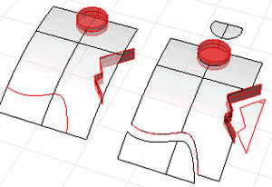

---
---

{: #kanchor2048}{: #kanchor2049}{: #kanchor2050}{: #kanchor2051}
# Split
 [Where can I find this command?](javascript:void(0);) Toolbars
 [Curve Drawing](curve-drawing-toolbar.html)  [Geometry Fix](geometry-fix-toolbar.html)  [Main2](main2-toolbar.html)  [Solids Sidebar](solids-sidebar-toolbar.html)  [Surface Sidebar](surface-sidebar-toolbar.html) 
Menus
Edit
Split
Shortcut
 [Ctrl](ctrl-key.html) + [Shift](shift-key.html) +S
The Split command divides objects into parts using other objects as cutters.

Note
Use [Untrim](trim.html#untrim) to remove a trimming boundary from a surface.When you split a surface with a curve in a [plan](setview.html#plan) parallel view like the default Top, Front, and Right view, the cutting curve is projected on the surface in the view direction.When you split a surface with a planar curve in an angled parallel or a perspective view like the default Perspective view, the cutting curve is projected on the surface in a direction perpendicular to the curve plane.When you split a surface with a 3-D curve in an angled parallel or a perspective view, the cutting curve is pulled onto the surface by closest points.Steps
 [Select](select-objects.html) objects.You can select multiple objects to split with multiple objects.Select the cutting objects.Deselect cutting objects with [Ctrl](ctrl-key.html) Press [Enter](enter-key.html) to end the command.Command-line options
CurveAtPoint
Pick locations on the curve.
{: #isocurve}SurfaceAtIsocurve
Split an object by its own [isoparametric curves](isocurve.html). This option only appears when a single surface is selected.
Use theIntobject snap for snapping to [isoparametric curves](isocurve.html) intersections.
Your browser does not support the video tag.Direction
U
Splits a surface with [isoparametric curves](isocurve.html) in the surface u&#160; [direction](curvesurfacedirection.html).
V
Splits a surface with [isoparametric curves](isocurve.html) in the surface v&#160; [direction](curvesurfacedirection.html).
Both
Splits a surface with [isoparametric curves](isocurve.html) curves in both u and v&#160; [directions](curvesurfacedirection.html).
Toggle
Toggles the direction between u and v [directions](curvesurfacedirection.html).
Shrink *(surfaces only)* 
Determines whether or not the resulting underlying untrimmed surface shrinks close to the trimming boundaries similar to the [ShrinkTrimmedSrf](shrinktrimmedsrf.html) command.
See also
 [Split and trim curves and surfaces](sak-splittrim.html) 
&#160;
&#160;
Rhinoceros 6 © 2010-2015 Robert McNeel &amp; Associates.11-Nov-2015
 [Open topic with navigation](split.html) 

