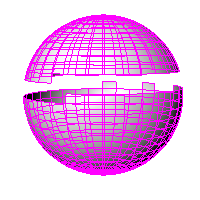
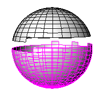

---
---

{: #kanchor2052}
# SplitDisjointMesh
 [Where can I find this command?](javascript:void(0);) Toolbars
 [Mesh Tools](mesh-tools-toolbar.html) 
Menus
Mesh
Mesh Repair Tools
Split Disjoint Mesh
The SplitDisjointMesh command divides into separate objects meshes that do not connect, but are still one object.

Note
Some STL/SLA printers have problems if meshes contain many long, thin facets. These can slow the printer's slicing process down, produce odd printed results, and run the printer out of memory.The [MeshRepair](meshrepair.html) command may be useful when tuning up meshes for STL/SLA printing.Steps
 [Select](select-objects.html) a mesh.Mesh objects have the ability to appear to be separate objects while still belonging to the same mesh.This can happen due to mesh editing or by importing a mesh in this condition.See also
 [Split and trim curves and surfaces](sak-splittrim.html) 
&#160;
&#160;
Rhinoceros 6 © 2010-2015 Robert McNeel &amp; Associates.11-Nov-2015
 [Open topic with navigation](splitdisjointmesh.html) 

