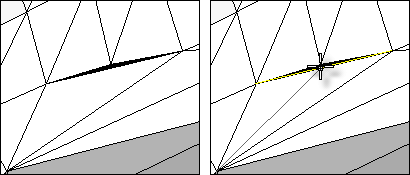

---
---

{: #kanchor2056}
# SplitMeshEdge
 [Where can I find this command?](javascript:void(0);) Toolbars
 [Mesh Tools](mesh-tools-toolbar.html) 
Menus
Mesh
Mesh Repair Tools
Split Edge
The SplitMeshEdge command divides a mesh edge to create two or more triangles.
Use the SplitMeshEdge command to specify how you want to split faces, and then match an adjacent mesh using the [MatchMeshEdge](matchmeshedge.html) command.

Note
Some STL/SLA printers have problems if meshes contain many long, thin facets. These can slow the printer's slicing process down, produce odd printed results, and run the printer out of memory.The [MeshRepair](meshrepair.html) command may be useful when tuning up meshes for STL/SLA printing.Steps
 [Select](select-objects.html) a mesh edge. [Pick](pick-location.html) a location for the split.See also
 [Split and trim curves and surfaces](sak-splittrim.html) 
&#160;
&#160;
Rhinoceros 6 © 2010-2015 Robert McNeel &amp; Associates.11-Nov-2015
 [Open topic with navigation](splitmeshedge.html) 

