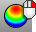
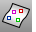
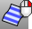

---
---

# Surface Analysis toolbar
{: #kanchor2385}
 [To open a toolbar](javascript:void(0);) Toolbars can be opened as a free-standing group or added to the current group.
To open a toolbar as a free-standing group
Click theOptionsicon in any toolbar group.On the menu, clickShow Toolbar, and then select the toolbar name from the list.To open a toolbar as a new tab in the current group
Click theOptionsicon in the toolbar group where you want to add the new tab.On the menu, clickShow or Hide Tabs, and then select the toolbar name from the list. [CurvatureAnalysis](curvatureanalysis.html) 
Evaluate surface curvature using false-color analysis.
 [CurvatureAnalysisOff](curvatureanalysis.html#curvatureanalysisoff) 
Turn off curvature analysis display.
 [DraftAngleAnalysis](draftangleanalysis.html) 
Visually evaluate surface draft-angle using false-color analysis.
 [DraftAngleAnalysisOff](draftangleanalysis.html#draftangleanalysisoff) 
Turn off draft angle analysis.
 [EMap](emap.html) 
Visually evaluate surface smoothness using an image bitmap reflected in the surface.
 [EMapOff](emap.html#emapoff) 
Turn off environment map display.
 [PointDeviation](pointdeviation.html) 
Report the distance between points and a surface.
 [PointsFromUV](pointsfromuv.html) 
Create point objects at specified surface u and v&#160;coordinates.
 [EvaluateUVPt](evaluateuvpt.html) 
Report the u and v&#160;coordinates of a specified location on a surface.
 [ThicknessAnalysis](thicknessanalysis.html) 
Use false-color display to evaluate the thickness of a solid.
 [ThicknessAnalysisOff](thicknessanalysis.html#thicknessanalysisoff) 
Turn off thickness analysis display.
 [ViewCaptureToFile](viewcapture.html#viewcapturetofile) 
Save an image of the current view to a file.
 [ViewCaptureToClipboard](viewcapture.html#viewcapturetoclipboard) 
Save an image of the current view to the Clipboard.
 [Zebra](zebra.html) 
Visually evaluate surface smoothness and continuity using a stripe map.
 [ZebraOff](zebra.html#zebraoff) 
Turn off zebra analysis.
&#160;
&#160;
Rhinoceros 6 © 2010-2015 Robert McNeel &amp; Associates.11-Nov-2015
 [Open topic with navigation](surface-analysis-toolbar.html) 

