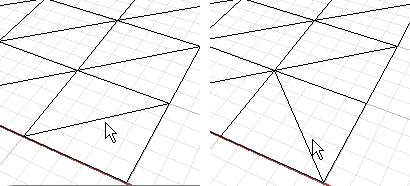

---
---

{: #kanchor2082}{: #kanchor2083}{: #kanchor2084}
# SwapMeshEdge
 [Where can I find this command?](javascript:void(0);) Toolbars
 [Mesh Tools](mesh-tools-toolbar.html) 
Menus
Mesh
Mesh Repair Tools
Swap Edge
The SwapMeshEdge command transposes the corners of mesh triangles that share an edge.

Note
The edge must be shared by two faces.This helps repair meshes for rapid prototype printing.Mesh edges and other subparts cannot be selected in a shaded view. *Steps* 
 [Select](select-objects.html) a shared mesh edge.See also
 [Edit mesh objects](sak-meshtools.html) 
 [White paper: Scan, Cleanup, Remodel](http://download.rhino3d.com/download.asp?id=ScanCleanupRemodel) 
&#160;
&#160;
Rhinoceros 6 © 2010-2015 Robert McNeel &amp; Associates.11-Nov-2015
 [Open topic with navigation](swapmeshedge.html) 

