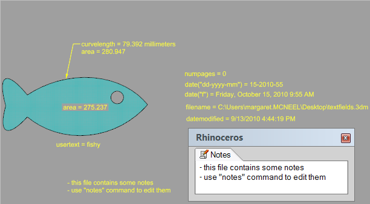

---
---

# Text fields
{: #kanchor2620}
Text fields are a feature for text and leaders. Text fields are formulas that are evaluated while Rhino is running and the result is displayed in the text. All text fields are in the syntax of %&lt; *field and options* &gt;%. When a formula cannot be evaluated an error string of #### is displayed.

Area
Area of a closed curve, hatch, surface, or mesh.
Syntax:
%&lt;area("id")&gt;%
idis theguidof an existing object in the document.
BlockInstanceCount
Displays the number of blocks of the specified name.
Syntax:
%&lt;blockinstancecount("apple")&gt;%
displays the number of blocks named "apple" in the model.
CurveLength
Length of a curve.
Syntax:
%&lt;curvelength("id")&gt;%
idis theguidof an existing curve in the document.
Date
Current date.
Syntax:
%&lt;date&gt;%
%&lt;date("format")&gt;%
Text string examples
The date format can be any of the following strings:
%&lt;date("d")&gt;%= 08/17/2000
%&lt;date("D")&gt;%= Thursday, August 17, 2000
%&lt;date("f")&gt;%= Thursday, August 17, 2000 16:32
%&lt;date("F")&gt;%= Thursday, August 17, 2000 16:32:32
%&lt;date("g")&gt;%= 08/17/2000 16:32
%&lt;date("G")&gt;%= 08/17/2000 16:32:32
%&lt;date("m")&gt;%= August 17
%&lt;date("r")&gt;%= Thu, 17 Aug 2000 23:32:32 GMT
%&lt;date("s")&gt;%= 2000-08-17T16:32:32
%&lt;date("t")&gt;%= 16:32
%&lt;date("T")&gt;%= 16:32:32
%&lt;date("dddd, MMMM dd yyyy")&gt;%= Thursday, August 17 2000
%&lt;date("ddd, MMM d 'yy")&gt;%= Thu, Aug 17 '00
%&lt;date("dddd, MMMM dd")&gt;%= Thursday, August 17
%&lt;date("M/yy")&gt;%= 8/00
%&lt;date("dd-MM-yy")&gt;%= 17-08-00
DateModified
Date this file was last saved.
Syntax:
Same as date.
DocumentText
Document text from the document.
Syntax:
%&lt;documenttext("key")&gt;%
keyis the key for the DocumentText value to retrieve.
FileName
Path to the file.
Syntax:
%&lt;filename&gt;%
%&lt;filename&gt;% - creates the full path to the model
%&lt;filename("0")&gt;% - creates the full path to the model
%&lt;filename("1")&gt;% - short filename (includes file extension)
%&lt;filename("2")&gt;% - full path to model without file extension
%&lt;filename("3")&gt;% - short filename without extension
The number parameter is a mask to turn on certain features:
1 = short file name
2 = no extension
1+2 = 3 = short filename + no extension
ModelUnits
Active model units.
Syntax:
%&lt;modelunits&gt;%
Notes
Contents of the Notes.
Syntax:
%&lt;notes&gt;%
NumPages
Number of layout pages in the document.
Syntax:
%&lt;numpages&gt;%
ObjectName
Displays the object or block name if there is one.
Syntax:
%&lt;objectname&gt;%
PageName
Current layout name.
Syntax:
%&lt;pagename&gt;%
PageNumber
Current layout number.
Syntax:
%&lt;pagenumber&gt;%
UserText
Usertext for a given object / key combination.
Syntax:
%&lt;usertext("id","key")&gt;%
idis theguidof an existing object in the document.
keyif the key of the UserText for the value to retrieve.
&#160;
&#160;
Rhinoceros 6 © 2010-2015 Robert McNeel &amp; Associates.11-Nov-2015
 [Open topic with navigation](text-fields.html) 

