---
---

{: #kanchor2107}{: #kanchor2108}{: #kanchor2109}{: #kanchor2110}{: #kanchor2111}{: #kanchor2112}{: #kanchor2113}{: #kanchor2114}{: #kanchor2115}{: #kanchor2116}{: #kanchor2117}{: #kanchor2118}
# Text
 [Where can I find this command?](javascript:void(0);) Toolbars
 [Dimension](dimension-toolbar.html)  [Drafting](drafting-toolbar.html) 
Menus
Dimension
Text Block
The Text command creates two-dimensional annotation text.
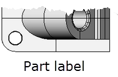
Steps
 [Pick](pick-location.html) the location for the text.Specify the options.Type the text.Text Options
Annotation text is primarily used for printing, so the settings affect the printed size of your annotation text.
{: #font}Font
Sets the font of the annotation text.
{: #height}Height ___ &lt; *units* &gt;
Sets the text height in model units.
{: #mask}Mask
Places an opaque mask around the text so objects in the model do not show through.
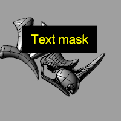
Text mask.
None
No mask is used.
Background color
Sets the mask color to the [viewport background](appearance-colors.html#backgroundcolor) color.
Solid Color
Select a color from the [Select Color](select-color.html) dialog box.
Margin
Sets the size of the margin between the text and the edge of the mask.
Layout scaling{: #layout-scaling}
When displayed in a [layout detail](layout.html), the text [Height](#height) will be multiplied by the [scale](detail.html#detail-scale) of the detail containing the text.
Bold{: #bold}
Sets all of the text to bold.
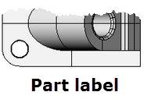
Italic{: #italic}
Sets all of the text to italic.
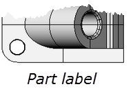
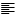Align Left{: #justification}
Sets the horizontal text alignment to the left.
Align Center
Sets the horizontal text alignment to the center.
Align Right
Sets the horizontal text alignment to the right.
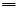Align Top
Sets the vertical text alignment to the top.
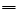Align Middle
Sets the vertical text alignment to the middle.
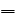Align Bottom
Sets the vertical text alignment to the bottom.
Text to create{: #text-to-create}
Type the text in the edit box.
## Context Menu options
 [Right-click](right-mouse-click.html) in the text editing area to display the context menu.Undo
Undo typing.
Cut
Cut selected text to the Clipboard.
Copy
Copy selected text to the Clipboard.
Paste
Paste text from the Clipboard.
Delete
Delete selected text.
Select All
Selected all text in the edit window..
Set Edit Text Size
Sets the size for the text inside the edit box.
{: #textfield} [Text Field](text-fields.html) 
Text fields are formulas that are evaluated while Rhino is running and the result is displayed in the text.
Import text{: #import-text}
Imports text from a file.

# RText
{: #kanchor2121}
{: #kanchor2120}
{: #kanchor2119}
{: #rtext}
 [Where can I find this command?](javascript:void(0);) Toolbars
 [Not on toolbars.](toolbarwhattodo.html) 
Menus
 [Not on menus.](menuwhattodo.html) 
The RText command creates two-dimensional rich text. Rich text can be formatted on a word-by-word or letter-by-letter basis similar to a word processor.
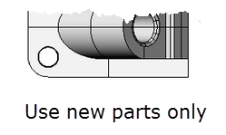
Steps
 [Pick](pick-location.html) the location for the text.Specify the options.Type the text.Rich Text options
Annotation text is primarily used for printing, so the settings affect the printed size of your annotation text.
{: #font}Font
Sets the font of the annotation text.
{: #height}Height ___ &lt; *units* &gt;
Sets the text height in model units.
Bold{: #bold}
Sets the selected text to bold.
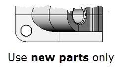
Italic{: #italic}
Sets the selected text to italic font.
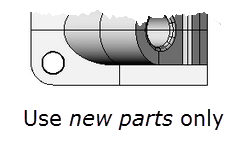
Underline{: #italic}
Sets all of the text to underline.
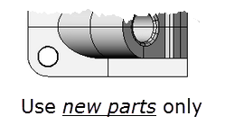
Formatting options can be combined to create bold italic, bold underline, italic underline, bold underline, etc.
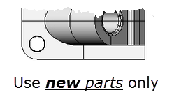
Align Left{: #justification}
Sets the horizontal text alignment to the left.
Align Center
Sets the horizontal text alignment to the center.
Align Right
Sets the horizontal text alignment to the right.
Align Top
Sets the vertical text alignment to the top.
Align Middle
Sets the vertical text alignment to the middle.
Align Bottom
Sets the vertical text alignment to the bottom.
Text to create{: #text-to-create}
Type the text in the edit box.{: #textfield} [Text Field](text-fields.html) 
Text fields are formulas that are evaluated while Rhino is running and the result is displayed in the text.
Import text{: #import-text}
Imports text from a file.

# Related commands

## TextProperties
{: #textproperties}
 [Where can I find this command?](javascript:void(0);) Toolbars
 [Popup](popup-toolbar.html)  [Properties](properties-toolbar.html)  [Standard](standard-toolbar.html) 
Menus
Edit and Panels
Object Properties
Shortcut
F3
The TextProperties command opens the Properties panel.
Steps
 [Select](select-objects.html) text to edit.Options
 [Font](#font) 
 [Height ___ &lt; *units* &gt;](#height) 
 [Mask](#mask) 
 [Bold](#bold) 
 [Italic](#italic) 
 [Justification](#justification) 
 [Layout scaling](#layout-scaling) 
 [Text to create](#text-to-create) 
 [Field](#textfield) 
 [Import text](#import-text) 
Match
Change an object's properties to match another object. [Font](#font), [Height](#height), [Layout scaling](#layout-scaling), and [Mask](#mask) are matched.

## TextScale
{: #textscale}
 [Where can I find this command?](javascript:void(0);) Toolbars
 [Drafting](drafting-toolbar.html) 
Menus
 [Not on menus.](menuwhattodo.html) 
The TextScale command scales text in model and layout space.
Steps
Specify the text scale value.Command-line options
Enabled
When enabled:
Text viewed in a [layout detail](detail.html) are scaled according to a detail's [zoom factor](zoom.html#factor) .Text viewed in model space are scaled by the TextScale value.Disabled
When disabled, text is not scaled.
Toggle
Toggles between Enabled and Disabled states.
See also
 [Use drafting tools](sak-drafting.html) 
 [Use text and dimensions for annotation](sak-textanddimensions.html) 
&#160;
&#160;
Rhinoceros 6 © 2010-2015 Robert McNeel &amp; Associates.11-Nov-2015
 [Open topic with navigation](text.html) 

