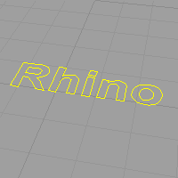
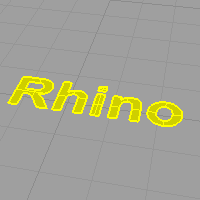
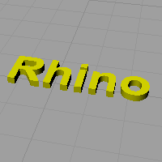
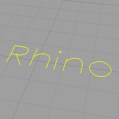
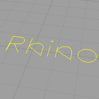

---
---

{: #kanchor2122}{: #kanchor2123}{: #kanchor2124}{: #kanchor2125}{: #kanchor2126}{: #kanchor2127}{: #kanchor2128}{: #kanchor2129}{: #kanchor2130}{: #kanchor2131}{: #kanchor2132}
# TextObject
 [Where can I find this command?](javascript:void(0);) Toolbars
 [Main1](main1-toolbar.html) 
Menus
Solid
Text
The TextObject command draws text-shaped curves, surfaces, or polysurfaces based on TrueType fonts.
Steps
Specify options. [Pick](pick-location.html) a location.Text Object Options
Text to create
Types the text. Right-click in the edit area to cut, copy, and paste text.
Font
Selects the font and style.
Name
Font name.
Bold
Sets the font to bold.
Italic
Sets the font to italic.
Create
Specifies object type.
Curves
Creates text using outline curves.

Surfaces
Creates text using planar surfaces.

Solids
Creates text using solids.

Group objects
Groups resulting text objects.
Allow single-stroke fonts
Allows fonts that do not have closed loop boundaries. Engraving-style fonts for machine applications are the most common application.

If not checked, single-stroke engraving fonts display closed loop boundaries.

Text size
Sets text height and thickness.
Height ___ *&lt;units&gt;* 
Sets the height in model units (y&#160;direction).
Solid thickness ___ *&lt;units&gt;* 
Sets the thickness of text created from solids (z&#160;direction).
Lower case as small caps
Displays lower-case letters as small caps. Set the relative text size to a percentage of the normal text.
Add spacing
Adds spacing between letters.
See also
 [Use text and dimensions for annotation](sak-textanddimensions.html) 
&#160;
&#160;
Rhinoceros 6 © 2010-2015 Robert McNeel &amp; Associates.11-Nov-2015
 [Open topic with navigation](textobject.html) 

