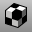
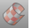

---
---

# Texture Mapping toolbar
{: #kanchor2389}
 [To open a toolbar](javascript:void(0);) Toolbars can be opened as a free-standing group or added to the current group.
To open a toolbar as a free-standing group
Click theOptionsicon in any toolbar group.On the menu, clickShow Toolbar, and then select the toolbar name from the list.To open a toolbar as a new tab in the current group
Click theOptionsicon in the toolbar group where you want to add the new tab.On the menu, clickShow or Hide Tabs, and then select the toolbar name from the list. [ApplyBoxMapping](texturemapping.html#applyboxmapping) 
Add a box texture mapping channel to an object.
 [ApplyCylindricalMapping](texturemapping.html#applycylindricalmapping) 
Add a cylindrical texture mapping channel to an object.
 [ApplyPlanarMapping](texturemapping.html#applyplanarmapping) 
Add a planar texture mapping channel.
 [ApplySphericalMapping](texturemapping.html#applysphericalmapping) 
Add a spherical texture mapping channel to an object.
 [ApplySurfaceMapping](texturemapping.html#applysurfacemapping) 
Add a surface texture mapping channel to an object.
 [MappingWidget](texturemapping.html#mappingwidget) 
Turn on texture mapping widgets.
 [MappingWidgetOff](texturemapping.html#mappingwidgetoff) 
Turn off texture mapping widgets.
 [RemoveMappingChannel](texturemapping.html#removemappingchannel) 
Remove mapping channels from an object.
&#160;
&#160;
Rhinoceros 6 © 2010-2015 Robert McNeel &amp; Associates.11-Nov-2015
 [Open topic with navigation](texture-mapping-toolbar.html) 

