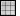
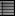

---
---

## Texture Palette tools menu
These settings also appear on right-click context menus for the thumbnail previews and the thumbnail background.
Create New Texture
Creates a new basic blank texture.
Import Texture from File
Imports textures from a saved Rhino .rtex file.
Save to File
Saves a texture to a Rhino .rtex file.
Reset to Defaults
Changes all of the texture settings a blank texture.
Copy
Copies the selected texture to the Clipboard. The Clipboard can then be pasted into the editor to create a new texture or pasted directly into a folder to create a [library](libraries.html#libraries) file.
Paste
Creates a new texture based on the contents of the Clipboard.
Paste as Instance
Creates a new texture based on the contents of the Clipboard that is linked to the original through instancing.
Delete
Deletes the selected texture.
Tags
Tag textures to group or categorize textures to make searching easier.
Duplicate
Copies the selected texture to a new texture with the same settings.
Remove Instancing
Removes the connection between instanced materials.
Save as Image
Saves the selected texture as a bitmap image.
Floating Preview
Floats the preview image in a resizable window.
Grid
Displays the previews as a grid of thumbnails.
List
Displays the previews as a list of thumbnails.
Tree
Displays the previews as a tree showing nesting.
Tiny
Sets the thumbnail size to the smallest size.
Small
Sets the thumbnail size to the small size.
Medium
Sets the thumbnail size to medium size.
Large
Sets the thumbnail size to large size.
Horizontal Layout
Displays the previews to the left of the controls.
Show Labels
Displays thumbnail name labels when inGridmode.
Listmode always displays labels.
Show Preview Pane
Displays the preview properties for the currently-selected thumbnail. Set the preview geometry, size, background, rotation behavior.
Content Filter
Allows filtering materials, textures, and environments in the [Libraries](libraries.html#libraries).

### Content Filters
Name filter
Use wild-card characters to select content items by name.
 **Clear** 
Clear the name filtering.
Invert
Reverse the name filtering.
Show unassigned materials
Displays materials that are not assigned to objects or layers.
Show V4 materials
Displays materials that were created in Rhino V4.
Show hidden materials, environments and textures
Displays items that are hidden by their rendering engine.
Show reference materials, environments and textures
Displays items that are generated by [worksession references](worksession.html) or [linked blocks](insert.html).
Show content for these render engines
Shows all of the render engines available.
Universal
 **Check All** 
 **Uncheck All** 
 **Invert** 
 [Open topic with navigation](texturepalette-toolsmenu.html) 

