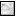
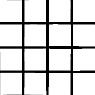
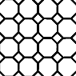

---
---

{: #kanchor2133}{: #kanchor2134}{: #kanchor2135}{: #kanchor2136}{: #kanchor2137}{: #kanchor2138}{: #kanchor2139}{: #kanchor2140}{: #kanchor2141}{: #kanchor2142}{: #kanchor2143}{: #kanchor2144}
# TexturePalette
 [Where can I find this command?](javascript:void(0);) Toolbars
 [Render Tools](render-tools-toolbar.html) 
Menus
Panels and Render
Texture Palette
The TexturePalette command textures can be dragged and dropped onto [Material](materialeditor.html) and [Environment](environmenteditor.html) controls.
Note
Any number of textures can be stored in the model. Textures can also be designed in-place in the material and environment editors by adding textures as child. Opening a floating preview allows visualization of the texture during its development.Lower-level procedural textures such asPerturbing,Noise, andWavesallow the design of complex new procedural textures. The high-level textures (Wood,Marble, etc.) are made by combining lower-level components.Textures can be assigned as children to many other content types. The texture list (shown in theTexture Editor) is typically used as a palette of stored ready-to-use textures.Specifies the color, finish, transparency, texture, and bump for use by the built-in Rhino renderer.Textures Panel
 [Panel options](panel-options.html) 
Textures panel toolbar
The Textures panel has additional browsing tools.
Back
Walks back though the previously selected textures.
Forward
Walks forward through the previously selected textures.
Currently selected item name
Displays the current texture icon and name.
Search
Search for textures.
Menu
Displays the [Tools](texturepalette-toolsmenu.html) menu.
Help
Preview thumbnail actions
Right-click a thumbnail to display a [context menu](texturepalettethumbnail-contextmenu.html) .Right-click the blank area of the thumbnail browser to display a [context menu](texturepalettethumbnail-blankcontextmenu.html) .Double-click to display a larger preview window.Drag the preview thumbnails to reorder the list.Double-click the large preview to open a floating window that can be re-sized to get a higher resolution view of the preview.This window has all the same functionality as the original preview image including the context menu and the ability to drag and drop onto other materials or objects in the model.Right-click the large preview window or the floating preview window to display the [context menu](texturepalette-largepreviewmenu.html).
## Creating and editing textures
To create a new texture
In the thumbnail browser, click theCreate New Texturebutton.On the menu, select a texture type.Sub-panels containing the settings for that texture type appear in the Texture Palette panel.Create New Texture
Create a new bitmap texture
A new Basic Bitmap texture is created.
2D Checker
Creates a new [2-D Checker](#2d-checker) texture.
3D Checker
Creates a new [3-D Checker](#3d-checker) texture.
Basic Bitmap
Creates a new [Basic Bitmap](#basic-bitmap) texture.
Bitmap
Creates a new [Bitmap](#bitmap) texture.
Blend
Creates a new [Blend](#blend) texture.
Cube Map
Creates a new [Cube Map](#cubemap) texture.
Dots
Creates a new [Dots](#dots) texture.
Exposure
Creates a new [Exposure](#exposure) texture.
fBm
Creates a new [fBm](#fbm) texture.
Gradient
Creates a new [Gradient](#gradient) texture.
Granite
Creates a new [Granite](#granite) texture.
Grid
Creates a new [Grid](#high-dynamic-range) texture.
High&#160;Dynamic&#160;Range
Creates a new [High&#160;Dynamic&#160;Range](#high-dynamic-range) texture.
Marble
Creates a new [Marble](#marble) texture.
Mask
Creates a new [Mask](#mask) texture.
Noise
Creates a new [Noise](#noise) texture.
OpenEXR Image
Creates a new [OpenEXR Image](#openexr) texture.
Perlin Marble
Creates a new [Perlin Marble](#perlin) texture.
Perturbing
Creates a new [Perturbing](#perturbing) texture.
Physical Sky
Creates a new [Physical Sky](#physical-sky) texture.
Projection Changer
Creates a new [Projection Changer](#projection-changer) texture.
Resample
Creates a new [Resample](#resample) texture.
Single Color
Creates a new [Single Color](#single-color) texture.
Stucco
Creates a new [Stucco](#stucco) texture.
Texture Adjustment
Creates a new [Texture Adjustment](#texture-adjustment) texture.
Tile
Creates a new [Tile](#tile) texture.
Turbulence
Creates a new [Turbulence](#turbulence) texture.
Waves
Creates a new [Waves](#waves) texture.
Wood
Creates a new [Wood](#wood) texture.
Import Texture from File
Imports materials from a saved Rhino .rtex file.
Type
Specifies the texture type.
Types
 [2D Checker](#2d-checker) 
 [3D Checker](#3d-checker) 
 [Basic Bitmap](#basic-bitmap) 
 [Bitmap](#bitmap) 
 [Blend](#blend) 
 [Cube Map](#cubemap) 
 [Dots](#dots) 
 [Exposure](#exposure) 
 [fBm](#fbm) 
 [Gradient](#gradient) 
 [Granite](#granite) 
 [Grid](#grid) 
 [High&#160;Dynamic&#160;Range](#high-dynamic-range) 
 [Marble](#marble) 
 [Mask](#mask) 
 [Noise](#noise) 
 [OpenEXR Image](#openexr) 
 [Perlin Marble](#perlin) 
 [Perturbing](#perturbing) 
 [Physical Sky](#physical-sky) 
 [Projection Changer](#projection-changer) 
 [Resample](#resample) 
 [Single Color](#single-color) 
 [Stucco](#stucco) 
 [Texture Adjustment](#texture-adjustment) 
 [Tile](#tile) 
 [Turbulence](#turbulence) 
 [Waves](#waves) 
 [Wood](#wood) 
&#160;
## Texture settings
Each texture type its own set of settings appropriate for the type.
In addition to the settings specific to the texture type, the following settings sub-panels appear when appropriate.
{: #name}Name
Names the texture. All textures are automatically assigned a name. You can change this generic name.
When a texture or image file is dragged to a Rhino object, a material with that image is assigned to the object.
{: #colors1-2}Colors{: #kanchor2145}
This setting displays whenever colors can be specified for the texture components.
Color 1 / 2
The color for each component of the material can be set to a different color or texture.
To change the color
Click the color swatch to select a color from the [Select Color](select-color.html) dialog box.Click the menu arrowor [right-click](right-mouse-click.html) the swatch to open the context menu.Context menu options
Color Picker
Opens the [Select Color](select-color.html) dialog box.
Eye Dropper
Allows picking the color from anywhere on the screen.
Copy
Copies the color in the color swatch.
Paste
Pastes the color from one color swatch to another.
Assign texture
Assign a texture to the color control.
Edit texture
Opens the texture editor.
Remove texture
Removes the texture from the control.
(click to assign texture)
Assign a texture to use as the color.
To specify an image
Click in theclick to assign texture)control.The check box automatically becomes checked the first time you do this. You can clear the check box to turn off the assignment.
Select an image file to use.In the edit box, specify the percentage of strength the image will use to affect the color, transparency, bump, or environment.Browse
Click to select a different image.Context menu options
Edit
Opens the [Bitmap Texture Settings](#bitmap) panel.
Copy
Copies the image to the clipboard.
Paste
Pastes the image in the clipboard into the texture slot.
Paste as Instance
Pastes the image in the clipboard as an instance. Changes to the parent image also change the instances.
Floating Preview
Opens a floating thumbnail preview of the texture.
Change
Select a different image or texture type.
Remove
Removes the texture from the slot.
Remove Instancing
Removes the instancing, breaking the connection to the original parent image.
Properties
Opens thePropertiesdialog box for setting the output channel.
Properties
Output Channel
Custom
Default
Swap colors
Exchanges colors 1 and 2 for each other.
Super sample
Tries to reduce aliasing in the texture.
See: [Wikipedia, Supersampling](http://en.wikipedia.org/wiki/Supersampling).
You can drag the color swatch to a folder to create a Rhino color file.
To add this color to a color library
Drag it from a folder to another color swatch in the [Material](materialeditor.html), [Environment](environmenteditor.html), or [Texture Palette](#) panels, or you can drag it onto an object.
Mapping for 3-D textures
Determines how colors at the original uv(w) coordinates of the texture are translated to the uv location on an object. The Rhino default is to use the uv coordinates given by the geometry itself: either the parameters of the surface or the original texture coordinates of the mesh. These controls allow modification of the way the texture appears to wrap itself around objects.
Offset U/V/W
Shifts the texture along the u and/or v&#160;direction in texture space.
Repeat U/V/W
Causes the texture to recur in texture space.
Rotation U/V/W
Rotates the texture in texture space by a specific number of degrees.
WCS
UV coordinates are generated from the actual position in world space of the object. This is useful for real-world size materials - especially 3&#8209;D procedural textures.
Box style
UV coordinates are generated from a coordinate system specified by the world space location on the object and the side of an imaginary box pointed to by the object’s normal at that location. This is useful for real-world style materials, particularly 2&#8209;D types like bitmaps, since the sides of objects will also be projected in a meaningful manner.
Mapping Channel
Uses the texture coordinates of that object on a specific mapping channel. By default, with a single mapping channel in use on an object, the texture coordinates will be generated from values found in [Object Properties &gt; Texture Mapping](texturemapping.html).
Preview in 3D
Uses a 3-D object in the thumbnail and preview window to display the mapping on an object. See: [Texture palette thumbnail context menu](texturepalettethumbnail-contextmenu.html).
Preview local mapping
If this checkbox is on, texture previews will be modified by the mapping parameters. This can make it difficult to see the texture itself, if there is a high repeat, for example.
 **Display in Viewport** 
Displays the results of mapping a texture when that texture is not well displayed in the viewport. The texture is displayed temporarily as if it were the object color. This can be useful with advanced rendering engines where the viewport display does not support a particular rendering feature that can be textured (for example, reflectivity).
Mapping for 2-D textures
Determines how colors at the original uv(w) coordinates of the texture are translated to the uv location on an object. The Rhino default is to use the uv coordinates given by the geometry itself: either the parameters of the surface or the original texture coordinates of the mesh. These controls allow modification of the way the texture appears to wrap itself around objects.
Offset U/V
Shifts the texture along the u and/or v&#160;direction in texture space.
Repeat U/V
Causes the texture to recur in texture space.
Rotation
Rotates the texture in texture space by a specific number of degrees.
No repeat
Only one instance of the texture will be seen on the object.
Environment map
Projects the image using similar mapping to the [EMap](emap.html) command, while allowing for other input projections to be used.
Automatic
Uses information from the texture itself to determine the projection type. This may be actually specified in the texture. For example, [HDR](#high-dynamic-range), [EXR](#openexr), and [Projection Changer](#projection-changer) textures specify their output projection.
Emap
Elliptical subsection reaching each border of the texture is mapped onto the sphere. This projection is the result of taking a photo of a mirror sphere with an orthographic camera.
Box
Maps the entire texture onto all sides of the cube.
Lightprobe
Also known as angular fish-eye projection or azimuthal equidistant projection. Elliptical subsection reaching each border of the texture is mapped onto the sphere.
See: [Wikipedia: Azimuthal equidistant projection](http://en.wikipedia.org/wiki/Azimuthal_equidistant_projection).
Spherical
Also known as equirectangular projection. Horizontal line in the middle of the texture is mapped to the equator of the sphere.
See: [Wikipedia: Equirectangular projection](http://en.wikipedia.org/wiki/Equirectangular_projection).

Cubemap
Subsections corresponding to each side of the cube are located side by side dividing the texture into six equal parts.
See: [Wikipedia: Cube mapping](http://en.wikipedia.org/wiki/Cube_mapping).
Vertical cross cubemap
Subsections corresponding to each side of the cube are located in a vertical cross pattern. Each subsection is one fourth of the image in height and one third in width.

Horizontal cross cubemap
Subsections corresponding to each side of the cube are located in a horizontal cross pattern. Each subsection is one third of the image in height and one fourth in width.

Preview local mapping
Texture previews will be modified by the mapping parameters. This can make it difficult to see the texture itself, if there is a high repeat, for example.
Screen
Uses the flat 2&#8209;D screen coordinates of the object (where 0,0 is the top left corner and 1,1 is the bottom right) to determine the texture uv. This is often used in conjunction with a background image to cause the colors on an object to match the background.
WCS
UV coordinates are generated from the actual position in world space of the object. This is useful for real-world size materials - especially 3&#8209;D procedural textures.
WCS (box style)
UV coordinates are generated from a coordinate system specified by the world space location on the object and the side of an imaginary box pointed to by the object’s normal at that location. This is useful for real-world style materials, particularly 2&#8209;D types like bitmaps, since the sides of objects will also be projected in a meaningful manner.
Mapping Channel
Uses the texture coordinates of that object on a specific mapping channel. By default, with a single mapping channel in use on an object, the texture coordinates will be generated from values found in [Object Properties &gt; Texture Mapping](texturemapping.html).
 **Display in Viewport** 
Displays the results of mapping a texture when that texture is not well displayed in the viewport. The texture is displayed temporarily as if it were the object color. This can be useful with advanced rendering engines where the viewport display does not support a particular rendering feature that can be textured (for example, reflectivity).
Graph
The graph control displays the color values at particular sections from the uv space of the texture. This can be useful when the color values are used to calculate parameters in non-color slots, such as bump, transparency.

Red
Shows the value of the red component of the texture.
Green
Shows the value of the green component of the texture.
Blue
Shows the value of the blue component of the texture.
Alpha
Shows the value of the alpha component of the texture.
Luminance
Shows the combined luminance of the texture (calculated using the CIE standard method from the red, green and blue channels). This calculates non-color values such as transparency and bump.
U
Shows a section through the specified u&#160;parameter of the texture.
V
Shows a section through the specified v&#160;parameter of the texture.
W
Shows a section through the specified w&#160;parameter of the texture.
Output Adjustment
Allows the modification of the texture output with some common transformations.
Clamping
Given a specific output color component (R, G, B), the clamp controls allow scaling and to zero the values above or below specified thresholds.
Clamp
Turns component clamping on or off.
Scale to clamp range
Scales the component values between the minimum and maximum values.
Min
Sets the minimum value.
Max
Sets the maximum value.
Color adjustment
Invert
Transforms the image to its negative. For low dynamic range (LDR) images, this involves subtracting each component from 1.0. For HDR images, each component is replaced with its reciprocal.
Grayscale
Each color is replaced with a gray value based on the luminance.
Gamma
Each color transforms by a given gamma. The effect is increased or decreased contrast.
Multiplier
Each color value is multiplied by a this amount. The effect is to increase or decrease brightness.
Gain
Each color by a given gain amount. This is used in many procedural texture transformations, particularly [Perlin noise](#perlin).
Saturation
Changes the image saturation where 1.0 is the original color saturation and 0.0 is fully gray.
Hue shift
Changes the hue value of each color by a given degree on the color wheel.
Notes
Enter any notes that describe the texture. All textures have a Notes section.
{: #2d-checker}{: #kanchor2146}The 2D Checker texture is a planar texture that does provides a checker pattern in only two directions.

Checker Texture Settings
Remap textures to tile size
Causes child textures to be re-sized to fit into an individual checker.
{: #3d-checker}{: #kanchor2147}The 3D Checker texture is a 3-D pattern. Sub textures can be set to each of the colors of the texture, and their u, v, and w can be re-mapped to the scale of the checker pattern.

{: #name}Name
Names the texture. All textures are automatically assigned a name. You can change this generic name.
When a texture or image file is dragged to a Rhino object, a material with that image is assigned to the object.
Checker Texture Settings
Remap textures to tile size
Causes child textures to be re-sized to fit into an individual checker.
{: #basic-bitmap}{: #kanchor2148}The Basic Bitmap texture represents a simple bitmap image. There are no additional settings for transparent color, mapping, or output adjustment.
For more control, see

Bitmap Texture Settings
Image preview and properties
Preview image
Size in pixels
Color depth
Image size
File size
Filename
The path and name of the bitmap file.
Browse for file
Open file browser.
Open image in associated editor
Opens the image in your assigned image editor (Windows Paint, PaintShop, or similar).
Mirror alternate tiles
Mirrors every other tile to allow easier edge matching on non-repeatable bitmaps.
Enable filtering
When multiple points on the surface are mapped to the same point in the texture the image can be "pixelated," displaying jagged lines and stair-stepped transitions between colors in the texture. Filtering smooths those transitions. In most cases the pixelation is smoothed out but if a very small texture is mapped to a very large surface the filtering tends to make things look blurry.

Enable filtering off (left) and on (right).
{: #bitmap}{: #kanchor2150}The Bitmap texture contains a simple bitmap image. You can also specify a transparent color to be used as an alpha channel in the case that no alpha channel is specified in the image.

Bitmap Texture Settings
Image preview and properties
Preview image
Size in pixels
Color depth
Image size
File size
Mirror alternate tiles
Mirrors every other tile to allow easier edge matching on non-repeatable bitmaps.
Enable filtering
When multiple points on the surface are mapped to the same point in the texture the image can be "pixelated," displaying jagged lines and stair-stepped transitions between colors in the texture. Filtering smooths those transitions. In most cases the pixelation is smoothed out but if a very small texture is mapped to a very large surface the filtering tends to make things look blurry.

Enable filtering off (left) and on (right).
Filename
The path and name of the bitmap file.
Browse for file
Open file browser.
Open image in associated editor
Opens the image in your assigned image editor (Paint, PaintShop, or similar).
Color mask
(Color selector)
Specifies the color
To change the color
Click the color swatch to select a color from the [Select Color](select-color.html) dialog box.OrClick the menu arrowor [right-click](right-mouse-click.html) the swatch to open the context menu.Menu options
Color Picker
Opens the [Select Color](select-color.html) dialog box.
Eye Dropper
Allows picking the color from anywhere on the screen.
Copy
Copies the color in the color swatch.
Paste
Pastes the color from one color swatch to another.
Tolerance %
The tolerance to be used to determine if the texture's color matches the transparency color.
Use alpha channel
Use the alpha channel stored in the image file.
{: #blend}{: #kanchor2151}The Blend texture is a simple color blending between two textures.
Blend Texture Settings
Factor
Blends [Colors 1 and 2](#colors1-2) using an amount of blend.
Texture
Blends [Colors 1 and 2](#colors1-2) using the luminance values of a texture.
{: #cubemap}{: #kanchor2152}The Cube Map texture takes six individual images arranged as separate cube map face images, and produces a linear cube map texture. This texture can then be converted into any other projection using the projection changer texture.

See: [Wikipedia: Cube Mapping](http://en.wikipedia.org/wiki/Cube_mapping) 
Cube Map Settings
Positive / Negative X / Y / Z
The texture to use at each face of the cube.
Turn the image on
These buttons are always disabled. The image is always on.
Texture slot
The child texture to use.
Percentage
These buttons are always disabled. The image always uses 100%.
{: #dots}{: #kanchor2153}The Dots texture generates a random dot pattern. Sub-textures can be set for the dot color and the background color.

Default settings (left), customized settings (center), used a bump map(right).
Sampler
Specifies the algorithm used to distribute the dots in space.
Sampler type
Best candidate
A low discrepancy sampler to generate dots that are randomly placed but uniformly distributed.
Stratified
A perturbed grid pattern that is more memory efficient but tends to be less well distributed.
#of dots
The approximate number of dots in the pattern.
Pattern size
Determines how far apart dots are generated. It operates like zooming in and out, but as you zoom in, more dots appear to keep the number of dots as close as possible to the#of dotsvalue.
Dot Style
The Dot Style settings specify the way the dot merges into its background. These settings work well with bump mapping.
Fall off type
The fall-off type describes the shape of the dot when used as a bump map.
Flat
Generates flat dots that appear as simple discs.
Linear
Uses a linear method so that when used as a bump map, the bumps are conical with a very sharp center point.
Cubic
Similar toLinearbut uses a different method so that when used as a bump map, the bumps are more smooth and rounded.
Elliptic
Similar toCubicbut uses a different method so that when used as a bump map, the bumps are much flatter and lozenge-shaped.
Arc
Radius
Specifies the radius of the dots.
Variance
Specifies a level of randomization for the radius.
Rings
Makes the dot into a ring with a variable size hole.
Hole
Specifies the size of the hole as a percentage of the radius.
Variance
Specifies the size of the hole as a percentage of the radius.
Dot Appearance
The Dot Appearance settings specify how the dot interacts with the background.
Composition type
Specifies how the two dot colors are composited.
Standard
The dot blending functions are added together and the resulting value is used to interpolate between the background and foreground colors.
Maximum
The maximum value for each color channel (R, G, B and A) is used.
Addition
Color channels are added.
Subtraction
Color channels are subtracted.
Multiplication
Color channels are multiplied.
Average
Color channels are averaged.
Amplitude
This is the amount of the dot effect. When used as a color, it affects the brightness of the dot. When used as a bump map, it affects the depth of the bumps.
Variance
Specifies a level of randomization for the amplitude.
Hue
Normally the dots are colored according to the value of [Color 2](materialeditor.html#color-diffuse). This setting allows the color hue to randomly vary.
Variance
Specifies a level of randomization for the hue. This has no effect when the composition type isStandard.
Saturation
Normally the dots are colored according to the value of [Color 2](materialeditor.html#color-diffuse). This setting allows the color saturation to randomly vary.
Variance
Specifies a level of randomization for the saturation. This has no effect when the composition type isStandard.
{: #exposure}{: #kanchor2154}The Exposure texture takes high-dynamic-range information and converts it to a low-dynamic-range image using the same exposure algorithms used in the high-dynamic-range texture.
Exposure Texture Settings
Input
Add the high-dynamic range (HDR) texture whose exposure you want to control.
Exposure
Changes the exposure of the HDR texture. It decides the part of the HDR dynamic range is mapped to the pixel range (0 to 255).
Multiplier
A scale factor that multiplies the final pixel color before it is displayed. The pixel color is then clamped to the range 0 to 255.
{: #fbm}{: #kanchor2155}The fractal Brownian motion (fBm) texture is a standard computer graphics noise type where the noise is superimposed upon itself at different scales and amplitudes. So the closer you look, the more detailed the pattern is. A basic continuous noise function for bump maps based on [Perlin](#perlin) noise. fBm is a variation on Perlin noise with either Fractal Sum synthesis. Textures can be set to the two colors in the noise function.

Similar effects are possible using the more complex but much more powerful [Noise texture](#noise).
See: [Wikipedia: Perlin noise](http://en.wikipedia.org/wiki/Perlin_noise).
fBm Texture settings
Roughness
The amplitude change between octaves.
Maximum octaves
The maximum number of super-impositions. This relates to the amount of detail in the noise.
Gain
A standard way of modifying the output of textures from linear to exponential.
{: #gradient}{: #kanchor2156}The Gradient texture provides predefined gradient types along with custom curve support. Textures can be set to the two colors of the gradient.

Gradient Texture Settings
Gradient type
Specifies the way the colors combine.

Linear

Box

Radial

Tartan

Sweep

Pong

Spiral
&#160;&#160;Flip alternate gradients
Custom curve
Opens theCustom Curvepanel.
Custom Curve
Graph
Drag points on the graph to reset the curves.

Add
Adds edit points with handles to a curve.
Delete
Deletes edit points from a curve.
Select All
Selects all active curves.
Channel Buttons
Red
Green
Blue
Alpha
Reset Display
Resets the thumbnail.
Reset Graph
Resets the graph to the default settings.
Enlarge
Opens the panel as a free-standing control.
{: #granite}{: #kanchor2158}The Granite texture is a spotted 3-D texture. The granite procedure combines a randomly distributed spot component in a base component.

Granite Texture Settings
Size
The overall size of the texture.
Spot size
The size of the spots.
Blending
The amount of blending between the base color and the spot color.
{: #grid}{: #kanchor2159}The Grid texture uses a numbered grid bitmap as the texture.
Grid Texture Settings
Cells
The number of squares.
Font thickness
The size of the font used to number the grid squares.
{: #high-dynamic-range}{: #kanchor2160}A High-Dynamic-Range (HDR) texture provides automatic conversion to a bitmap for non-HDR capable renderers. This allows the Rhino renderer and viewport display to show HDR environments. The HDR texture also provides projection conversion features. Most HDRi files come as light probe projection.
See: [www.easyhdr.com/examples](http://www.easyhdr.com/examples).
High-Dynamic Range Texture Settings
Preview
Image and file properties.
Filename
The path and name of the HDR/OpenEXR file.
Original projection
Planar
Maps texture directly to background. Environment looks always the same no matter where the camera is looking.
Light probe{: #kanchor2162}
Also known as angular fish-eye projection or azimuthal equidistant projection. Elliptical subsection reaching each border of the texture is mapped onto the sphere.
See: [Wikipedia: Azimuthal equidistant projection](http://en.wikipedia.org/wiki/Azimuthal_equidistant_projection).
Equirectangular
Also known as spherical projection. Horizontal line in the middle of the texture is mapped to the equator of the sphere.
See: [Wikipedia: Equirectangular projection](http://en.wikipedia.org/wiki/Equirectangular_projection).

Cubemap
Subsections corresponding to each side of the cube are located side by side dividing the texture into six equal parts.
See: [Wikipedia: Cube mapping](http://en.wikipedia.org/wiki/Cube_mapping).
Vertical cross cubemap
Subsections corresponding to each side of the cube are located in a vertical cross pattern. Each subsection is one fourth of the image in height and one third in width.

Horizontal cross cubemap
Subsections corresponding to each side of the cube are located in a horizontal cross pattern. Each subsection is one third of the image in height and one fourth in width.

Emap
Elliptical subsection reaching each border of the texture is mapped onto the sphere. This projection is the result of taking a photo of a mirror sphere with an orthographic camera.
Hemispherical
Like spherical projection but the entire texture is mapped onto the upper half of the sphere. The bottom border of the texture is stretched over the under side of the sphere.
Output projection
Same as input
Use the same projection as the input image.
Azimuth / Altitude
Modify the way the image is rotated in space during the projection conversion.
Tone mapper
See: [Tone Mapping](renderwindowpostprocess.html#tone-mapping).
HDR multiplier
A simple linear multiplier on all values in the image. This can be used to brighten or dim the image in an HDR/OpenEXR capable renderer.
Save As
Converts the image to a bitmap file.
Tone Mapping: Logarithmic
Changes the response curve to a power function so that the upper range is slowly given less prominence. It is based on logarithmic compression of luminance values, imitating the human response to light.
See: [Adaptive Logarithmic Mapping For Displaying High Contrast Scenes, by F. Drago, K. Myszkowski, T. Annen and N. Chiba](http://resources.mpi-inf.mpg.de/tmo/logmap/).
Exposure
Adjusts the brightness of the output image to suit displaying conditions.
Bias
Adjusts the compression of bright areas and visibility of details in dark areas. The default value of 0.85 produces consistent, well-balanced images.
Contrast
Adjusts the overall contrast of the image.
{: #marble}{: #kanchor2163}Creates alternating slabs of base and vein components.

Marble Texture Settings
Size
The overall size of the texture
Vein width
The fraction of the distance from one base stripe to the next. Values range from 0 for no Vein component to 1 for no base component.
Blur
Blurs the edges of the veins.
Noise
Adds noise to the texture.
{: #mask}{: #kanchor2164}The Mask texture creates a grayscale image from a specific component of an input texture. This is useful for creating textures suitable for non-color uses (like transparency, or bump). It is even more useful for calculating a mask from only a single component. It is most commonly used to extract the alpha channel from an input texture.
Mask Texture Settings
Source texture
The texture to be used as input.
Mask type
The texture component to be used as the output.
Luminance
Calculates the output texture from the grayscale of the input image.
Red
Calculates the output texture from the grayscale color made by using the red component for all components (R, R, R, 1.0).
Green
Calculates the output texture from the grayscale color made by using the green component for all components (G, G, G, 1.0).
Blue
Calculates the output texture from the grayscale color made by using the blue component for all components (B, B, B, 1.0).
Alpha
Calculates the output texture from the grayscale color made by using the alpha component for all components (A, A, A, 1.0).
{: #noise}{: #kanchor2165}The noise texture is a general purpose procedural texture for creating many types of coherent or partially coherent multi-octave noise. The texture is very useful as a building block for other procedural types, but can also be used on its own for non-repeating bump patterns or random variations in color.

Noise Texture Settings
Noise Type
Type
Many different types of noise for use in computer graphics have been developed. The noise texture provides several of them.
Perlin
The classic noise developed by Ken Perlin in 1983.
See: [Wikipedia:&#160;Perlin noise](https://en.wikipedia.org/wiki/Perlin_noise).
Value
Creates a lattice of points which are assigned random values.
See: [Wikipedia: Value noise](https://en.wikipedia.org/wiki/Value_noise).
Perlin+Value
The result of Perlin noise and Value noise added together.
Simplex
A method for constructing ann-dimensional noise function comparable to Perlin noise but with a lower computational overhead.
See: [Wikipedia: Simplex noise](https://en.wikipedia.org/wiki/Simplex_noise).
Sparse convolution
A noise method with accurate spectral control, easily mapped to a surface, and anisotropic filtering.
See:&#160; [Procedural Noise using Sparse Gabor Convolution](http://graphics.cs.kuleuven.be/publications/LLDD09PNSGC/).
Lattice convolution
Similar to Value noise but with a different interpolation method.
Ward's Hermite
A [Hermite](http://en.wikipedia.org/wiki/Charles_Hermite) noise published by [Greg Ward](http://www.graphicsgems.org/).
Aaltonen
A coherent noise function developed byRobert McNeel &amp; Associates.
Spectral Synthesis Type
Determines how the noise octaves are combined.
Fractal sum
Results in a smooth noise function where there are no discontinuities.
Turbulence
Results in a non-smooth function where there are sudden discontinuities in the noise function.
Settings
Octaves
Multi-layered noise is available by adding octaves. Noise octaves are additional noise waveforms layered onto the base wave at increasing frequencies and decreasing amplitude. Multi-layered noise can be used to simulate fractal-type effects such as ocean waves and landscape.
Frequency number
The frequency is multiplied by this number to reach the next octave.
Amplitude multiplier
Typically each octave is reduced in amplitude to create a fractal like pattern. This multiplier determines how much each octave is reduced by.
Clamping
Min/Max
Sets the minimum and maximum values.
Scale to clamp
Scales the component values between the minimum and maximum values.
Invert
Transforms the image to its negative. For low dynamic range (LDR) images, this involves subtracting each component from 1.0. For HDR images, each component is replaced with its reciprocal.
Gain
Each color by a given gain amount. This is used in many procedural texture transformations, particularly [Perlin noise](#perlin).
{: #openexr} [OpenEXR Image Texture](javascript:void(0);) OpenEXR is a high dynamic-range (HDR) image file format developed by Industrial Light &amp; Magic for use in computer imaging applications.
See: [OpenEXR: Samples](http://www.openexr.com/samples.html).
The OpenEXR texture provides automatic conversion to a bitmap for non-HDR capable renderers. This allows the Rhino renderer and viewport display to show HDR environments. The HDR texture also provides projection conversion features. Most HDRi files are light probe projections.
OpenEXR Texture Settings
Preview
Image and file properties.
Filename
The path and name of the OpenEXR file.
Original projection
Planar
Maps texture directly to background. Environment looks always the same no matter where the camera is looking.
Light probe
Also known as angular fish-eye projection or azimuthal equidistant projection. Elliptical subsection reaching each border of the texture is mapped onto the sphere.
See: [Wikipedia: Azimuthal equidistant projection](http://en.wikipedia.org/wiki/Azimuthal_equidistant_projection).
Equirectangular
Also known as spherical projection. Horizontal line in the middle of the texture is mapped to the equator of the sphere.
See: [Wikipedia: Equirectangular projection](http://en.wikipedia.org/wiki/Equirectangular_projection).

Cubemap
Subsections corresponding to each side of the cube are located side by side dividing the texture into six equal parts.
See: [Wikipedia: Cube mapping](http://en.wikipedia.org/wiki/Cube_mapping).
Vertical cross cubemap
Subsections corresponding to each side of the cube are located in a vertical cross pattern. Each subsection is one fourth of the image in height and one third in width.

Horizontal cross cubemap
Subsections corresponding to each side of the cube are located in a horizontal cross pattern. Each subsection is one third of the image in height and one fourth in width.

Emap
Elliptical subsection reaching each border of the texture is mapped onto the sphere. This projection is the result of taking a photo of a mirror sphere with an orthographic camera.
Hemispherical
Like spherical projection but the entire texture is mapped onto the upper half of the sphere. The bottom border of the texture is stretched over the under side of the sphere.
Output projection
Light probe
Equirectangular
Cube map
Vertical cross cubemap
Horizontal cross cubemap
Emap
Hemispherical
Same as input
Azimuth/Altitude
Modify the way the image is rotated in space during the projection conversion.
Tone mapper
See: [Tone Mapping](renderwindowpostprocess.html#tone-mapping).
HDR multiplier
A simple linear multiplier on all values in the image. This can be used to brighten or dim the image in an OpenEXR capable renderer.
Save As
Converts the image to a bitmap file.
Tone Mapping: Logarithmic
Changes the response curve to a power function so that the upper range is slowly given less prominence. It is based on logarithmic compression of luminance values, imitating the human response to light.
See: [Adaptive Logarithmic Mapping For Displaying High Contrast Scenes, by F. Drago, K. Myszkowski, T. Annen and N. Chiba](http://resources.mpi-inf.mpg.de/tmo/logmap/).
Exposure
Adjusts the brightness of the output image to suit displaying conditions.
Bias
Adjusts the compression of bright areas and visibility of details in dark areas. The default value of 0.85 produces consistent, well-balanced images.
Contrast
Adjusts the overall contrast of the image.
{: #perlin}{: #kanchor2166}A simple Perlin marble texture implementation.
See: [Wikipedia: Perlin noise](http://en.wikipedia.org/wiki/Perlin_noise).

Perlin Marble Texture Settings
Size
Sets the size of the marble pattern.
Color 1 Sat:
Sets the saturation level of Color 1.
Color 2 Sat:
Sets the saturation level of Color 2.
Levels
Sets the number of times the turbulence algorithm is applied. The higher the value, the more complicated the marble pattern.
Noise
Adds noise to the texture.
Blur
Blurs the edges of the veins.
{: #perturbing}{: #kanchor2167}The perturbing texture takes a source texture, and a texture that controls the perturbation of the source; generally a [noise](#noise) or [fBm](#fbm) texture although anything will work.
Perturbing Texture Settings
Texture
The source texture.
Perturbing texture
The texture that controls the perturbation of the source.
Amount
Adjusts the strength of the perturbing texture.
{: #physical-sky}{: #kanchor2168}Creates a texture based on the appearance of the sky based on date, time, and location settings.

Physical Sky Texture Settings
Use document sun
Uses the settings from the [Sun](sun.html) panel.
Year
Specifies the date. As you move the slider or enter a date in the edit box, the texture dynamically updates to reflect the change. The slider bar colors indicate the relative brightness of the sun at the specified date.

Time
Specifies the time. As you move the slider or enter a time in the edit box, the texture dynamically updates to reflect the change. The slider bar colors indicate the relative brightness of the sun at the specified time.

 **Now** 
Sets the time and date from your computer’s clock.
Map
Specifies the location and the Time Zone on Earth which is typically set from the closest city to the selected location.

Click and drag the map to pan.Pick a location on the map.The cursor jumps to the nearest city.City list
Sets the location from a city list.
 **Here** 
Sets the time to the current system location.
Find place
Specifies a city in the city list.
Lat
Specifies the location's latitude.
Long
Specifies the location's longitude.
Time zone
Specifies the location's time zone.
Show sun
Shows the sun in the texture.

Sun off (left) and on (right).
Sun size
The size of the sun in the rendered image.

Sun large (left) and small (right).
Sun brightness
The brightness of the sun.
Sun coronal color
The color of the sun's corona (halo around the sun).
Atmospheric density
The denser the atmosphere, the larger the Sun will appear because the atmospheric density acts as a magnifier.
Light scattering
How much the light particles spread out and how fast. This is similar to the way refraction works through transparent materials. As the sun approaches the horizon, the light scatters more and at a faster rate the lower it gets because you are looking through a thicker slice of the atmosphere, which causes the light to scatter more. Higher values cause the sun to appear more red.
Particle scattering (haze)
Affects the results when the Sun is low on the horizon. Higher numbers cause thicker (smoggier) air. More particles “scatter” as the Sun approaches the horizon causing a greater effect (sunset, sun size, color distribution, etc...).
Light wavelengths
Attempts to model how wavelengths of light are diffused and refracted through our atmosphere. The settings represent the physical wavelengths of the primary colors. The default values are the physically correct values for our atmosphere (Earth). However, these values do not define the color of the sky, but rather how light interacts within the atmosphere due to its wavelengths using [Rayleigh](http://en.wikipedia.org/wiki/Rayleigh_scattering) and [Mie](http://en.wikipedia.org/wiki/Mie_scattering) scattering models.
Exposure
Multiplies the overall intensity. Brighter areas will become more intense than darker areas.
{: #projection-changer} [Projection Changer Texture](javascript:void(0);) {: #kanchor2169}{: #kanchor2170}The projection changer texture converts a texture or image from one type of projection to another. The options available are the same as for the HDR image and cover most forms of texture projection. This can be very useful for conversion of environment maps.
Projection Changer Texture Settings
Input
Original projection
See: [Environment Editor, Projection](environmenteditor.html#mappingprojection).
Output projection
See: [Environment Editor, Projection](environmenteditor.html#mappingprojection).
Same as input
Use the same projection type as the input image.
Azimuth/Altitude
Modify the way the image is rotated in space during the projection conversion.
{: #resample}{: #kanchor2171}The Resample texture takes an input texture and divides it into pixels. The color of these pixels is determined by sampling the colors from the input texture. Fewer samples may result in noisy pixelation, especially on noisy input textures, but will be quicker.
It also has features for smooth interpolation between the pixel centers, and blurring controls. The re-sample texture is especially useful for creating blurred or pixelated versions of other textures, particularly procedural textures or HDR textures which cannot be easily blurred in an image editing package.
Resample Texture Settings
Texture
Texture name
The input texture. Click to assign a new texture.
Resampling
U divisions
The number of pixels in the re-sampled texture in the u&#8209;direction.
V divisions
The number of pixels in the re-sampled texture in the v&#8209;direction.
Min samples
The minimum number of samples taken from the original image used to determine the color of the re-sampled pixel.
Max samples
If the maximum is higher than the minimum, the input texture will be adaptively sampled up to the maximum number of samples.
Interpolate
The interpolate option causes the sample values taken from the grid to be linearly interpolated. For a grid of simple colors, clear this check box.
Texture colors will be generated using bi-linear interpolation between the colors at the nearest pixel centers. Causes the re-sampled texture to switch between pixelated and smooth.
Blur
Blurring causes the values of neighboring re-sampled pixels to be averaged with their near neighbors.
On
Turns blur on.
Type
The re-sample texture supports four averaging types, each with its own characteristics.
Box
Uses a simple and fast technique to sum and average neighboring pixels. This method can result in artifacts.
Triangle
A fast averaging technique that reduces the edge artifacts.
Gaussian
A true Gaussian blurring technique that uses a bell-curve weighting to produce most accurate and artifact-free blur. This method can result in “over blurring” and can be slow.
Mitchell-Netravali
A modification of the Gaussian curve that preserves details while keeping artifacts to a minimum. This method can be slow.
Radius
The radius determines how colors far from the original pixel contribute to the resulting pixel's color. A larger radius means more blurring. The radius is measured in texture units (1.0 means the entire width of the image). Values of around 0.1 - 0.2 work for significant blurred results.
Wrap U
Determines whether pixels at the left and right edges of the image can use color information from the opposite side of the image in the blurring results.
Wrap V
Determines whether pixels at the top and bottom edges of the image can use color information from the opposite side of the image in the blurring results.
{: #single-color}{: #kanchor2172}The Single Color texture acts as a placeholder for either a color or a sub-node texture. It can be useful in situations where you want to instance colors across many materials or textures.
Single Color Texture Settings
Color 1
Texture slot
Click to use a texture.
Super sample
Performs a basic randomized multi-sampling of the texture. This can help with moiré effects in sub-pixel ray sampling
Use object color
The texture uses the wire color of the object being rendered instead of its own color. This means you can have a single Basic Material with this texture in the Color slot and each object using that material will be colored according to its Display Color attribute.

Shaded view (left); Rendered view with texture and Use object color and Noise texture (right).
{: #stucco}{: #kanchor2173}The Stucco texture generates a simple surface pattern useful for creating the effect of a stuccoed surface using bump mapping.
Stucco Texture Settings
Size
Controls the size of the bumps. Increasing this value appears to zoom in on the texture.
Thickness
Controls the thickness of the bumpy areas. Higher values create more detail in the bumps.
Threshold
Controls how pronounced the bumps are. Lower values make the texture more bumpy. Higher values smooth the texture out and show fewer bumps. A value of 1 makes the texture completely smooth.
{: #texture-adjustment}{: #kanchor2174}The Texture Adjustment Texture provides a set of color and geometry adjustment settings that are applied to the child texture. The settings are much as the same as the adjustment section available for most textures.
Texture Adjustment Texture Settings
Input
Texture name
The name of the image file.
Clamping
Clamp
Turns component clamping on or off.
Scale to clamp range
Scales the component values between the minimum and maximum values.
Min
Sets the minimum value.
Max
Sets the maximum value.
Color adjustment
Invert
Transforms the image to its negative. For low dynamic range (LDR) images, this involves subtracting each component from 1.0. For HDR images, each component is replaced with its reciprocal.
Grayscale
Each color is replaced with a gray value based on the luminance.
Gamma
Each color transforms by a given gamma. The effect is increased or decreased contrast.
Multiplier
Each color value is multiplied by a this amount. The effect is to increase or decrease brightness.
Gain
Each color by a given gain amount. This is used in many procedural texture transformations, particularly [Perlin noise](#perlin).
Saturation
Changes the image saturation where 1.0 is the original color saturation and 0.0 is fully gray.
Hue shift
Changes the hue value of each color by a given degree on the color wheel.
Geometry
Flip vertically
Flips the image vertically.
Flip horizontally
Flips the image horizontally (as in mirror).
{: #tile}{: #kanchor2175}Tile textures are repeating patterns of color or texture or both.
Tile Texture Settings
Tile geometry
Specifies the tile pattern.
2D / 3D rectangular

2D triangular

2D hexagonal

2D octagonal

Joint width U/V/W
Specifies the width of the joint color in each u,v, w&#160;direction.
Phase shift U/V/W
The offset in tile space between each row or column of tiles (for each of the axes in u, v, and w). This is used to create brick-like patterns (where, for a simple stretcher bond, the u&#8209;phase shift is 0.5).

Without phase shift (left), horizontal phase shift (center), vertical phase shift (right).
{: #turbulence}{: #kanchor2176}The Turbulence texture creates a simplified partially coherent noise texture.

Similar effects are possible using the more complex but much more powerful [Noise texture](#noise). Turbulence is a variation of Perlin noise Turbulence spectral synthesis.
See: [Wikipedia: Perlin noise](http://en.wikipedia.org/wiki/Perlin_noise).
Turbulence Texture Settings
Roughness
A measure of the contrast between noise levels.
Maximum octaves
The levels of fractal detail in the noise algorithm.
Gain
A simple gain adjustment to increase and decrease contrast and brightness.
{: #waves}{: #kanchor2177}The waves texture produces grayscale strips with a sine wave value curve in either a linear or radial pattern.

Waves Texture Settings
Type
Linear
Produces linear waves (parallel lines).
Radial
Produces radial waves (concentric circles)
Contrast In
The steepness of the sine wave on the negative u&#160;side of the texture (1.0 is linear).
Contrast Out
The steepness of the sine wave on the positive u&#160;side of the texture (1.0 is linear).
Spacing
The distance in texture units between the waves.
By value
Specifies the distance in simple texture units.
By texture
Specifies the distance by evaluating the luminance of another texture at that point.
{: #wood}{: #kanchor2178}The Wood texture consists of concentric cylinders of alternatingBaseandRingcomponents. TheWoodprocedure defines how theBaseandRingcomponents combine.
The method used to create wood materials depends on how close it will be viewed.
If the viewpoint is not close to the wood, a solid color can take the place of wood without sacrificing image quality. This allows faster rendering.

Wood Texture Settings
Grain thickness
The thickness of the wood grain. The thicker the grain, the more [Color 2](materialeditor.html#color-diffuse) affects the result and the less [Color 1](materialeditor.html#color-diffuse) does.
Radial noise
The amount of random variation in the grain. A value of zero makes the grain perfectly smooth. Higher values cause a more pronounced random variation in the grain.
Axial noise
Provides further random variation in the grain. This setting only has an effect when viewing the texture in 3&#8209;D with WCS on and whenRadial noiseis greater than zero.
Blur 1
Controls the amount of blurring on the inner edge of the grain.
Blur 2
This controls the amount of blurring on the outer edge of the grain.

## Saving render content
Materials, environments, and textures are stored in the model, but render content can also be saved to files that can be shared between models. Content can be dragged between Rhino sessions and into a folder.
Color swatches can be dragged and dropped in the same way.
The [Libraries](libraries.html#libraries) panel displays the default content folder. Use this to drag and drop content into the model or to drag and drop model content to an external file.
Command-line options
To access hidden command-line options
Type ahyphenin front of the command name:-TexturePalette.ShowPanel
Displays the Texture Palette panel.
Options
Displays command-line options.
Add
Delete
Rename
Change
Duplicate
LoadFromFile
SaveToFile
See also
 [EnvironmentEditor](environmenteditor.html) 
Background color, image, projection.
 [MaterialEditor](materialeditor.html) 
Open the Material Editor to manage materials in the model.
 [Render](render.html) 
Render the objects using the current renderer.
&#160;
&#160;
Rhinoceros 6 © 2010-2015 Robert McNeel &amp; Associates.11-Nov-2015
 [Open topic with navigation](texturepalette.html) 

