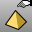

---
---

# Tools toolbar
{: #kanchor2391}
 [To open a toolbar](javascript:void(0);) Toolbars can be opened as a free-standing group or added to the current group.
To open a toolbar as a free-standing group
Click theOptionsicon in any toolbar group.On the menu, clickShow Toolbar, and then select the toolbar name from the list.To open a toolbar as a new tab in the current group
Click theOptionsicon in the toolbar group where you want to add the new tab.On the menu, clickShow or Hide Tabs, and then select the toolbar name from the list. [CommandHistory](commandhistory.html) 
Open the Command History window.
 [CommandHistory, *Save* ](commandhistory.html) 
Save the Command History to a file.
 [Digitize](digitize.html) 
Connect and initialize a digitizing arm.
Link to [3-D Digitizing toolbar](3-d-digitizing-toolbar.html) 
 [DigDisconnect](digitize.html#digdisconnect) 
Disconnect the digitizing arm.
 [EarthAnchorPoint](earthanchorpoint.html) 
Add information about the model's position for GIS mapping applications.
 [History](history.html) 
Store the connection between a command's input geometry and the result, so that when the input geometry changes, the result updates accordingly.
Link to [History toolbar](history-toolbar.html) 
 [Options](options.html) 
Manage global options: [3D mouse](3dconnexion.html), [alerter](alerter.html), [aliases](aliases.html), [appearance](appearance.html), [context menu](context-menu.html), [display modes](view-displaymode-options.html), [files](files.html), [general](general.html), [idle processor](idleprocessor.html), [keyboard](keyboard.html), [libraries](libraries.html), [licenses](licenses.html), [modeling aids](modeling-aids.html), [mouse](mouse.html), [plug-ins](plug-ins.html), [render](rendering.html), [RhinoScript](rhinoscript.html), [selection menu](selection-menu.html), [toolbars](toolbars.html), [updates and statistics](updates-and-statistics.html), [view](view.html).
 [Plug-ins Options](plug-ins.html) 
Install, load, load protect.
 [ReadCommandFile](rhinoscripting.html#readcommandfile) 
Read and execute a command script from a text file.
 [Rescue3dmFile](rescue3dmfile.html) 
Recover data from damaged files.
Link to [Utilities toolbar](utilities-toolbar.html) 
 [Toolbar](toolbars.html) 
Manage the toolbars and toolbar buttons.
 [Toolbar, *Open* ](toolbars.html) 
Opens a toolbar collection.
 [Toolbar, *Save* ](toolbars.html#saveas-toolbar) 
Save an open toolbar collection.
 [Toolbar, *Save all* ](toolbars.html) 
Save all open toolbar collections.
&#160;
&#160;
Rhinoceros 6 © 2010-2015 Robert McNeel &amp; Associates.11-Nov-2015
 [Open topic with navigation](tools-toolbar.html) 

