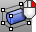
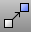

---
---

# Transform toolbar
{: #kanchor2392}
 [To open a toolbar](javascript:void(0);) Toolbars can be opened as a free-standing group or added to the current group.
To open a toolbar as a free-standing group
Click theOptionsicon in any toolbar group.On the menu, clickShow Toolbar, and then select the toolbar name from the list.To open a toolbar as a new tab in the current group
Click theOptionsicon in the toolbar group where you want to add the new tab.On the menu, clickShow or Hide Tabs, and then select the toolbar name from the list. [Align](align.html) 
Line up bounding boxes of objects.
Link to [Align toolbar](align-toolbar.html) 
 [Array](array.html) 
Copy and space objects in columns, rows, and levels.
Link to [Array toolbar](array-toolbar.html) 
 [ArrayPolar](arraypolar.html) 
Copy and space objects around a central location.
 [Bend](bend.html) 
Deform objects along an arc.
 [CageEdit](cageedit.html) 
Deform objects smoothly using control cage objects.
Link to [Cage toolbar](cage-toolbar.html) 
 [Cage](cage.html) 
Create a control cage object used by the [CageEdit](cageedit.html) command to deform other objects.
 [Copy](copy.html) 
Duplicate objects.
 [Flow](flow.html) 
Re-align objects from a base curve to a target curve.
 [FlowAlongSrf](flowalongsrf.html) 
Re-align objects from a source surface to a target surface.
Link to [Deformation tools](deformation-tools-toolbar.html) 
 [Mirror](mirror.html) 
Create a mirror-image copy of objects.
 [Mirror, *3Point* ](mirror.html#3point) 
Create a mirror-image copy of objects on a 3-point plane.
 [Move](move.html) 
Move objects from one location to another.
 [Move X+](move.html) 
Move one unit in the positive construction plane x&#160;direction.
Link to [Organic toolbar](organic-toolbar.html) 
 [Orient](orient.html) 
Transform objects using two reference and two target points.
 [Orient3Pt](orient3pt.html) 
Transform objects using three reference and three target points.
 [OrientCrvToEdge](orientcrvtoedge.html) 
Copy and align a curve to a surface edge.
 [OrientOnCrv](orientoncrv.html) 
Transform objects along a curve normal.
 [OrientOnSrf](orientonsrf.html) 
Transform objects normal to a surface.
 [ProjectToCPlane](projecttocplane.html) 
Flatten objects onto the construction plane.
 [RemapCPlane](remapcplane.html) 
Reorient objects to a different construction plane.
 [Rotate](rotate.html) 
Rotate objects around an axis perpendicular to the construction plane.
 [Rotate3D](rotate3d.html) 
Rotate objects around a 3-D axis.
 [Scale](scale.html) 
Change the size of objects uniformly in the x, y, and z&#160;directions.
Link to [Scale toolbar](scale-toolbar.html) 
 [Scale2D](scale2d.html) 
Change the size of objects uniformly in two directions.
 [SetPt](setpt.html) 
Move objects to a specified location in the x, y, and/or z&#160;directions.
 [Shear](shear.html) 
Skew objects parallel to one axis at an angle.
 [Shear](shear.html) 
Shear the position of objects parallel to one axis at an angle without shearing the objects themselves.
 [Smooth](smooth.html) 
Average the positions of curve and surface [control points](controlpoint.html) and mesh vertices in a specified region and evens out the spacing of selected control points in small increments to remove unwanted detail, and loops in curves and surfaces.
 [SoftEditCrv](softeditcrv.html) 
Move the surrounding curve area smoothly relative to the distance.
Link to [Move toolbar](move-toolbar.html) 
 [Taper](taper.html) 
Deform objects toward or away from an axis.
 [Taper](taper.html) 
Taper the position of objects toward or away from an axis without tapering the objects themselves.
 [Twist](twist.html) 
Deform objects by rotating portions around an axis.
&#160;
&#160;
Rhinoceros 6 © 2010-2015 Robert McNeel &amp; Associates.11-Nov-2015
 [Open topic with navigation](transform-toolbar.html) 

