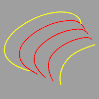
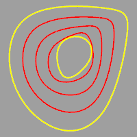
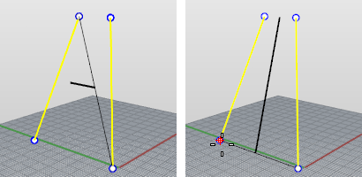
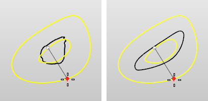
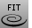

---
---

{: #kanchor2602}
# TweenCurves
 [Where can I find this command?](javascript:void(0);) Toolbars
 [Curve Tools](curve-tools-toolbar.html) 
Menus
Curve
Tween Curves
 [&#160;History enabled](historyenabled.html) 
The TweenCurves command creates curves between two open or closed input curves.

Steps
 [Select](select-objects.html) the first curve.Select the second curve.Adjust the curve if necessary.Click a curve endpoint to change direction. A preview of the curves changes each time the endpoint is clicked.
Before changing curve endpoint (left) and after clicking the left curve endpoint (right).

Before changing curve endpoint (left) and after clicking the left curve endpoint (right).
Command-line options
Number
Specifies the number of curves to create between the two input curves.
OutputLayer
CurrrentLayer
Places new curves on the current layer.
StartCrv
Places new curves on the same layer as the first curve selected.
EndCrv
Places new curves on the same layer as the second curve selected.
MatchMethod
Specifies the method for refining the output curves.
None
Uses the [control points](controlpoint.html) of the curves for matching. So the first control point of first curve is matched to first control point of the second curve.
Refit
Refits the output curves like using the [FitCrv](fitcrv.html) command. Both the input curve and the output curve will have the same structure. The resulting curves are usually more complex than input unless input curves are compatible.
SamplePoints
Input curves are divided to the specified number of points on the curve, corresponding points define new points that output curves go through.
If you are making one tween curve, the command essentially does the following:
Divides the two curves into an equal number of points, finds the midpoint between the corresponding points on the curves. and interpolates the tween curve through those points.
SampleNumber
The number of sample points to use.
See also
 [Rebuild](rebuild.html) 
Reconstruct curves, surfaces, and extrusion objects to a specified degree and control point number.
 [FitCrv](fitcrv.html) 
Make a non-rational NURBS curve of a specified degree that matches the input curve to within the specified tolerance.
 [TweenSurfaces](tweensurfaces.html) 
Create intermediate surfaces between two input surfaces.
 [Create curves from other objects](sak-curvefromobject.html) 
&#160;
&#160;
Rhinoceros 6 © 2010-2015 Robert McNeel &amp; Associates.11-Nov-2015
 [Open topic with navigation](tweencurves.html) 

