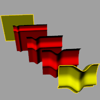
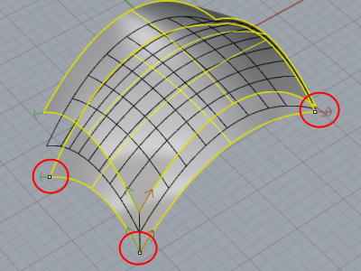

---
---

{: #kanchor2603}
# TweenSurfaces
 [Where can I find this command?](javascript:void(0);) Toolbars
 [Not on toolbars.](toolbarwhattodo.html) 
Menus
Surface
Tween Surfaces
 [&#160;History enabled](historyenabled.html) 
The TweenSurfaces command creates intermediate surfaces between two input surfaces.

Steps
 [Select](select-objects.html) the first surface.Select the second surface.Infinite Plane: TypeIPfor [InfinitePlane](infiniteplane.html) options.
Click the corner points to flip the u and v, or swap the u and v&#160;directions.
Command-line options
NumberOfSurfaces
Specifies the number of surfaces to create between the two input surfaces.
MatchMethod
Specifies the method for refining the output surfaces.
None
No refinement of the output surfaces is done. [Control points](controlpoint.html) of resulting surfaces are generated by connecting corresponding control points. Any extra control points are connected to the last control points of the surface with the smaller number of control points.
Refit
Refits the output surfaces like using the [FitSrf](fitsrf.html) command. The resulting surfaces are usually more complex than input unless input surfaces are compatible.
SamplePoints
Input surfaces are divided to the specified number of points (on curve), corresponding points define new points that output surfaces go through.
SampleNumber
The number of sample points to use.
See also
 [Edit surfaces](sak-surfacetools.html) 
&#160;
&#160;
Rhinoceros 6 © 2010-2015 Robert McNeel &amp; Associates.11-Nov-2015
 [Open topic with navigation](tweensurfaces.html) 

