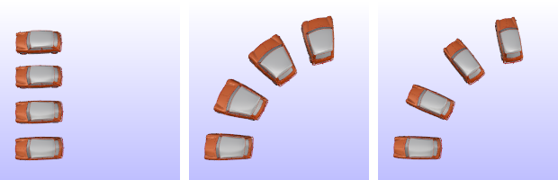
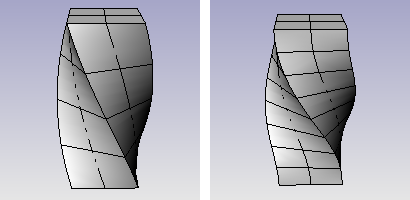
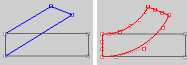

---
---

{: #kanchor2207}{: #kanchor2208}
# Twist
 [Where can I find this command?](javascript:void(0);) Toolbars
 [Transform](transform-toolbar.html)  [Deformation Tools](deformation-tools-toolbar.html) 
Menus
Transform
Twist
The Twist command deforms objects by rotating them around an axis.
Steps
 [Select](select-objects.html) objects. [Pick](pick-location.html) the start of the twist axis.The part of the object closest to this point will be fully twisted, and the part farthest from it will keep its original orientation.Pick the end of the twist axis.Type the angle, or pick two reference points to define the rotation angle.Your browser does not support the video tag.Command-line options
Copy
 [&#160;History enabled](historyenabled.html) 
The Copy option specifies whether or not the objects are copied. A plus signappears at the cursor when copy mode is on.
The [RememberCopyOptions](remembercopyoptions.html) command determines whether the selected option is used as the default.
Rigid
The Rigid option specifies that individual objects will not be deformed as they are transformed.
The illustration shows the Rigid option with the Bend command.

Original objects (left), Rigid=No (center), Rigid=Yes (left).
Yes
Individual objects will not change, only their positions will change.
No
Individual objects are transformed as well as their positions.
Infinite
IfYes, the deformation is constant throughout the object, even if the axis is shorter than the object.
IfNo, the twisting is not constant throughout the object. The deformation takes place only the length of the axis. The length of the axis is important. If the axis is shorter than the object, the twist applies only to that part of the object. In addition, the twist blends in and out at the ends of the axis.

Infinite=Yes (left); Infinite=No (right).
PreserveStructure
Specifies whether the control-point structure of a curve or surface will be maintained after the deformation.
The PreserveStructure option does not apply to polysurfaces, and will not be displayed if polysurfaces are selected for editing.
Yes
The [control point](controlpoint.html) structure of the surface is maintained. Deformation may be less accurate if there are too few control points in on the object.
No
The objects are [refit](fitcrv.html) as needed with more [control points](controlpoint.html) to allow accurate deformation.
PreserveStructure=Yes (left); PreserveStructure=No (right).
See also
 [Use Universal Deformation Technology](sak-udt.html) 
&#160;
&#160;
Rhinoceros 6 © 2010-2015 Robert McNeel &amp; Associates.11-Nov-2015
 [Open topic with navigation](twist.html) 

