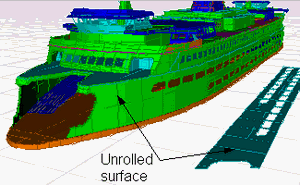
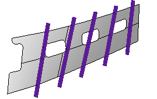
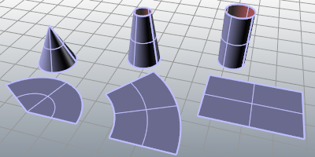
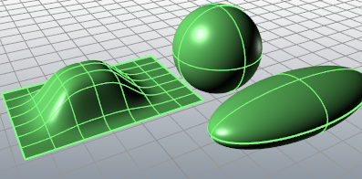
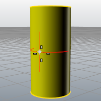
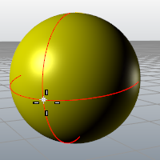
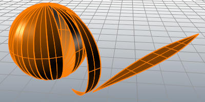

---
---

{: #kanchor2213}{: #kanchor2214}{: #kanchor2215}{: #kanchor2216}{: #kanchor2217}{: #kanchor2218}{: #kanchor2219}{: #kanchor2220}{: #kanchor2221}{: #kanchor2222}{: #kanchor2223}
# UnrollSrf
 [Where can I find this command?](javascript:void(0);) Toolbars
 [Surface Tools](surface-tools-toolbar.html) 
Menus
Surface
Unroll Developable Srf
The UnrollSrf command flattens ( [develops](#developablesurface) ) a surface or polysurface with curvature in one direction to a planar surface.
Steps
 [Select](select-objects.html) surfaces or polysurfaces.Select curves on the surface.This is useful if you are trying to develop a trimmed polysurface. In situations in which the surface cannot be developed, [remove the trim curves](trim.html#untrim), develop the surface and curves, and then re-trim the developed surface with the trim curves.Your browser does not support the video tag.Note
Use Gaussian [curvature analysis](curvatureanalysis.html) to determine which areas of a surface have double curvature and are not developable.Surfaces such as spheres, tori, and surfaces that are curved in two directions cannot be unrolled.Command-line options
Explode
Yes
The resulting surfaces are not joined.
No
The resulting surfaces are re-joined along the same edges that were joined in the original polysurface.
To specify where the unrolled polysurface will split
Use the [UnjoinEdge](joinedge.html#unjoinedge) commandSelect the edges that should be open after unrolling.Labels
Determines whether or not matching numbered dots are placed on the edges of the selected object and the resulting objects.
KeepProperties
Determines whether or not the selected object's [properties](properties.html) are copied to the resulting object.
RelativeTolerance
Compares the maximum deviation of a curve from a line between its endpoints to the [Relative Tolerance](units.html#relativetolerance) * length of the curve. If a curve is 10 units long and the relative tolerance is .01, the maximum deviation is compared to 0.1. If the line is 100 units long, max deviation is compared to&#160;1.
Warning
TheWarningoption displays a warning if the area of the unrolled surface is not within a percentage tolerance.
These options are displayed only if the surface is selected after starting the command ( [post-select](selection-commands.html#preselect) ).
Area difference tolerance
TheArea difference toleranceoption sets the percentage of difference between the area of the unrolled surface and the area of the original surface.
WarningDisplay
TheWarningDisplayoption specifies whether the warning will be displayed at the command line or in a dialog box that you must click to dismiss.
CommandLine
TheCommandlineoption displays the warning message on the command line. No action is required.
Dialog
TheDialogoption displays the warning message in a dialog box. You must dismiss the dialog box before continuing. This will interrupt scripting the command.

## Developable Surface
{: #developablesurface}
Rhino has commands to create and unroll developable surfaces with holes and marking curves.
Developable surfaces are surfaces that can be formed by rolling a flat sheet of material such that the material does not stretch, tear, or wrinkle. Examples of this type of shape are cylinders, cones, and some steel ship hulls.

Developed surfaces used to make patterns for cutting steel.
Picture trying to make your surface out of aluminum foil. If it crinkles or tears as you try to bend it into position, the surface is not developable. A sphere is an example of a surface that are not developable (try wrapping an apple with aluminum foil). So are most of the shapes on car bodies and most modern car windshields.
Surfaces must still be linear in one direction for [UnrollSrf](#) to unroll them. You could lay a ruler along the surface and it would touch the surface from one edge to the other. These are called ruling lines.

Ruling lines.
Because these surfaces are linear in one direction, the Gaussian curvature is zero at every point on the surface. If the Gaussian curvature is not zero, Rhino will not be able to unroll the surface. If the surface is not linear in one direction, Rhino will not be able to unroll the surface.
Since developable surfaces cannot be created from just any two curves, results from a developable style loft can be unpredictable. Curves of similar shape without kinks work best.
You can use [Gaussian curvature analysis](curvatureanalysis.html) to determine which areas of a surface are not developable.
These developable surface tools work best for designing airfoil and hydrofoil type surfaces. They were not designed to be used for bending and unfolding sheet metal like duct work or for developing fabric patterns.

### Developable surface pitfalls
When building a developable surface, you can get very different results depending on the complexity and similarity of the two edge curves. It is best if they are as simple as possible and have the same [parameterization](parameterization.html).
Picking different ends of the curves can give different results. You can sometimes combine the different results to get a better developable surface.
A developable surface is not necessarily a fair surface.
It is possible to make a developable surface that unrolls with a difference in area and ruling lengths from the 3-D surface. It is easy to miss the warning Rhino gives.
You can unroll surfaces that are not developable.
Rhino does not have any method of making a surface a bit more or less developable. Some programs have a way of spreading out the concentrated fans of rulings that often occur, thereby smoothing the surface. Since metal, especially aluminum, has some elasticity, you can deviate quite a bit from a mathematically correct developable surface and still plate it up. Some builders that use developable surfaces in their models, expand the plates, and then add up to 1-inch chord depth of radius to the flat sides in the sections to make the plate "taut." The expanded plates fit up to the changed sections. They have not figured out how to get this "blow" into their 3-D models, though.
One way to approach the problem is to use the [CurvatureAnalysis](curvatureanalysis.html) command to analyze the Gaussian curvature as a guide to surface creation instead of the developable loft. But there is no way in Rhino to expand surfaces created this way (unless they happen to meet the requirements for the [UnrollSrf](#) command).

## Troubleshooting unrolling surfaces
The goal of many designers is to obtain flattened, two-dimensional patterns from their three-dimensional designs. The three-dimensional surfaces are analyzed using Gaussian curvature analysis and classified into two types of surfaces: developable and non-developable.
Developable surfaces can be flattened using exact solutions. These are surfaces like cones, truncated cones, and cylinders.

Unrolled cone, truncated cone, and cylinder surfaces.
Spheres and other surfaces, that have compound curvature, cannot be unfolded or “developed” accurately without knowing something about the characteristics of the material (amount of stretch available and more.)

Non-developable surfaces.
Non-developable surfaces have compound curvature, that is, curvature in two directions. Flattening or developing these surfaces requires stretching or shrinking of the material used.
The [Curvature](curvature.html) command will show the curvature curve as you move your cursor over the surface. The non-developable surface show the curvature with two arcs, to illustrate the compound curvature. Developable surfaces will show curvature with a single arc and a line, illustrating the curvature in a single direction.

Curvature circle of a developable cylinder.

Curvature circles of a non-developable sphere.
The unrolling or flattening of non-developable surfaces is based on complex transformation matrices that factor in material characteristics and transform the surface on to the xy plane as a two-dimensional boundary. The material’s characteristics help determine stretch that material will experience to produce the shape.
It is helpful to imagine cutting and folding paper. A developable surface can be folded or rolled from a sheet of paper. Clearly, a sphere does not fit that criterion. A sphere of sorts can be constructed from a series of developable panels and can be developed panel by panel, but of course it will not be a true sphere, but an approximation. In short, if a surface can be constructed with paper, then it is determined to be developable and Rhino should be able to unroll it. If you need a sheet of rubber to make the 3-D shape, then it is non-developable and the [UnrollSrf](#) command will not unroll it.

A "sphere" made from developable panels.
The [Smash](smash.html) command makes an approximate 2-D development of surfaces that have compound curvature. This command can be used to deal with fabrics that have a certain amount of flexibility and stretch.
See also
 [Smash](smash.html) 
Flatten a surface without restriction to single-directional curvature.
 [Squish](squish.html) 
Flatten a non-developable (curved in two directions) 3-D mesh or NURBS surface into a flat 2-D pattern.
 [Flatten curves and surfaces](sak-flatten.html) 
&#160;
&#160;
Rhinoceros 6 © 2010-2015 Robert McNeel &amp; Associates.11-Nov-2015
 [Open topic with navigation](unrollsrf.html) 

