---
---

{: #kanchor2488}{: #kanchor2489}{: #kanchor2490}{: #kanchor2491}{: #kanchor2492}{: #kanchor2493}{: #kanchor2494}{: #kanchor2495}{: #kanchor2496}
# Using toolbars and buttons
Rhino opens with the default toolbar layout open. The default toolbar layout displays only one of the many Rhino toolbar groups, theStandard Toolbar Group. Most of the unopened toolbars in the default toolbar layout are linked to buttons this toolbar.
The toolbar docked at the left of the screen is the [Sidebar](#sidebars) that is linked to theStandard Toolbar Group.
Open a toolbar
On theToolsmenu, clickToolbar Layout.On theRhino OptionsToolbarspage, underFiles, select the toolbar collection name.UnderToolbars, select toolbars to open, and clickOK.Or use the toolbar group [Options icon](#group-options-menu) to display the list.{: #floatdocked}Float a toolbar
Drag the toolbar handle.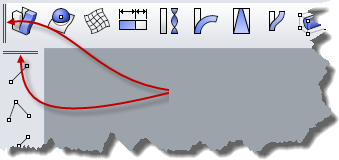Release the mouse button to place the toolbar.A tab will appear on the toolbar.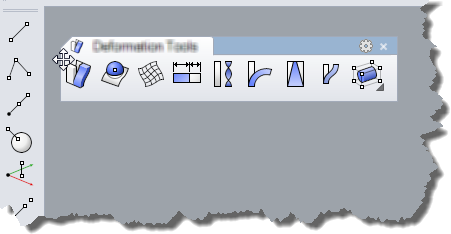Reshape a floating toolbar group
Drag the toolbar group border.Notice that the cursor changes shape to indicate that the toolbar group can be re-sized.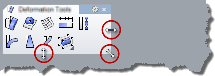
## Toolbar groups
Each free-standing toolbar is actually a toolbar group.
Parts of a toolbar group
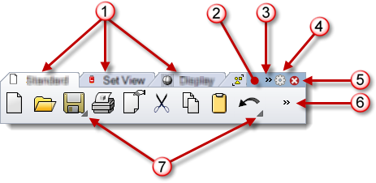
Tabs (1), group handle (2), scroll control (3), options menu icon (4), close button (5), Show more (6), and linked toolbar cascade button (7).
TabsEach toolbar docked in a group displays as a tab.
To bring a tab to the top
Click on a tab.Tabs can be moved from group to group or made to be free standing.
Move a toolbar tab
Drag the toolbar tab to a different group.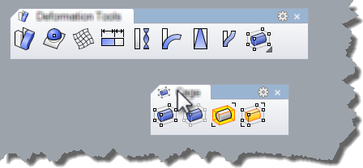Drag the toolbar tab to a blank area on the screen to make it a free-standing group.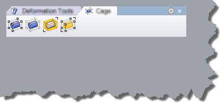Copy a toolbar tab to another group
Hold [Ctrl](ctrl-key.html) and drag the toolbar tab to a different group.Group handleThe group handle is the blank area of the group where no tabs appear.
To move a floating toolbar group
Click in the handle area to drag the whole toolbar.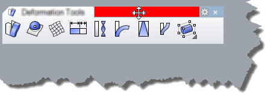The cursor changes shape to a four-direction arrow when the handle is active.{: #dockfloated}Dock a toolbar group
Drag the toolbar group handle to the edge of the Rhino graphics area.A blue shape will light up the area where the toolbar will dock.Release the mouse button to dock the toolbar.The toolbar docks.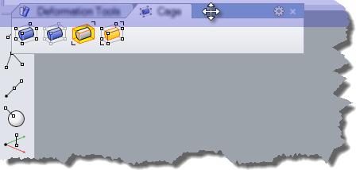Prevent a toolbar from docking while being dragged
To prevent a toolbar from docking when you drag it near viewport edges, press and hold [Ctrl](ctrl-key.html) while you drag the toolbar.Scroll control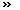If the toolbar group is not expanded to show all tabs, aScrollcontrol appears.
Click the scroll control and select a tab name from the menu.The selected tab comes to the front.{: #group-options-menu}Group Options menuOpens the groupOptionsmenu.
See: [Customize toolbars](customize-toolbars.html).
Options
Show Toolbar
Opens a toolbar as a free-standing group.
New Button
Adds a new button and opens the [Button Editor](toolbar-button-editor.html#openbuttoneditor).
New Separator
Inserts a button separator.
Edit Button
Opens the selected button in the [Button Editor](toolbar-button-editor.html#openbuttoneditor).
New Tab
Creates a new blank tabbed toolbar.
Show or Hide Tabs
Shows/hides a toolbar tab in the current group.
Size to content
Expands a toolbar to show all buttons.
Properties
Opens the [Toolbar Properties](toolbars.html) dialog box.
Group close buttonCloses the group.
Show moreIf the tab is not expanded to show all buttons, aShow morecontrol appears.
Click the Show more control and select a button name from the menu.The selected command runs, or the linked toolbar opens as a menu.Cascade buttonsCascades a toolbar linked to that button.
Cascade a linked toolbar
Click the triangle in the lower right of a toolbar button to cascade a linked toolbar.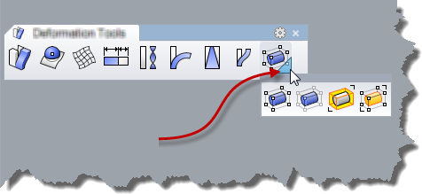Drag the title bar of the toolbar to a new position.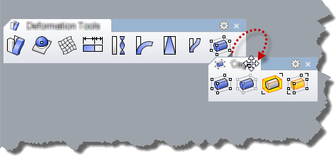{: #lock}Lock the toolbar locations
To prevent the toolbars from being accidentally moved, lock them.Locking the toolbars also locks any docked panels.Click the toolbar group menu icon and on theToolbar groupmenu, clickLock Docked Windows.Or [Right-click](mouse-buttons.html) in the group handle area or tab, and clickLock Docked Windows.{: #sidebars}Sidebars
The sidebar is a special toolbar that is populated with a specified group by the currently active tab. When the tab is active, the contents of the Sidebar toolbar changes to the toolbar tab specified in the [Toolbar Properties](toolbars.html#toolbar-properties).
For example
In the Default workspace, notice the contents of the toolbar docked at the left.This is the Sidebar displaying the contents of the [Main](main-sidebar-toolbar.html) toolbar.In the Standard toolbar group (usually docked at the top of the workspace, under the command prompt, click theCurve Toolstab.Notice that the buttons in the Sidebar change to the contents of the [Curve Tools](curve-tools-toolbar.html) toolbar.
Other tabs with Sidebars include [Mesh Tools](mesh-tools-toolbar.html), [Solid Tools](solid-tools-toolbar.html), [Render Tools](render-tools-toolbar.html), and [Drafting](drafting-toolbar.html).
Restoring lost toolbars
If your toolbars are lost or become corrupted, they can be restored with the [ToolbarReset](toolbars.html#toolbarreset) command.
Warning
The [ToolbarReset](toolbars.html#toolbarreset) command replaces all custom toolbars and groups with the default set that ships with Rhino.

## Using toolbar buttons
{: #movebutton}Move a button
Move the cursor over the toolbar button.Press and hold [Shift](shift-key.html) .Click the [left mouse button](mouse-buttons.html) and drag the toolbar button to a different toolbar or to a different position in the same toolbar.{: #copybutton}Copy a button
Move the cursor over the toolbar button.Press and hold [Ctrl](ctrl-key.html) .Click left mouse button and drag the button to another location in the same toolbar or to a different toolbar.{: #deletebutton}Delete a button
Move the cursor over the toolbar button.Press and hold [Shift](shift-key.html) .Click the left mouse button, drag the toolbar button outside the toolbars and drop.{: #linkbydragging}Create a link
Open the parent toolbar that will contain the link button.Open the child toolbar that will be linked to it.Press and hold [Ctrl](ctrl-key.html) .With the [right mouse button](mouse-buttons.html) down, drag a button from the child toolbar to the parent toolbar.A copy of the button appears in the parent toolbar with the white triangle link symbol in its corner.Unlink a toolbar
Move the cursor over the linked button.Press and hold [Shift](shift-key.html) .Click the [right mouse button](mouse-buttons.html) to open theEdit Toolbar Buttondialog box.Click **Unlink** .See also
 [Customize toolbars](customize-toolbars.html) 
 [Toolbar button editor](toolbar-button-editor.html) 
 [Edit toolbar bitmap](toolbar-button-editor.html#openbuttoneditor) 
&#160;
&#160;
Rhinoceros 6 © 2010-2015 Robert McNeel &amp; Associates.11-Nov-2015
 [Open topic with navigation](using-toolbars.html) 

