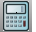

---
---

# Utilities toolbar
{: #kanchor2395}
 [To open a toolbar](javascript:void(0);) Toolbars can be opened as a free-standing group or added to the current group.
To open a toolbar as a free-standing group
Click theOptionsicon in any toolbar group.On the menu, clickShow Toolbar, and then select the toolbar name from the list.To open a toolbar as a new tab in the current group
Click theOptionsicon in the toolbar group where you want to add the new tab.On the menu, clickShow or Hide Tabs, and then select the toolbar name from the list. [AttachGHSData](attachghsdata.html) 
Add GHS-specific information to objects.
 [Alerter options](alerter.html) 
Enable alerter, watch commands, time, sound, run Rhino commands.
 [Calc](calc.html) 
Toggle the on-screen calculator.
 [CalcRPN](calc.html#calcrpn) 
Toggle the on-screen RPN (reverse Polish notation) calculator.
 [ClearAllMeshes](clearallmeshes.html) 
Delete render and analysis meshes.
 [Hyperlink](hyperlink.html) 
Manage URL addresses attached to an object.
 [Hyperlink,Open](hyperlink.html) 
Open a URL address attached to an object.
 [MacroEditor](rhinoscripting.html#macroeditor) 
Open an edit window for script creation and testing.
 [OptionsExport](optionsexport.html) 
Save [Options](options.html) settings to a file.
 [OptionsImport](optionsexport.html#optionsimport) 
Restore [Options](options.html) settings from a file.
 [Purge](purge.html) 
Delete unused block definitions, groups, layers, hatch patterns, linetypes, dimension styles, and materials.
 [Rescue3dmFile](rescue3dmfile.html) 
Recover data from damaged files.
 [WebBrowser](webbrowser.html) 
Opens the Web Browser panel.
Link to [HTML toolbar](html-toolbar.html) 
&#160;
&#160;
Rhinoceros 6 © 2010-2015 Robert McNeel &amp; Associates.11-Nov-2015
 [Open topic with navigation](utilities-toolbar.html) 

