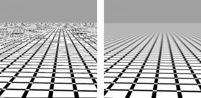

---
---

# OpenGL
{: #kanchor2487}
 [Where can I find this command?](javascript:void(0);) Toolbars
 [Properties](properties-toolbar.html)  [Standard](standard-toolbar.html)  [Tools](tools-toolbar.html) 
Menus
Tools
Options
TheOpenGLoptions manage display options for OpenGL accelerator graphics cards.
OpenGL Options
Use accelerated hardware modes
Uses hardware acceleration. Turn this option off if the OpenGL acceleration causes problems with Rhino.
Redraw scene when viewports are exposed
Ensures that viewports that are in a rendered state will refresh correctly when other windows are dragged over them.
Use Texture Compression
Images are compressed as they are stored in memory. When the image is used, it is decompressed. Since the compression is lossy, the results can sometimes appear degraded over the original. Textures can compress up to a 4-to-1 ratio, freeing up video memory.
Appearance Settings
Antialiasing
None
2x
4x
8x
Mip Map Filtering
Mip map filtering improves the quality of textures based on distance or space occupied. Mip maps are generated when the texture image is first loaded, and the number of maps created depends on the original image size. For example: If you load a 1024x1024 image, Rhino will create similar, sampled images based on the original in the following resolutions: 512x512, 256x256, 128x128, 64x64, 32x32, 16x16, 8x8, 4x4, 2x2, 1x1 (single pixel). Based on size and distance, textures are chosen from the collection of textures to result in smoother, less grainy images and to moiré patterns.
Nearest
Linear
Anisotropic Filtering
Anisotropic filtering improves the clarity and crispness of textured objects, and enhances the image quality for textures viewed at low angles relative to the camera.

Anisotropic filtering off (left) and on (right).
Low
Medium
High
Video Hardware &amp; Driver Information
Lists information about your system.
To save options for use on other computers
 [OptionsExport](optionsexport.html) 
Save [Options](options.html) settings to a file.
 [OptionsImport](optionsexport.html#optionsimport) 
Restore [Options](options.html) settings from a file.
See also
 [Wikipedia: Mipmap](https://en.wikipedia.org/wiki/Mipmap) 
&#160;
&#160;
Rhinoceros 6 © 2010-2015 Robert McNeel &amp; Associates.11-Nov-2015
 [Open topic with navigation](view-opengl.html) 

