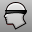

---
---

# View toolbar
{: #kanchor2396}
 [To open a toolbar](javascript:void(0);) Toolbars can be opened as a free-standing group or added to the current group.
To open a toolbar as a free-standing group
Click theOptionsicon in any toolbar group.On the menu, clickShow Toolbar, and then select the toolbar name from the list.To open a toolbar as a new tab in the current group
Click theOptionsicon in the toolbar group where you want to add the new tab.On the menu, clickShow or Hide Tabs, and then select the toolbar name from the list. [DollyZoom](dollyzoom.html) 
Move the camera location and change the lens length at the same time.
 [ZoomLens](zoom.html#zoomlens) 
Adjust the lens length of the viewport camera in a perspective view.
 [Pan](pan.html) 
Shift the location of the view camera and target parallel to the view plane.
 [RotateView](rotateview.html) 
Rotate the view camera around the target.
 [RotateCamera](rotatecamera.html) 
Rotate the view target around the camera.
 [SetRedrawOff](rhinoscripting.html#setredrawoff) 
Disable screen redraw, construction plane, and view changes during scripts.
 [SetRedrawOn](rhinoscripting.html#setredrawon) 
Enable screen redraw, construction plane, and view changes during scripts.
 [TiltView](tiltview.html) 
Rotate the view around the view axis.
 [Turntable](turntable.html) 
Rotate a view around the target.
 [Turntable, *One cycle* ](turntable.html) 
Rotates a view around the target one time.
 [Zoom](zoom.html) 
Move the viewport camera so the area defined by a window selection fills the viewport.
 [Zoom, *Target* ](zoom.html#target) 
Zoom the view by specifying a target and window.
 [Zoom 1To1](zoom.html#zoom-1to1) 
Zooms the active viewport so that the view is full scale.
 [Zoom Dynamic](zoom.html#dynamic) 
Zooms the view as you drag the mouse.
 [Zoom, *Factor* ](zoom.html#factor) 
Zoom the view in or out the specified amount.
 [Zoom Extents](zoom.html#extents) 
Zooms the view to show all objects.
 [Zoom Extents All](zoom.html#all) 
Zooms the view to show all objects in all viewports.
 [Zoom Selected](zoom.html#selected) 
Zooms the view to show all selected objects.
 [Zoom Selected All](zoom.html#all) 
Zooms all viewports to show all selected objects.
 [UndoView](undoview.html) 
Undo the last view change.
 [RedoView](undoview.html#redoview) 
Reverse the last UndoView.
&#160;
&#160;
Rhinoceros 6 © 2010-2015 Robert McNeel &amp; Associates.11-Nov-2015
 [Open topic with navigation](view-toolbar.html) 

