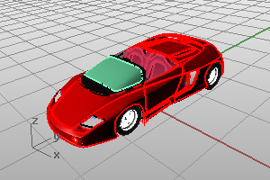
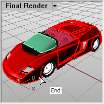

---
---

{: #kanchor1903}{: #kanchor1904}{: #kanchor1905}{: #kanchor1906}{: #kanchor1907}{: #kanchor1908}{: #kanchor1909}{: #kanchor1910}{: #kanchor1911}{: #kanchor1912}{: #kanchor1913}{: #kanchor1914}
# View Capture
The ViewCapture and ScreenCapture commands save a bitmap image. The ViewCapture commands save the contents of the viewport with options for turning on various viewport elements. The SceenCapture commands save the viewport including the viewport frame, viewport title, and the cursor.

# ViewCaptureToFile
{: #viewcapturetofile}
 [Where can I find this command?](javascript:void(0);) Toolbars
 [Display](display-toolbar.html)  [Surface Analysis](surface-analysis-toolbar.html) 
Menus
View
 [Viewport title](rhino-window.html#viewport-title-menu) 
Capture
To File
The ViewCaptureToFile command saves an image of the current view to a file.

ViewCaptureToFile saves the contents of the view with a specified width and height, disregarding the current viewport size.
Viewport borders, cursor images, and other decorations are not saved.
Steps
Choose the location, file type, and name for the bitmap file.BMP, JPG, PCX, PNG, TIFF, and TGA formats are supported.Options
Transparent background *(supported file types only)* 
Saves the background with alpha channel. Select a file format that supports alpha channels, otherwise, the alpha channel will be stripped out.
Command-line options
To access command-line options
Type ahyphenin front of the command name:-ViewCaptureToFile.These options stay in effect when the command is subsequently run normally with the exception of the width and height, which are taken from the current viewport size.
Width
Sets the image width. This option persists when the command is run in scripting mode. When the command is run normally, the width of the current viewport determines the image width.
Height
Sets the image height. This option persists when the command is run in scripting mode. When the command is run normally, the height of the current viewport determines the image height.
Scale
Scales the image from the viewport size. For example, with a viewport that is 400x600, a scale of 2 will make the image 800x1200.
DrawGrid
The grid appears in the captured image.
DrawWorldAxes
The world axis icon appears in the captured image.
DrawCPlaneAxes
The construction plane axes appear in the captured image.
TransparentBackground
All background pixels will have a 0.0% alpha value. This overrides the DrawWorldAxes setting.

# ViewCaptureToClipboard
{: #viewcapturetoclipboard}
 [Where can I find this command?](javascript:void(0);) Toolbars
 [Display](display-toolbar.html)  [Surface Analysis](surface-analysis-toolbar.html) 
Menus
View
 [Viewport title](rhino-window.html#viewport-title-menu) 
Capture
To Clipboard
The ViewCaptureToClipboard command saves an image of the current view to the Clipboard.
Command-line options
To access command-line options
Type ahyphenin front of the command name:-View CaptureToClipboard.These options stay in effect when the command is subsequently run normally with the exception of the width and height, which are taken from the current viewport size.
Width
Sets the image width. This option persists when the command is run in scripting mode. When the command is run normally, the width of the current viewport determines the image width.
Height
Sets the image height. This option persists when the command is run in scripting mode. When the command is run normally, the height of the current viewport determines the image height.
Scale
Scales the image from the viewport size. For example, with a viewport that is 400x600, a scale of 2 will make the image 800x1200.
DrawGrid
The grid appears in the captured image.
DrawWorldAxes
The world axis icon appears in the captured image.
DrawCPlaneAxes
The construction plane axes appear in the captured image.

# ScreenCaptureToFile
{: #screencapturetofile}
 [Where can I find this command?](javascript:void(0);) Toolbars
 [Not on toolbars.](toolbarwhattodo.html) 
Menus
 [Not on menus.](menuwhattodo.html) 
The ScreenCaptureToFile command saves an image of the current viewport with viewport borders, viewport titles, cursor images, and other decorations as a bitmap file, using the current viewport size.
Screen captures are useful if you are creating illustrations for documentation. With Rhino you can capture the current viewport to the Clipboard, to a file with a color depth to match your current settings.

Steps
Choose the location, file type, and name for the bitmap file.BMP, JPG, PCX, PNG, TIFF, and TGA formats are supported.
# ScreenCaptureToClipboard
{: #screencapturetoclipboard}
 [Where can I find this command?](javascript:void(0);) Toolbars
 [Not on toolbars.](toolbarwhattodo.html) 
Menus
 [Not on menus.](menuwhattodo.html) 
The ScreenCaptureToClipboard command saves an image of the current viewport with borders and viewport titles to the Clipboard.
The active viewport is captured to the Clipboard as a bitmap. You can paste this image into a paint program for further editing, or another program that accepts bitmap images.
See also
 [Save viewport images](sak-saveviewportimage.html) 
 [Manage views](sak-view.html) 
 [Rhino Screen Capture Strategies tutorial](http://discourse.mcneel.com/t/video-rhino-screen-capture-strategies/18893) 
&#160;
&#160;
Rhinoceros 6 © 2010-2015 Robert McNeel &amp; Associates.11-Nov-2015
 [Open topic with navigation](viewcapture.html) 

