---
---

# Viewport Layout toolbar
{: #kanchor2397}
 [To open a toolbar](javascript:void(0);) Toolbars can be opened as a free-standing group or added to the current group.
To open a toolbar as a free-standing group
Click theOptionsicon in any toolbar group.On the menu, clickShow Toolbar, and then select the toolbar name from the list.To open a toolbar as a new tab in the current group
Click theOptionsicon in the toolbar group where you want to add the new tab.On the menu, clickShow or Hide Tabs, and then select the toolbar name from the list. [3View](new-viewport-arrangements.html#3view) 
Set up a three-viewport workspace.
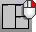 [3View](new-viewport-arrangements.html#3view) + [Zoom,Extents,All](zoom.html#extents) 
Set up a three-viewport workspace and zoom all viewports to object extents.
 [4View](new-viewport-arrangements.html#4view) 
Set up a four-viewport workspace.
 [4View](new-viewport-arrangements.html#4view) + [Zoom,Extents,All](zoom.html#extents) 
Set up a four-viewport workspace and zoom extents in all.
 [ClippingPlane](clippingplane.html) 
Create a plane that hides objects.
 [Grid, *On* ](grid.html) 
Turn the grid display on.
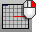 [Grid, *Off* ](grid.html) 
Turn the grid display off.
 [Layout, *Four details* ](layout.html) 
Create a print layout viewport with four details.
Link to [Drafting toolbar](drafting-toolbar.html) 
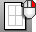 [Layout, *One detail* ](layout.html) 
Create a print layout viewport with one detail.
 [MaxViewport](maxviewport.html) 
Maximize the active viewport.
 [NewFloatingViewport](new-viewport-arrangements.html#newfloatingviewport) 
Create a new free-floating viewport.
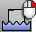 [NewFloatingViewport, *Perspective* ](new-viewport-arrangements.html#newfloatingviewport) 
Create a new free-floating viewport, copying the active viewport.
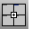 [NewViewport](new-viewport-arrangements.html#newviewport) 
Create a new viewport.
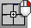 [CloseViewport](new-viewport-arrangements.html#closeviewport) 
Close the active viewport.
 [Print](print.html) 
Print the current viewport or layouts.
 [Set 2-Point Perspective](viewport.html#two-point-perspective) 
Set the projection to two-point perspective.
 [PerspectiveAngle](perspectiveangle.html) 
Set the viewport field-of-view angle.
 [ReadViewportsFromFile](new-viewport-arrangements.html#readviewportsfromfile) 
Set the viewport layout to match that of another model.
 [SplitViewportHorizontal](viewport-arrangement.html#splitviewporthorizontal) 
Divide a viewport horizontally into two viewports.
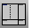 [SplitViewportVertical](viewport-arrangement.html#splitviewportvertical) 
Divide a viewport vertically into two viewports.
 [SynchronizeViews](synchronizeviews.html) 
Set the scale and center of all viewports to match the active viewport.
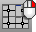 [Options,View](view.html#linkedviewports) 
Toggle linked viewports.
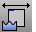 [ToggleFloatingViewport](new-viewport-arrangements.html#togglefloatingviewport) 
Toggle the viewport between docked and floating.
 [ViewportProperties](viewport.html) 
Title, size, projection, camera and target, lens length, wallpaper.
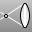 [ViewportProperties, *Lens length* ](viewport.html#lens-length) 
Set the viewport camera lens length.
Link to: [Lens Length toolbar](lens-length-toolbar.html) 
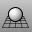 [ViewportProperties, *Toggle Projection* ](viewport.html#projection-parallel-perspective) 
Toggle between parallel and perspective projection.
 [PerspectiveAngle](perspectiveangle.html) 
Set the viewport field-of-view angle.
 [ViewportTabs](new-viewport-arrangements.html#viewporttabs) 
Display a tab control UI along the viewport edge.
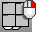 [Toggle viewport tab display](new-viewport-arrangements.html#viewporttabs) 
Toggle the viewport tab display on or off.
&#160;
&#160;
Rhinoceros 6 © 2010-2015 Robert McNeel &amp; Associates.11-Nov-2015
 [Open topic with navigation](viewport-layout-toolbar.html) 

