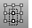

---
---

# Visibility toolbar
{: #kanchor2398}
 [To open a toolbar](javascript:void(0);) Toolbars can be opened as a free-standing group or added to the current group.
To open a toolbar as a free-standing group
Click theOptionsicon in any toolbar group.On the menu, clickShow Toolbar, and then select the toolbar name from the list.To open a toolbar as a new tab in the current group
Click theOptionsicon in the toolbar group where you want to add the new tab.On the menu, clickShow or Hide Tabs, and then select the toolbar name from the list. [ClippingPlane](clippingplane.html) 
Create a plane that hides objects.
 [DisableClippingPlane](clippingplane.html#disableclippingplane) 
Turn off the selected clipping plane.
 [Hide](hide.html) 
Conceal objects from view.
 [Show](hide.html#show) 
Redisplay all hidden objects.
 [Hide,A](hide.html) 
Hide a cluster of objects named A.
 [Show,A](hide.html#show) 
Show cluster A.
 [Hide,B](hide.html) 
Hide a cluster of objects named B.
 [Show,B](hide.html#show) 
Show cluster B.
 [Hide,C](hide.html) 
Hide a cluster of objects named C.
 [Show,C](hide.html#show) 
Show cluster C.
 [Hide,custom cluster](hide.html) 
Hide a named cluster of objects..
 [Show,custom cluster](hide.html#show) 
Show a named cluster.
 [HidePt](hide.html#hidept) 
Conceal control and edit points.
 [ShowPt](hide.html#showpt) 
Redisplay all hidden control points and edit points.
 [HideSwap](hide.html#hideswap) 
Conceal all visible objects and re-displays all previously hidden objects.
 [Invert](selection-commands.html#invert) and [Hide](hide.html) 
Deselect all selected objects and select all previously unselected objects and hide.
 [Invert](selection-commands.html#invert) and [Lock](lock.html) 
Deselect all selected objects and select all previously unselected objects and lock.
 [InvertPt](selection-commands.html#invertpt) 
Deselect all selected control or edit points and select all previously unselected control or edit points.
 [ShowPt](hide.html#showpt) 
Redisplay all hidden control points and edit points.
 [Lock](lock.html) 
Lock objects so they cannot be selected for editing.
 [Unlock](lock.html#unlock) 
Unlock all locked objects.
 [LockSwap](lock.html#lockswap) 
Lock all unlocked objects and unlock all previously locked objects.
 [Show](hide.html#show) 
Redisplay all hidden objects.
 [ShowSelected](hide.html#showselected) 
Redisplay selected hidden objects.
 [Unlock](lock.html#unlock) 
Unlock all locked objects.
 [UnlockSelected](lock.html#unlockselected) 
Unlock selected locked objects.
&#160;
&#160;
Rhinoceros 6 © 2010-2015 Robert McNeel &amp; Associates.11-Nov-2015
 [Open topic with navigation](visibility-toolbar.html) 

