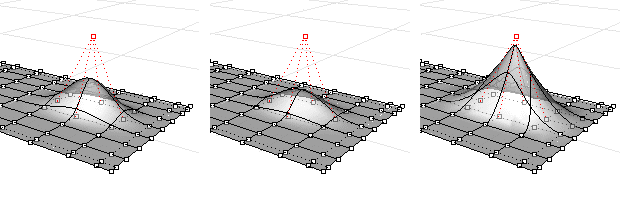

---
---

{: #kanchor2259}{: #kanchor2260}
# Weight
 [Where can I find this command?](javascript:void(0);) Toolbars
 [Point Edit](point-edit-toolbar.html) 
Menus
Edit
Control Points
Edit Weight
The Weight command edits the weight of a curve or surface control point.
The weight of a [control point](controlpoint.html) determines how much the curve or surface is attracted to the control point. The higher the value of the weight, the closer the curve or surface is to the control point.
Warning
If you are exporting to another application, it is best to leave all [control-point](controlpoint.html) weights at 1.
Steps
Use the slider to adjust the weight of the selected [control points](controlpoint.html) .Set Control Point Weight
Slider and Edit box
Set weight between 0.1 and 10.0.
Example

Weight=1 (left), Weight=0.5 (center), Weight=10 (right).
See also
 [Edit surfaces](sak-surfacetools.html) 
&#160;
&#160;
Rhinoceros 6 © 2010-2015 Robert McNeel &amp; Associates.11-Nov-2015
 [Open topic with navigation](weight.html) 

