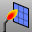
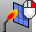

---
---

{: #kanchor2400}
# Welding toolbar
 [To open a toolbar](javascript:void(0);) Toolbars can be opened as a free-standing group or added to the current group.
To open a toolbar as a free-standing group
Click theOptionsicon in any toolbar group.On the menu, clickShow Toolbar, and then select the toolbar name from the list.To open a toolbar as a new tab in the current group
Click theOptionsicon in the toolbar group where you want to add the new tab.On the menu, clickShow or Hide Tabs, and then select the toolbar name from the list. [Weld](weld.html) 
Remove creases from a mesh by merging coincident mesh vertices.
 [Unweld](weld.html#unweld) 
Add creases to a smooth mesh by creating coincident vertices.
 [WeldEdge](weld.html#weldedge) 
Remove creases from a mesh by merging coincident mesh vertices along selected edges.
 [UnweldEdge](weld.html#unweldedge) 
Add creases to a smooth mesh by creating coincident vertices along selected edges.
 [WeldVertices](weld.html#weldvertices) 
Remove creases from a mesh by merging all selected mesh vertices.
&#160;
&#160;
Rhinoceros 6 © 2010-2015 Robert McNeel &amp; Associates.11-Nov-2015
 [Open topic with navigation](welding-toolbar.html) 

