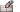
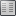

---
---

# Workspace Editor
Provides the ability to customize the Rhino workspace by adding, deleting, and editing toolbars and menus.
To edit a workspace
On theToolsmenu, clickToolbar Layout.On the Rhino Options &gt; Toolbars &gt;Toolsmenu, clickWorkspace Editor.Workspace Editor
Groups
Add, delete, and edit toolbar groups, toolbars, and toolbar buttons.
Groups panel
New toolbar group
Copy toolbar group
Delete selected toolbar group or remove toolbar from group
Rename toolbar group
Toolbar panel
New toolbar item
Help
Toolbars panel
New toolbar
Copy toolbar
Delete selected toolbar
Toolbar properties
Choose single- or multiple-column toolbar list view
Display toolbar list in a single column
Display toolbar list in multiple columns.
Help
Menus
Add new menus and menu items and edit their properties.
In the default menus, new menu items can be inserted, and these new menu items can be edited and deleted, but default menu items cannot be edited or deleted.
To add a new menu to the menu bar
In the menu bar, clickClick here to add.To add a new menu item, separator, or sub-menu
At the bottom of the menu, ClickClick here to add.OrRight-click a menu item and clickInsert Menu Item.To edit custom menu items
Right-click a menu item to edit the menu.Options
Insert Menu Item
Adds a new custom menu item.
Insert separator
Inserts a separator line.
Insert Sub Menu
Inserts a sub-menu.
Delete Item
Deletes custom menu items.
Item Properties
Edit bitmap
Opens the [Edit Bitmap](toolbar-button-editor.html#edit-bitmap) dialog box.
Menu text
The text that appears in the menu.
Status bar help text
The text that appears in the status bar when the mouse hovers over a menu item.
Macro Library
Choose a command script from the macro library.
Command
Creates a command script for the menu item.
Plug-in Properties
Item Type
Normal item
Displays text only.
Check item
Displays a check to indicate the on/off state of the command or option.
Radio item
Displays a menu item with a radio button.
Default State
Enabled
Checked
Plug-in Menu Update Handler
Demand load plug-in to handle menu update
Generate C++ Code
Generate C# Code
See also
 [Using toolbars and buttons](using-toolbars.html) 
 [Toolbar Properties](toolbars.html#toolbar-properties) 
 [Edit toolbar bitmap](toolbar-button-editor.html#openbuttoneditor) 
&#160;
&#160;
Rhinoceros 6 © 2010-2015 Robert McNeel &amp; Associates.11-Nov-2015
 [Open topic with navigation](workspace-editor.html) 

