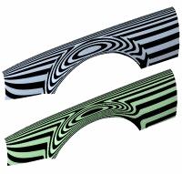
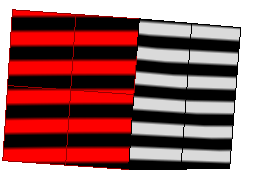
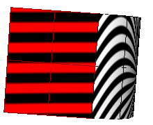
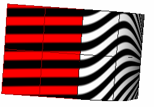

---
---

{: #kanchor2266}{: #kanchor2267}{: #kanchor2268}{: #kanchor2269}
# Zebra
 [Where can I find this command?](javascript:void(0);) Toolbars
 [Surface Analysis](surface-analysis-toolbar.html) 
Menus
Analyze
Surface
Zebra
The Zebra command visually evaluates surface smoothness and [continuity](continuity-descriptions.html) using a stripe map.
TheZebracommand is one of a series of visual surface analysis commands. These commands use [NURBS](http://www.rhino3d.com/nurbs) surface evaluation and rendering techniques to help you visually analyze surface smoothness, curvature, and other important properties.
Steps
Set the stripe direction, size, and color.Set the stripe color to contrast with the base color of the object to see the zebra stripes.The first stage is to set the detail level for the analysis mesh. You can increase the density of the mesh if the level of detail is not fine enough.
## Interpreting the stripes
Position Only (G0)
If the stripes have [kinks](kink.html) or jump sideways as they cross the connection from one surface to the next, the surfaces touch, but have a kink or crease at the point where the zebra stripes jag. This indicates G0 (position only) [continuity](continuity-descriptions.html) between the surfaces.

Tangent matches; curvature does not match (G1)
If the stripes line up as they cross the connection but turn sharply at the connection, the position and tangency between the surfaces match. This indicates G1 (position + tangency) [continuity](continuity-descriptions.html) between the surfaces. Surfaces that are connected with the [FilletSrf](filletsrf.html) command display this behavior.

Position, curvature, and tangency match (G2)
If the stripes match and continue smoothly over the connection, this means that the position, tangency, and curvature between the surfaces match. This matching indicates G2 (position + tangency + curvature) [continuity](continuity-descriptions.html) between the surfaces. Surfaces connected with the [BlendSrf](blendsrf.html), [MatchSrf](matchsrf.html), or [NetworkSrf](networksrf.html) commands display this behavior. When you use surface edges as part of the curve network, the [NetworkSrf](networksrf.html) options allow any of these connections.

If, when you use theZebracommand, the selected objects do not already have a surface analysis mesh, an invisible mesh will be created based on the settings in thePolygon Mesh Optionsdialog box.
Polygon Mesh Options
Fewer polygons – More polygons
The slider roughly controls the density and number of mesh polygons. Set the slider and click
Preview
The mesh is drawn as a preview in the viewports, and the dialog box stays on screen for more adjustments.
Detailed Controls
Opens the [Polygon Mesh Detailed Options](polygon-mesh-detailed-options.html) dialog box.
The surface analysis meshes save in the Rhino files. These meshes can be large. The [RefreshShade](refreshshade.html) command and theSave geometry onlyoption of the [Save](save.html) and [SaveAs](save.html#saveas) commands remove any existing surface analysis meshes.
To properly analyze a free-form [NURBS](http://www.rhino3d.com/nurbs) surface, the analysis commands generally require a detailed mesh.

# ZebraOff
{: #zebraoff}
 [Where can I find this command?](javascript:void(0);) Toolbars
 [Surface Analysis](surface-analysis-toolbar.html) 
Menus
 [Not on menus.](menuwhattodo.html) 
CloseZebra Optionsbox.
The ZebraOff command turns off zebra analysis and closes the Zebra dialog box.
Steps
Close theZebra Optionsdialog box.See also
 [Analyze objects](sak-analysis.html) 
&#160;
&#160;
Rhinoceros 6 © 2010-2015 Robert McNeel &amp; Associates.11-Nov-2015
 [Open topic with navigation](zebra.html) 

